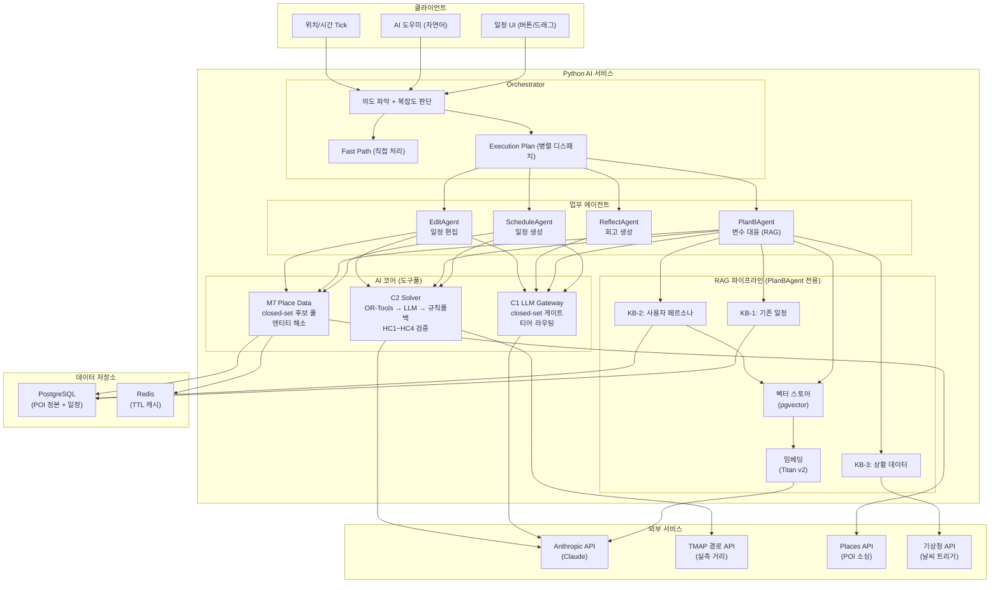

# TripPilot AI — 설계 저장소

TripPilot의 **AI 담당 설계 저장소**. 일정 생성·여행 중 변수 대응·회고 기능의 AI 아키텍처를 소유한다.

---

## 3대 핵심 기능

| 기능 | 설명 | 담당 에이전트 |
|---|---|---|
| **일정 생성** | 숙소 기반으로 최적 여행 일정 자동 생성 | ScheduleAgent |
| **여행 중 변수 대응 (Plan-B)** | 날씨·휴무·지연 발생 시 대안 일정 제안 (RAG 기반) | PlanBAgent |
| **회고 생성** | 여행 기록 기반 당일 회고·전체 요약·스타일 분석 | ReflectAgent |

---

## 멀티에이전트 아키텍처 (업무 기준)

```
사용자 입력 (자연어 또는 이벤트)
        |
        v
+--------------------+
|   Orchestrator     |  의도 파악 + 복잡도 판단
+--------------------+
        |
        | 간단? → 직접 처리 (Fast Path)
        |           "다음 일정 뭐야" → DB 조회 → 즉시 응답
        |
        | 복잡? → 에이전트에 위임 (병렬 가능)
        v
+--------------------------------------------------------------+
| ScheduleAgent | PlanBAgent  | ReflectAgent | EditAgent        |
| 일정 생성     | 변수 대응   | 회고 생성    | 일정 편집        |
| (Generation)  | (RAG 기반)  | (LLM 생성)  | (해석+검증)      |
+--------------------------------------------------------------+
        |
        | 각 에이전트가 필요한 도구만 조합
        v
+--------------------------------------------------------------+
| [도구풀 — 에이전트별 제한 할당]                                |
| LLM 호출 (Anthropic) | M7 후보 조회 | Solver 배치/검증          |
| 벡터 검색 (RAG)    | 엔티티 해소  | 외부 API (날씨, 지도)    |
+--------------------------------------------------------------+
        |
        v
+--------------------------------------------------------------+
|  C2 Solver — 하이브리드                                       |
|  OR-Tools (1차 결정론) → [LLM 2차: 미배선] → 규칙 폴백 (최후)      |
|  모든 출력은 HC1~HC4 검증 통과 필수                           |
+--------------------------------------------------------------+
        |
        v
  사용자에게 보이는 일정 (솔버 검증값만)
```

---

## 시스템 아키텍처



---

## Orchestrator

| 모드 | 조건 | 처리 방식 |
|---|---|---|
| **Fast Path** | 도구 1~2개로 끝나는 간단한 task | 직접 처리 (위임 오버헤드 제거) |
| **Delegate** | 다단계 판단이 필요한 복잡한 업무 | 에이전트에 위임 (병렬 가능) |
| **Fallback** | 의도 파악 실패 | 기본 응답 + 수동 편집 경로 안내 |

Fast Path 대상: 일정 조회, 상태 확인, POI 단일 조회, 확인/취소/되돌리기, 정보 에이전트 단일 질의(날씨·거리·POI)

- **위임 프로토콜**: 모든 위임은 `AgentTask`/`AgentResult` 표준 봉투로 — 데이터 대신 참조(`context_refs`) 전달, deadline 상속, trace_id 전파. 상세 → `aidlc-docs/inception/application-design/orchestrator-delegation-design.md`
- **의도 파악 하이브리드** **(미배선 — 2026-08-25 기준 프로덕션 호출자 0)**: 의도별 질문뱅크 임베딩 매칭(1차, LLM 0회) → 저신뢰 시 LLM 유사질문 생성·투표(2차) → LLM 직접 분류(3차). `IntentRouter`·질문뱅크는 구현·테스트 완료지만 `api/wiring.py` 가 import 하지 않아 어느 요청 경로에서도 실행되지 않는다 — 자연어 진입점이 열릴 때 배선된다. 상세 → `aidlc-docs/inception/application-design/intent-matching-design.md`

---

## 에이전트 4종

### ScheduleAgent — 일정 생성 비서

- **패턴**: Generation (백지에서 새로 만들기)
- **흐름**: 후보 풀 조회 → LLM 선호 점수 → 솔버 배치 → 설명 생성
- **할당 Tool**: `m7.get_candidates`, `m7.source_web`, `llm.score_preferences`, `llm.explain_slot`, `solver.solve`, `solver.validate`

### PlanBAgent — 변수 대응 비서 (RAG 기반)

- **패턴**: RAG (기존 정보를 꺼내서 + 상황에 맞게 재구성)
- **흐름**: KB에서 Retrieve(기존 일정 + 페르소나 + 상황) → Augment(프롬프트 조립) → Generate(LLM 대안 선택) → Validate(솔버 검증)
- **할당 Tool**: `kb.retrieve_schedule`, `kb.retrieve_persona`, `kb.retrieve_situation`, `m7.get_candidates`, `llm.select_alternatives`, `solver.solve`, `solver.validate`
- **벡터 스토어**: pgvector (저장 장소 메모, 방문 리뷰, POI 설명)
- **상세 설계**: `aidlc-docs/inception/application-design/planb-rag-design.md`

### ReflectAgent — 회고 비서

- **패턴**: 1차 — 단순 LLM Generation (DB 조회 → LLM 1회). 추후 C 확장(Multi-step)
- **흐름 (1차)**: 방문 기록 DB 조회 → 충분성 판단(0건→스킵) → LLM 회고 생성 → 결과 반환
- **할당 Tool (1차)**: `db.get_visit_history`, `llm.generate_reflection` **(2개만)**
- **추후 추가**: `llm.analyze_style` (7축 스타일 분류, 누적 10곳 이상 시)
- **폴백**: LLM 실패 → FallbackCard (통계 카드: 방문 N곳·이동 Nkm·사진 N장)
- **상세 설계**: `aidlc-docs/inception/application-design/reflect-agent-design.md`

### EditAgent — 편집 비서

- **패턴**: 의도 해석 → 검증 → 반영
- **흐름**: 편집 의도 해석 → 엔티티 해소 → 솔버 검증 → 반영 모드 결정
- **할당 Tool**: `llm.parse_intent`, `m7.resolve_entity`, `m7.get_candidates`, `solver.validate`, `solver.repair`

---

## 구조 개정 (2026-08-02): 4상자 파이프라인 — 도구 겹침 0

멘토 피드백(도구 겹침 금지) 반영. **Orchestrator(지휘) → Provider 5종(수집, LLM 0회) → Agent 4종(LLM 판단, 전속 도구 배타) → Solver 공통 관문(확정)**. 정보 수집은 Orchestrator 전속(InfoCollector), 정보 '에이전트'는 **Provider로 개명**, Solver는 도구가 아닌 공통 관문. 상세 → `aidlc-docs/inception/application-design/agent-structure-v2.md`

### (구) 정보 계층 5종 — Provider로 개명됨

| 에이전트 | 담당 | 우선순위 |
|---|---|---|
| **PlaceScoutAgent** | 장소 후보 확보 (M7 조회 → 충분성 판단 → 웹 소싱 → closed-set 보장, INV-1 관문) | 1차 (MVP) |
| **WeatherAgent** | 일 단위 기상청 API 조회·캐싱, 강수 80%↑ 트리거 판정 | 1차 (MVP) |
| **TransitAgent** | 교통·거리 (**TMAP→하버사인 직선** 2단 체인 — 2026-08-25 정정), 지연 30분+ 트리거 판정 | 2차 |
| **PersonaAgent** | KB-2 (저장 장소·선호 벡터·거절 이력) 조회·검색 | 2차 |
| **EventAgent** | 축제·행사 — **NAVER 검색 → `EVENT_EXTRACTION` LLM 추출 → 카카오 로컬 지오코딩 → `JsonEventStore`** (2026-08-25 정정) | 가동 중 (TRIP-421) |

> **정정 (2026-08-25) — 행사 소스는 TourAPI가 아니다**: 종전 표기 "TourAPI 축제·행사(M7 등록 게이트 경유)"는
> 사실과 반대였다. **TourAPI는 POI 수집 소스**이고(`scripts/load_pois_db.py` 계열), 행사는 NAVER 검색
> 스니펫을 `EVENT_EXTRACTION` 워커로 구조화하고 카카오 로컬로 지오코딩해 `background/event_store.py`
> (`JsonEventStore`)에 적재하는 **새벽 배치**가 채운다. 행사는 후보 풀에 들어가지 않으므로 M7 등록 게이트를
> 거치지 않는다 — **후보가 아니라 소프트 가점 항**이다(INV-1 비적용, agent-structure-v2 §2 행사 註).

계층 규칙: 정보 에이전트는 다른 에이전트 호출 금지(깊이 2 고정), 쓰기 금지, 모든 응답에 `FreshnessMeta`(신선도 메타) 필수. 정보 도구(`m7.*`, 날씨·교통 API)는 업무 계층에서 정보 계층으로 이동 — 개정 Tool 할당표는 상세 문서 참조.

---

## C2 Solver — 하이브리드 전략

"에이전트가 구해온 정보를 실현 가능하도록 최종 배치하는 결정론 엔진"

```
OR-Tools (1차) → LLM(Anthropic) (2차, 미배선) → 규칙 폴백 (최후)
```

| 계층 | 역할 | 특성 |
|---|---|---|
| OR-Tools | VRPTW 결정론 최적화 (3초 제한) | 빠름, 결정론, HC 네이티브 |
| LLM(Anthropic) | 복잡한 제약에서 창의적 배치 제안 | 유연하지만 비결정론. **(미배선 — 2026-08-25 기준 프로덕션 호출자 0)** |
| 규칙 폴백 | 전부 실패 시 최소 일정 보장 | INV-4 보장 |

> **LLM 2차 단계 미배선 (2026-08-25)**: `solver_engine/llm_solver.py`(`LlmSolver`)는 실재하지만
> `api/wiring.py` 가 조립하는 체인은 `stages = (OrToolsSolver, RuleFallbackSolver)` **2단**이다.
> 사유는 소스가 적어뒀다 — **"솔버 프롬프트 정본·모델 설정이 아직 없다"**(`api/wiring.py`).
> 따라서 실가동 체인은 `OR-Tools → 규칙 폴백` 이고, AI-D07 ①의 "잔여 ≥ 2.5s 면 2차 실행" 분기는
> **어떤 경로(day1·백그라운드·regenerate·Plan-B)에서도 발생하지 않는다.**

LLM 출력도 반드시 HC1~HC4 검증 통과 후에만 사용자에게 반환.

---

## 4대 불변식 (어기면 재설계)

| # | 불변식 | 검증 방법 |
|---|---|---|
| INV-1 | LLM은 closed-set 후보 안에서만 선택 (환각 0) | C1 출구 게이트 + PBT |
| INV-2 | 사용자에게 보이는 시각·순서는 솔버 검증값만 | 에이전트 공통 규칙 + PBT |
| INV-3 | 소요시간 미표시 — 거리만 | VisitSlotDisplay 타입 정적 보장 |
| INV-4 | AI 실패 시 결정론 폴백 (침묵 실패 금지) | 에이전트별 폴백 계단 + PBT |

---

## 기술 스택

| 영역 | 기술 | 비고 |
|---|---|---|
| 언어 | Python 3.11+ | AI 서비스 전체 |
| LLM | **Anthropic API 직접** (Claude) | **AI-D06 확정 (2026-07-21)** — Bedrock 아님. 티어: 경량 haiku-4-5 / 상위 sonnet-5 / 오프라인 opus-4-8 (설정값) |
| 솔버 | OR-Tools (1차) + LLM (2차 폴백) | 하이브리드 — 2차도 Anthropic API 경유 |
| RAG 프레임워크 | LangChain (부분 도입) | PlanBAgent + LLM 호출에만 (`ChatAnthropic`) |
| 벡터 스토어 | pgvector (PostgreSQL) | 1차, 추후 OpenSearch 이전 가능 |
| 임베딩 | **로컬 `nlpai-lab/KURE-v1` (MIT) 확정** | 1024차원 유지 → pgvector 스키마 무변경. Titan v2는 Bedrock 전용이라 대체 (AI-D06 부기 2026-08-23, TRIP-514 배선 완료). 종전 "잠정: multilingual-e5-large 또는 BGE-M3" 표기는 해소 |
| 테스트 | pytest + Hypothesis (PBT) | **`@given` 170개 / 테스트 파일 41개** (2026-08-25 실측 — `grep -rc "@given" ai/tests/*.py`). 종전 "19개(+신규 5)"는 스테일 |
| 패키지 관리 | uv | U1 FD에서 확정 |

> **표기 규칙 (AI-D06)**: 본 저장소 문서의 기존 "Bedrock" 표기는 "LLM API(Anthropic)"로 읽는다. 점진 개정 중.

### LangChain 적용 범위 (부분 도입)

| 적용 O | 적용 X (직접 구현) |
|---|---|
| PlanBAgent RAG 파이프라인 | Orchestrator |
| LLM(Anthropic) 호출 | Solver (OR-Tools) |
| pgvector 벡터 스토어 연동 | M7 후보 풀 생성 |
| 임베딩 생성 | ScheduleAgent, EditAgent 로직 |
| | HC1~HC4 검증, 에이전트 병렬 실행 |

적용 이유: RAG 보일러플레이트 제거 + LLM 호출 파싱·재시도 내장. 상세 → `aidlc-docs/inception/application-design/langchain-adoption.md`

---

## 에이전트별 Tool 제한 (토큰 절감)

각 에이전트에는 업무에 필요한 tool만 할당. 전체 17개 중 3~7개만 사용 → 호출당 토큰 50~60% 절감.

| Tool | Schedule | PlanB | Reflect | Edit | Orchestrator |
|---|---|---|---|---|---|
| `m7.get_candidates` | O | O | - | O | - |
| `m7.source_web` | O | - | - | - | - |
| `m7.resolve_entity` | - | - | - | O | - |
| `llm.score_preferences` | O | - | - | - | - |
| `llm.select_alternatives` | - | O | - | - | - |
| `llm.generate_reflection` | - | - | O | - | - |
| `llm.analyze_style` | - | - | (추후) | - | - |
| `llm.parse_intent` | - | - | - | O | - |
| `kb.retrieve_*` | - | O | - | - | - |
| `solver.solve` | O | O | - | - | - |
| `solver.validate` | O | O | - | O | O |
| `solver.repair` | - | - | - | O | - |

---

## 디렉토리 구조

```
TripPilot_AI/
├── README.md                ← 본 파일
├── claude.md                ← 프로젝트 루트 컨텍스트
├── .kiro/                   ← Kiro steering + AI-DLC 규칙
├── aidlc-docs/              ← AI-DLC 워크플로우 산출물
│   ├── aidlc-state.md       ← 현재 진행 상태
│   ├── inception/
│   │   ├── design-artifacts/  ← ai-*.md 설계 정본 6개 + 비용 추정
│   │   ├── reverse-engineering/
│   │   ├── requirements/
│   │   ├── plans/
│   │   ├── application-design/
│   │   │   ├── agent-redesign.md              ← 업무 에이전트 4종
│   │   │   ├── agent-hierarchy-design.md      ← 2계층 세분화 (정보 에이전트 5종)
│   │   │   ├── agent-io-contracts.md          ← FE↔BE↔Agent 입출력 계약
│   │   │   ├── orchestrator-delegation-design.md ← 위임 봉투 프로토콜
│   │   │   ├── intent-matching-design.md      ← 의도 파악 하이브리드
│   │   │   ├── evaluation-metrics-design.md   ← 최신성·신속도 지표
│   │   │   ├── mlops-llmops-design.md         ← MLOps/LLMOps + ML 유형화
│   │   │   ├── planb-rag-design.md            ← PlanB RAG 설계
│   │   │   ├── langchain-adoption.md          ← LangChain 부분 도입
│   │   │   └── ...
│   │   └── units/
│   └── construction/        ← (미착수)
```

---

## 핵심 컴포넌트 (C1 · C2 · M7)

### C1 LLM Gateway — 판단·해석 계층

에이전트들이 도구로 사용하는 LLM 호출 인프라.

- 티어 라우팅: feature에 따라 경량/상위 모델 분기
- closed-set 출구 게이트: OutputSchema 파싱 + poi_id ∈ 화이트리스트 교차 (INV-1)
- 서버 재조회 컨텍스트 주입: 요청자 권한으로 ResourceRef 재조회 (D31)
- 폴백: 타임아웃(2.5s)/파싱 실패 → FallbackSignal 발행

### C2 Solver Engine — 선택·순서·시각 보장

에이전트가 구해온 정보를 실현 가능하도록 배치하는 결정론 엔진.

- OPTW/TOPTW 최적화 + HC1~HC4 하드 제약 검증
- 이동시간 추정: 어댑터 체인 (**TMAP 실측 → 하버사인 직선거리×1.3**) — 2단 (TRIP-382·405·422·432)
- warm-start 재생성: 고정 블록 보존, 나머지만 재배치
- 하이브리드: OR-Tools(1차) → LLM(Anthropic)(2차, **미배선** — 위 C2 절 註) → 규칙 폴백(최후)

### M7 Place Data — closed-set 후보 풀

AI 파이프라인의 그라운딩 토대.

- 6단계 필터 파이프라인: 반경 → 예산 → 영업일 → 품질 → 인기 → 상한(5천)
- 웹 후보 소싱: Places API(1단계) → 자유 웹(2단계) + 수집 게이트(5단 검증)
- 엔티티 해소: 결정론 fuzzy match (edit-distance), LLM 아님 — **(미배선 — 2026-08-25 기준 프로덕션 호출자 0.** `poi_curation/entity_resolver.py` 는 구현·테스트 완료이나 호출 경로 없음)
- 캐싱: POI 24h, 영업시간 6h, 가격 캐싱 금지

---

## 일정 생성 시퀀스 (핵심 플로우)

```
사용자 → M8(Kotlin) → M7: 후보 풀 생성 (closed-set)
                     → C1: 선호 점수 (경량, 2.5s 타임아웃, 전 일자 1회)
                            실패 → 규칙 점수 폴백
                     → C2: day별 배치 (LLM 재호출 없음)
                            day1 → 5초 내 우선 반환 (독립 TX)
                            나머지 → 백그라운드
                     → 전체 완료 (20초 한계)
```

---

## Plan-B 변수 대응 시퀀스 (RAG 기반)

```
트리거 발생 (날씨 80%↑ / 휴무 / 이동지연 30분+ / 체류초과)
        |
        v
[1. Retrieve — 상황 파악]
        +→ KB-1: 기존 일정에서 영향받는 슬롯 추출
        +→ KB-3: 트리거 사유 + 현재 위치 + 시각 + 날씨
        |
        v
[2. Retrieve — 대안 후보 소싱]
        +→ KB-2: 저장 장소 (사용자 찜 목록, 1순위)
        +→ M7: 현재 위치 반경 내 POI
        |       (실내 필터 / 체류 짧은 것 우선 / 이미 간 곳 제외)
        +→ KB-2: 사용자 선호 패턴 (벡터 유사도 검색)
        |
        v
[3. Augment — 프롬프트 조립]
        트리거 사유 + 영향 슬롯 + 대안 후보(closed-set)
        + 사용자 선호 + 제약(남은 시간, 고정 블록)
        |
        v
[4. Generate — LLM 대안 선택]
        "이 후보 중 상황에 맞는 대안 A/B/C 선택" (closed-set, INV-1)
        |
        v
[5. Validate — 솔버 검증 (병렬)]
        +→ solver.solve(대안 A)
        +→ solver.solve(대안 B)  ← 동시 실행
        +→ solver.solve(대안 C)
        |
        HC1~HC4 통과한 것만 생존
        |
        v
[6. Return — 제안]
        대안 2~3개 + 전/후 비교 → 사용자에게 제안 (자동 변경 없음)
        |
        사용자 선택 → solver.validate(재검증) → 확정 반영
```

### Plan-B 3가지 Knowledge Base

| KB | 내용 | 저장 방식 |
|---|---|---|
| **KB-1: 기존 일정** | 현재 슬롯·고정 블록·방문이력·변경이력 | DB (구조화) |
| **KB-2: 사용자 페르소나** | 저장 장소·선호 패턴·거절 이력 | DB + 벡터 스토어 (pgvector) |
| **KB-3: 상황 데이터** | 트리거 사유·위치·시각·날씨·POI 상태 | 실시간 API |

### Plan-B 폴백 계단

```
저장 장소 0개 → M7 일반 후보로 진행
벡터 검색 실패 → M7 카테고리 필터만
LLM 타임아웃 → 규칙 점수 (카테고리+거리+평점)
솔버 전멸 → 건너뛰기 / 휴식 모드 제안
전체 실패 → "수동으로 수정하세요" + 수동 편집 화면
```

---

## ML 도입 전략 (AI-D05)

ML은 **soft 신호(추정·점수·개인화)에만** 적용. 하드 제약 검증은 솔버 결정론 유지.

| 후보 | 역할 | 현재 상태 | 폴백 |
|---|---|---|---|
| **선호 점수 — 추천/LTR** | 유저 피드백 기반 개인화 랭킹 | 1차는 LLM/규칙 부트스트랩 + 로깅 | `build_rule_score` (규칙 점수) |
| **체류 시간 예측 — 회귀** | POI+유저+시간대 → 실제 체류 분 | 1차는 정적 테이블(G51) | 카테고리 기본값 테이블 |
| **이동시간 보정 — 회귀** | 고정 안전계수 → 시간·지역별 보정 | 후순위 | G106 고정값 |

- 도입 시점: 유저 피드백 충분히 쌓인 후 (DAU 1천, 과설계 금지)
- 호스팅: SageMaker 엔드포인트 → C1/솔버 어댑터 뒤에 스왑
- closed-set 게이트(INV-1)는 ML 선호점수에도 그대로 적용
- 규칙 폴백 유지 (INV-4): ML 실패 → 기존 규칙 버전으로

### MLOps · LLMOps (운영 체계)

- **LLMOps는 MVP부터**: 프롬프트 레지스트리(버전·롤백), 4층 평가(PBT→평가셋→LLM-judge→온라인), trace_id 전량 트레이싱, 비용·쿼터 관리, 카나리/섀도 배포
- **MLOps는 "로깅 먼저"**: 학습 라벨이 자동으로 쌓이는 로그 6종(선호 피드백·실측 체류·실측 이동·대안 선택·트리거 반응·의도 확정)을 MVP 스키마에 반영 → 모델은 DAU 1천 이후
- **ML 패턴 유형화**: 점수·랭킹(A) / 수치 예측(B) / 분류(C) / 표현 학습(D) 4유형 10후보 + ML 금지 목록(hard 영역)
- 상세 → `aidlc-docs/inception/application-design/mlops-llmops-design.md`

### 평가 지표 — 최신성 · 신속도 (핵심 2축)

솔버 HC 검증(hard gate) 위에 품질 평가 축 2개:

- **최신성**: F1 데이터 신선도(도메인별 age/TTL, `FreshnessMeta` 기반) + F2 결과물 현행성(트리거 이후 데이터·현재 시각 실행 가능·영업 중·폐업 배제 등 체크리스트)
- **신속도**: 지연 예산의 SLO 승격 (day1 5s / 전체 20s / Plan-B 10s / 도우미 3s / Fast Path 500ms) + 구간 분해 측정
- 충돌 시 우선순위 규칙 포함 (Plan-B 트리거 검증은 최신성 우선, 여행 전 생성은 신속도 우선)
- 상세 → `aidlc-docs/inception/application-design/evaluation-metrics-design.md`

---

## 임베딩 · 벡터 검색

| 항목 | 선택 | 용도 |
|---|---|---|
| 임베딩 모델 | 로컬 오픈소스 — 잠정: multilingual-e5-large / BGE-M3 (1024차원, AI-D06) | 사용자 페르소나·POI 설명·질문뱅크 벡터화. 결제 승인 불요, 한국어 벤치마크 후 확정 |
| 벡터 스토어 | pgvector (PostgreSQL) — 1차 | 유사도 검색 (PlanBAgent RAG, 의도 질문뱅크) |
| 확장 | OpenSearch Serverless — 추후 스케일 시 | — |

인덱싱 대상: 저장 장소 메모, 과거 방문 리뷰, POI 설명, 과거 Plan-B 결과

---

## 정본 참조 (TripPilot 기획)

> **`aidlc-docs/planning/` 은 존재하지 않는다 (2026-07-17 팀 결정으로 삭제 — 루트 `CLAUDE.md` "never reference it").**
> 코드 체계별 현 소유자 (2026-08-25, TRIP-530 정정):
>
> | 코드 | 현 소유자 |
> |---|---|
> | `ADR-####` · `US-*` · `C1`–`C17` · `U0`–`U9` · `S1`–`S6` | `../aidlc/aidlc-docs/inception/` (requirements · user-stories · application-design) |
> | AI 축 결정 `AI-D0#` | 본 패키지 `ai-adr.md` (자체 소유) |
> | `D##` · `G###` · `M##` · `Δ#` · `N#` | **소유자 없음 — 역사적 코드.** 삭제된 planning 파일에 대해서만 해석되며 리포 어디에도 원문이 없다(`D38`·`G106`·`D27`·`D31`·`G181` 실측 확인). 근거가 필요하면 git 이력을 볼 것 |
>
> 아래 표기를 **결정 근거의 소재로 신뢰하지 말 것** — 인용 맥락 보존용으로만 남긴다.

| 문서 | AI 관련 내용 |
|---|---|
| `../aidlc/aidlc-docs/inception/requirements/requirements.md` | 제품 요구사항 정본 (`aidlc/docs/PRD/` 를 대체) |
| `../aidlc/aidlc-docs/inception/user-stories/` | 페르소나·스토리 (`US-*`) |
| `../aidlc/aidlc-docs/inception/application-design/` | 컴포넌트 `C1`–`C17` · 서비스 `S1`–`S6` · 유닛 `U0`–`U9` |
| ~~`../TripPilot/aidlc/aidlc-docs/planning/{decisions,architecture,nfr}.md`~~ | **삭제됨 (2026-07-17)** — 위 註 참조 |

---

## 현재 상태

- **INCEPTION 완료** — 설계·요구사항·계획 수립 끝
- **멘토 피드백 반영 중** — 에이전트 업무 기준 재설계, RAG, LangChain 부분 도입, Solver 하이브리드
- **다음**: CONSTRUCTION Phase (U1 Domain & Ports부터)

---

## 변경 이력

| 날짜 | 내용 |
|---|---|
| 2026-07-07 | 초기 작성 (ai-architecture.md, ai-implementation-design.md) |
| 2026-07-08 | AI-D02(멀티에이전트), AI-D03(웹소싱), AI-D04(엔티티해소), AI-D05(ML전략) |
| 2026-07-12 | AI-DLC INCEPTION 전체 완료 (Workspace Detection ~ Units Generation) |
| 2026-07-12 | 멘토 피드백 반영 — 에이전트 업무 기준 재설계 (tool 기준 → 업무 기준) |
| 2026-07-12 | Orchestrator Fast Path + 에이전트 병렬 실행 |
| 2026-07-12 | PlanBAgent RAG 설계 구체화 (KB 3종, 벡터 스토어, retrieve 전략) |
| 2026-07-12 | Solver 하이브리드 확정 (OR-Tools → Bedrock → 규칙 폴백) |
| 2026-07-12 | 에이전트별 Tool 제한 (토큰 절감) |
| 2026-07-12 | LangChain 부분 도입 (Bedrock + RAG만) |
| 2026-07-16 | 2계층 세분화 — 정보 에이전트 5종 신설 (PlaceScout/Weather/Transit/Persona/Event) |
| 2026-07-16 | FE(화면 IO)↔BE(DB·API)↔Agent 입출력 계약 정의 (agent-io-contracts.md) |
| 2026-07-16 | Orchestrator 위임 프로토콜 (AgentTask/AgentResult 봉투, deadline 상속, trace_id) |
| 2026-07-16 | 의도 파악 하이브리드 (질문뱅크 매칭 + LLM 유사질문 투표) |
| 2026-07-16 | 평가 지표 2축 — 최신성(F1 신선도+F2 현행성)·신속도(SLO) |
| 2026-07-16 | MLOps/LLMOps 설계 + ML 패턴 유형화 (4유형 10후보, 학습 로그 6종) |
| 2026-07-21 | AI-D06 — LLM 벤더 확정: Anthropic API 직접 (Bedrock 아님). 티어 라우팅 모델 제안, 임베딩 Titan → 로컬 오픈소스(잠정) |
| 2026-08-04 | Bedrock 잔여 표기 일괄 정정 (AI-D06 반영) · `SolveMode.BEDROCK`→`LLM` 개명 (TRIP-256) |
| 2026-08-25 | **위 2026-08-04 "일괄 정정"은 완료되지 않았다** — 문서 84건이 남아 있었다(TRIP-530 실측). 일괄 치환 대신 **읽기 규칙 註**를 각 문서에 달았다: AI-D06 표기 규칙상 기존 "Bedrock"은 "LLM API(Anthropic 직접)"로 읽는다. 결정 이력·감사 로그(`aidlc-docs/audit.md`, append-only)의 Bedrock 언급은 **역사 기록이라 고치지 않는다** |
