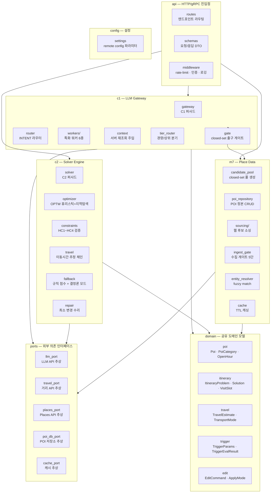

# Application Design — Components

> TripPilot Python AI 서비스의 내부 컴포넌트 분해.
> 각 컴포넌트의 책임, 내부 모듈 구성, 협력 관계를 정의한다.

---

## 1. 전체 컴포넌트 맵



---

## 2. C1 LLM Gateway — 내부 모듈

| 모듈 | 책임 | 주요 협력 |
|---|---|---|
| **gateway** | C1 공개 퍼사드. `call()` · `route()` · `resolve_context()` 진입점 | tier_router, workers, gate, context |
| **tier_router** | feature → 모델 티어(경량/상위) 매핑. 모델 설정 로드 | settings |
| **router** | INTENT feature 전용. 자연어 → 의도 분류 + 슬롯 추출 → Dispatch 생성 | gateway(call), entity_resolver(M7) |
| **workers/** | 특화 워커 6종(Preference·Explanation·Reflection·PlaceExtraction·Conversation·Requery). 각각 프롬프트 템플릿 + OutputSchema 소유 | gateway(call) |
| **gate** | closed-set 출구 게이트. ① OutputSchema 파싱 ② poi_id ∈ 화이트리스트 교차 ③ 전량 드롭 시 FallbackSignal | candidate_pool(M7) |
| **context** | `resolve_context` 구현. 요청자 Principal 권한으로 ResourceRef 재조회. 권한 밖 → PermissionDenied (조용한 제외 금지) | poi_db_port |

### C1 내부 흐름

```
call(feature, refs, prompt, schema)
    |
    +-> tier_router.resolve(feature) -> model_config
    +-> context.resolve(requester, refs) -> injected_context
    +-> llm_port.invoke(model_config, prompt + injected_context)
    +-> gate.validate(raw_output, schema, whitelist)
        |
        +-> 통과 -> TypedResult.success(parsed)
        +-> 전량 드롭 -> TypedResult.fallback()
```

```
route(utterance, refs, requester)
    |
    +-> call(INTENT, refs, intent_prompt, dispatch_schema)
    +-> dispatch.slots -> entity_resolver.resolve_entities(slots)
    +-> Dispatch(intent, resolved_slots, worker_plan, apply_mode)
```

---

## 3. C2 Solver Engine — 내부 모듈

| 모듈 | 책임 | 주요 협력 |
|---|---|---|
| **solver** | C2 공개 퍼사드. `solve()` · `validate()` · `repair()` · `estimate_travel()` 진입점 | optimizer, constraints, travel, fallback |
| **optimizer** | OPTW/TOPTW 최적화. 구성 휴리스틱(초기해) + 지역탐색(2-opt/or-opt 개선) | constraints(검증), travel(이동시간) |
| **constraints** | HC1~HC4 하드 제약 검증 로직. `check_all(solution) -> list[Violation]` | domain.itinerary |
| **travel** | 이동시간 추정 체인. 어댑터 순서: 카카오→네이버→직선거리. 안전계수·버퍼 적용 | travel_port, settings(G106) |
| **fallback** | 결정론 모드. `build_rule_score(poi, budget, seed)`. LLM 점수 없이 규칙 기반 배치 | settings |
| **repair** | 위반 배치 최소 수리. 시각·순서만 조정(POI 불변). MinimalChangePolicy 적용 | constraints, travel |

### C2 내부 흐름 — solve()

```
solve(problem: ItineraryProblem)
    |
    +-> problem.candidates에 llm_score 있는가?
    |   +-> 없음: fallback.build_rule_scores(candidates, seed)
    |   +-> 있음: 그대로 사용
    |
    +-> optimizer.construct_initial(scored_candidates, fixed_blocks, time_windows)
    |   +-> 고정 블록 시간순 배치
    |   +-> 점수 내림차순 삽입 시도 (HC 위반 시 스킵)
    |
    +-> constraints.check_all(initial_solution)
    |   +-> 위반 있으면 해당 슬롯 제거
    |
    +-> optimizer.local_search(solution, time_budget=3s)
    |   +-> 2-opt 교환 -> HC 재검증 -> 개선 시 유지
    |   +-> or-opt 이동 -> HC 재검증 -> 개선 시 유지
    |
    +-> constraints.check_all(final_solution)  # 최종 확인
    +-> ItinerarySolution(days, is_fallback, solve_mode)
```

### C2 내부 흐름 — validate()

```
validate(itinerary, constraint_set)
    |
    +-> constraints.check_hc1(itinerary)  # 영업시간
    +-> constraints.check_hc2(itinerary)  # 이동 부등식
    +-> constraints.check_hc3(itinerary)  # 고정 블록 불변
    +-> constraints.check_hc4(itinerary)  # 시간창
    +-> list[Violation] 반환 (빈 리스트 = 유효)
```

---

## 4. M7 Place Data — 내부 모듈

| 모듈 | 책임 | 주요 협력 |
|---|---|---|
| **candidate_pool** | closed-set 후보 풀 생성. 6단계 필터 파이프라인(반경→예산→영업일→품질→인기→상한) | poi_repository, cache |
| **poi_repository** | POI 정본 CRUD. DB 접근 추상화 | poi_db_port |
| **sourcing/** | 웹 후보 소싱 계층. PlacesApiAdapter(1단계) + WebSearchWorker(2단계) | places_port, C1(PlaceExtraction) |
| **ingest_gate** | 수집 게이트 5단 검증(스키마·실재·중복·신뢰·정책). 통과 → M7 등록, 실패 → quarantine | poi_repository, places_port |
| **entity_resolver** | 엔티티 해소. 지역·POI명 fuzzy match(edit-distance). 결정론, 신뢰도 분기 | poi_repository |
| **cache** | TTL 캐싱 로직. POI 24h, 영업시간 6h, 가격 캐싱 금지 | cache_port |

### M7 내부 흐름 — get_candidate_pool()

```
get_candidate_pool(request: CandidatePoolRequest)
    |
    +-> cache.get(cache_key)?  -> 있으면 반환 (세션 단위 TTL)
    |
    +-> poi_repository.find_by_radius(anchor, radius_km)
    +-> _filter_by_budget(budget_level)
    +-> _filter_by_open(dates)
    +-> _filter_by_data_quality()  # MINIMAL 제외
    +-> _rank_by_popularity()
    +-> _limit(MAX_CANDIDATES=5000)
    |
    +-> CandidatePool(poi_ids=frozenset, pois=list, generated_at)
    +-> cache.set(cache_key, pool)
    +-> return pool
```

### M7 내부 흐름 — 웹 후보 소싱 (비동기)

```
source_and_ingest(region, category, needed)
    |
    +-> places_api_adapter.search(region, category)  # ① 구조화
    +-> coverage 충분? -> Yes: 게이트로
    |                  -> No: web_search_worker.search_and_extract()  # ② 자유 웹
    |
    +-> for each sourced_poi:
    |       ingest_gate.validate(sourced_poi)
    |           ① 스키마 검증 (coord·hours·category 필수)
    |           ② 실재 검증 (geocode + crosscheck)
    |           ③ 중복 제거 (이름+좌표 50m 이내 동일 카테고리)
    |           ④ 신뢰 태깅 (source=WEB, confidence)
    |           ⑤ 정책 (가격 미캐싱, TTL)
    |       -> 통과: poi_repository.upsert(poi)
    |       -> 실패: quarantine(reason)
```

---

## 5. API Layer — 내부 모듈

| 모듈 | 책임 | 주요 협력 |
|---|---|---|
| **routes** | HTTP 엔드포인트 정의. C1/C2/M7 퍼사드 호출 | c1.gateway, c2.solver, m7.candidate_pool |
| **schemas** | pydantic 기반 요청/응답 DTO. 직렬화·검증 | domain |
| **middleware** | rate-limit(사용자별), 인증 토큰 검증, 요청 로깅, 에러 핸들링 | settings |
| **health** | 헬스체크·레디니스 엔드포인트. 외부 의존 상태 확인 | ports |

---

## 6. Ports Layer — 외부 의존 추상화

| Port | 구현체 (실) | 구현체 (fake) | 비고 |
|---|---|---|---|
| **LlmPort** | LlmAdapter (벤더 SDK 래핑) | FakeLlmAdapter (시드 기반 결정론 점수) | D37 |
| **TravelPort** | KakaoTravelAdapter → NaverTravelAdapter → StraightLineAdapter (체인) | FakeTravelAdapter (haversine) | 폴백 체인 |
| **PlacesPort** | KakaoPlacesAdapter / GooglePlacesAdapter | FakePlacesAdapter | AI-D03 |
| **PoiDbPort** | PostgresPoiRepository (또는 DynamoDB) | InMemoryPoiRepository | — |
| **CachePort** | RedisCacheAdapter | InMemoryCacheAdapter | TTL 정책 |

---

## 7. 컴포넌트 간 협력 규칙

### 의존 방향 (계층 규칙)
```
api → c1, c2, m7          (진입점 → 코어)
c1 → ports, domain, m7    (M7은 화이트리스트 조회만)
c2 → ports, domain        (M7 직접 참조 없음)
m7 → ports, domain, c1    (PlaceExtraction 워커 호출만)
domain → (없음)            (최하위 — 외부 의존 없음)
ports → (없음)             (인터페이스만 — 구현 없음)
```

### 금지된 의존
- c1 → c2 (직접 호출 금지 — 솔버는 오케스트레이션 계층에서만 호출)
- c2 → c1 (직접 호출 금지)
- domain → ports, c1, c2, m7 (역의존 금지)
- 어떤 컴포넌트도 api를 참조하지 않음

### DI (Dependency Injection)
- 모든 Port 구현체는 앱 시작 시 DI 컨테이너가 주입
- 테스트에서는 fake 구현체로 교체 (D37)
- 설정값(G106 파라미터 등)은 config.settings에서 일원 관리
