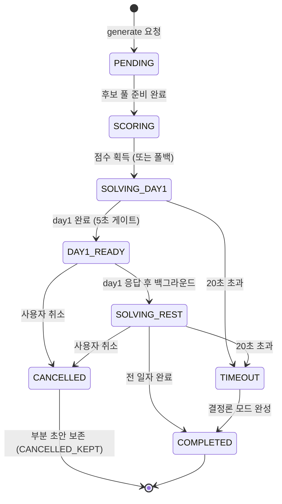

# Application Design — Services

> 서비스 계층 설계: 오케스트레이션 플로우, 에러 경로, 상태 전이, 시퀀스를 정의한다.

---

## 0. 경계 HTTP 경로 규칙 (2026-08-07 확정)

> 근거: PR #104 회신. `/v1`만으로는 **어느 서비스의 v1인지 모호**해 서비스명(`/ai`)을 접두하고,
> 리소스명은 **산출물 기준(`itinerary`)** 으로 잡아 백엔드 컨트롤러·스키마·DB 테이블 명칭과 통일한다.
> **`ScheduleAgent`는 "만드는 행위자"의 이름, `itinerary`는 "만들어진 산출물"의 이름** — 층이 다르므로 에이전트명은 그대로 유지한다.

| 경계 | 경로 | 지위 |
|---|---|---|
| 일정 생성 (포워드) | `POST /ai/v1/itinerary/generate` | **확정** — 구 표기 `POST /ai/generate` 폐기 |
| 일정 검증 (포워드) | `POST /ai/v1/itinerary/validate` | **확정** |
| 일정 수리 (포워드) | `POST /ai/v1/itinerary/repair` | **확정** |
| POI 정본 read — 반경 (리버스) | `GET /internal/pois?centerLat&centerLng&radiusKm` | **확정** — 백엔드 구현 기준 |
| POI 정본 read — 배치 (리버스) | `POST /internal/pois/batch-get` (요청 필드 `poi_ids`) | **확정** — 계약 초안의 `:batchGet`·`ids` 표기 정정 |
| AI 도우미 · Plan-B | `/ai/v1/...` 명명 규칙만 확정, 리소스명은 **협의 중** | 미확정 |

프로토콜은 **REST/JSON over HTTP 확정**(PR #76 결정4). `/c1/*`·`/c2/*`·`/m7/*` 세분 경로
(`../reverse-engineering/api-documentation.md`)는 PR #76 "굵은 경계 — 조각 조립 경계를 두지 않는다" 합의로
**폐기 방향**이며, 논리 인터페이스 참고용으로만 남는다.

---

## 1. 일정 생성 오케스트레이션 (핵심 플로우)

### 1.1 정상 경로

```
[Kotlin M8] generate_itinerary(trip_id, mode)
    |
    v
[API Layer] POST /ai/v1/itinerary/generate     # §0 확정 경로
    |
    v
[ItineraryOrchestrator.generate()]
    |
    +-> m7.get_candidate_pool(trip_id)           # ① 후보 풀 생성
    |       반경·예산·영업일·품질 필터 → CandidatePool
    |
    +-> c1.call(PREFERENCE_SCORING, pool, prefs) # ② LLM 선호 점수 (1회)
    |       타임아웃 2.5초. 전 일자 공용.
    |       성공 → ScoredCandidates(is_fallback=false)
    |
    +-> for day in trip.days:                    # ③ day별 솔버 배치
    |       c2.solve(day_problem)
    |       → DaySolution (HC1~HC4 검증 완료)
    |
    +-> ItinerarySolution(days, is_fallback=false, FULL_AI)
```

### 1.2 에러 경로 — 폴백 계단

```
[ItineraryOrchestrator.generate()]
    |
    +-> c1.call() 타임아웃/스키마 위반?
    |       YES → fallback.build_rule_scores(seed) → ScoredCandidates(is_fallback=true)
    |              고지: "일부 추천이 기본 모드로 생성"
    |
    +-> travel_estimator 실패 (카카오·네이버 모두)?
    |       YES → straight_line_fallback(×1.3)
    |              고지: "일부 정보 미확인"
    |
    +-> 전체 20초 초과?
    |       YES → 잔여는 결정론 단독 모드로 완성
    |              플래그: DETERMINISTIC_ONLY
    |
    +-> 모든 경로 실패?
    |       YES → 숙소 + 시각 고정 필수 방문지만의 최소 일정
    |              플래그: MINIMAL_ONLY, 고지: "다시 시도"
    |
    원칙: 어떤 경로든 반드시 ItinerarySolution 반환 (침묵 실패 금지)
```

### 1.3 상태 전이 — 생성 세션



---

## 2. AI 도우미 오케스트레이션 (자연어 → 편집)

### 2.1 정상 경로

```
[사용자 자연어] "비 와서 실내로 바꿔줘"
    |
    v
[API Layer] POST /ai/v1/... (AI 도우미)         # 구 표기 /ai/route 폐기.
    |                                            # 명명 규칙만 확정, 리소스명 협의 중 (§0)
    v
[AssistantOrchestrator.handle()]
    |
    +-> c1.route(utterance, refs, requester)      # ① 의도 분류
    |       → Dispatch(intent=REPLAN, slots, workers, CONFIRM_REQUIRED)
    |
    +-> for worker in dispatch.worker_plan:       # ② 워커 실행
    |       worker.execute(gateway, refs, requester, params)
    |       → 후보 재점수 / 사유 해석 (제안, 확정 아님)
    |
    +-> _translate_to_edit_command(dispatch, worker_results)  # ③ 편집 명령 변환
    |       → EditCommand(op=reorder_day, params={filter:indoor}, affected=3)
    |
    +-> c2.validate(current_itinerary + edit)     # ④ 솔버 검증
    |       위반 없음 → 반영 가능
    |
    +-> dispatch.apply_mode?
            AUTO_APPLY → 자동 반영 + changelog (되돌리기 가능)
            CONFIRM_REQUIRED → 미리보기 반환, 사용자 [적용] 대기
```

### 2.2 에러 경로

```
라우터 실패 (타임아웃/파싱 불가)
    → Dispatch.default_fallback()
    → intent=GENERATE (기본 의도) 또는 "직접 편집으로 진행" 안내
    → 빈 응답 금지 (next_action 반드시 포함)

워커 부분 실패 (예: Explanation만 죽음)
    → 해당 워커 결과 = None
    → 나머지 워커·솔버 정상 진행
    → 해당 항목만 "기본 모드" 표기

솔버 검증 실패 (Violation)
    → AUTO_APPLY였어도 자동반영 취소
    → CONFIRM_REQUIRED로 강등
    → 위반 사유 한 줄 + 미리보기
```

---

## 3. Plan-B 재계획 지원

### 3.1 오케스트레이션 (M10 → AI 서비스)

```
[Kotlin M10] start_replan(trigger_context)
    |
    v
[API Layer] POST /ai/v1/... (Plan-B)            # 구 표기 /ai/replan 폐기.
    |                                            # 명명 규칙만 확정, 리소스명 협의 중 (§0)
    v
[ReplanOrchestrator.generate_alternatives()]
    |
    +-> c1.call(CONVERSATION, trigger_reason)     # 사유 해석 (경량)
    |       → 재계획 범위·우선순위 결정
    |
    +-> m7.get_candidate_pool(replan_request)      # 저장 장소 우선
    |       excluded: 이미 방문 + 현재 일정 POI
    |
    +-> c1.call(PREFERENCE_SCORING, pool, prefs)   # 점수 (폴백 포함)
    |
    +-> for alt in range(2~3):                     # 대안 2~3개 생성
    |       c2.solve(replan_problem_variant)
    |       → 각 대안: HC 검증 완료
    |
    +-> alternatives (10초 목표)
    |
    [사용자 선택 후]
    +-> c2.validate(selected_alternative)          # 확정 시점 재검증 1회
    +-> return confirmed_itinerary
```

### 3.2 에러 경로

```
후보 0개 → 건너뛰기 / 휴식 모드 / 수동 수정
C1 실패 → M7 + C2만으로 후보 생성 (설명 없이)
10초 초과 → 생성된 후보까지만 제공 (부분 결과)
외부 API 오류 → 수동 수정 화면 (숙소 제약은 수동에서도 위반 차단)
```

---

## 4. 웹 후보 소싱 (비동기 서비스)

### 4.1 트리거

```
일정 생성 시 M7 커버리지 부족 감지
    → BackgroundSourcingJob.enqueue(region, category, needed)
    → 생성은 현재 스냅샷으로 즉시 진행 (차단하지 않음)
```

### 4.2 실행 흐름

```
[BackgroundSourcingJob.run()]
    |
    +-> places_port.search(region, category)         # ① 구조화 소싱
    +-> 부족? → web_search → c1.call(PLACE_EXTRACTION) # ② 자유 웹
    +-> for each poi:
    |       ingest_gate.validate_and_register(poi)
    |       → register / merge / quarantine
    +-> 결과 로깅 (격리율 계측)
    |
    생성에 영향 없음. 다음 생성/재생성에서 보강된 M7 사용.
```

### 4.3 격리 원칙
- 웹 소싱 전체 실패 → 로그만, 생성 정상 (INV-4)
- quarantine POI는 후보 풀에 절대 포함 안 됨 (INV-1)
- 커버리지 바닥(≈0) 지역만 1회 온디맨드 + "지역 정보 수집 중" 표시

---

## 5. 횡단 관심사

### 5.1 타임아웃 정책

| 호출 | 타임아웃 | 초과 시 |
|---|---|---|
| C1 LLM 호출 | 2.5초 | 폴백 신호, 규칙 점수 전환 |
| C2 solve (day1) | 3초 | 현재까지 best 반환 |
| 전체 생성 | 20초 | 결정론 모드 완성 |
| AI 도우미 첫 응답 | 3초 | 부분 응답 + next_action |
| AI 도우미 전체 | 15초 | 타임아웃 고지 |
| Plan-B 대안 | 10초 | 생성된 만큼 반환 |
| 이동추정 어댑터 (개별) | 1초 | 다음 어댑터 시도 |

### 5.2 서킷 브레이커

| 대상 | 설정 (권고) |
|---|---|
| LLM API | failure_threshold=3, reset_timeout=30s |
| 카카오모빌리티 | failure_threshold=5, reset_timeout=60s |
| 네이버 지도 | failure_threshold=5, reset_timeout=60s |
| Places API | failure_threshold=5, reset_timeout=120s |

서킷 오픈 시 → 즉시 폴백 (LLM→규칙, 카카오→네이버→직선거리)

### 5.3 계측 포인트

| 메트릭 | 위치 | 목적 |
|---|---|---|
| llm_call_duration | GatewayFacade.call | 지연 모니터링 |
| llm_fallback_rate | GatewayFacade.call | 품질 추적 |
| gate_drop_count | ClosedSetGate.validate | 환각 시도 감지 |
| solver_duration | SolverFacade.solve | 5초 게이트 감시 |
| travel_adapter_failures | TravelEstimator | 서킷 건강도 |
| ingest_gate_quarantine_rate | IngestGate | 소싱 품질 |
| replan_alternatives_count | ReplanOrchestrator | Plan-B 성능 |

### 5.4 Rate-Limit

```
사용자별 호출 상한 (전역 레이트리미터 재사용)
- 일정 생성: 분당 5회
- AI 도우미: 분당 20회
- Plan-B: 시간당 2회 / 하루 8회
초과 시 429 반환 + Retry-After 헤더
```
