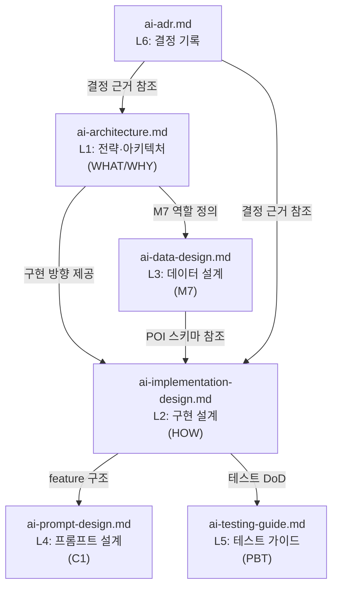

# AI 설계 문서 구조 (Design Artifacts)

> 본 디렉토리는 TripPilot AI 서비스의 **설계 정본**을 AI-DLC 구조로 정리한 것이다.
> 루트(`/`)에 있는 원본과 동일하며, aidlc-docs 내에서 참조 가능하도록 복사되어 있다.

---

## 문서 계층 구조

```
aidlc-docs/inception/design-artifacts/
+-- README.md                       <- 본 인덱스
+-- ai-architecture.md              <- L1: 전략·아키텍처 (WHAT/WHY)
+-- ai-implementation-design.md     <- L2: 구현 설계 (HOW)
+-- ai-data-design.md               <- L3: 데이터 설계 (M7)
+-- ai-prompt-design.md             <- L4: 프롬프트 설계 (C1 feature별)
+-- ai-testing-guide.md             <- L5: 테스트 가이드 (PBT·CI)
+-- ai-adr.md                       <- L6: 결정 기록 (ADR)
```

## 문서 간 의존 관계



## 문서별 역할과 읽는 시점

| 계층 | 문서 | 역할 | 읽어야 할 때 |
|---|---|---|---|
| L1 | ai-architecture.md | 전략·아키텍처 정본 | AI가 왜 이렇게 설계됐는지, 4대 불변식 이해 |
| L2 | ai-implementation-design.md | 구현 설계 (인터페이스·시퀀스·알고리즘) | 실제 코드 구조·인터페이스 설계 시 |
| L3 | ai-data-design.md | M7 데이터 계층 설계 | POI 스키마·후보 풀·캐싱 구현 시 |
| L4 | ai-prompt-design.md | C1 feature별 프롬프트 스펙 | LLM 프롬프트·OutputSchema 구현 시 |
| L5 | ai-testing-guide.md | PBT 속성·oracle·fake·CI | 테스트 코드 작성·CI 설정 시 |
| L6 | ai-adr.md | 아키텍처 결정 근거·이력 | 결정 배경 확인·새 결정 기록 시 |

## 외부 정본 참조

| 문서 (TripPilot 기획) | AI 관련 내용 |
|---|---|
| `../TripPilot/docs/planning/decisions.md` | ADR-0008·0009·0011·0015, D11·D25·D27·D31·D37·D38 |
| `../TripPilot/docs/planning/architecture.md` | 모듈 경계·의존 매트릭스·포트 격리 |
| `../TripPilot/docs/planning/nfr.md` | 성능(§1.1)·LLM 경계(§3.5)·PBT(§7) 기준 |
