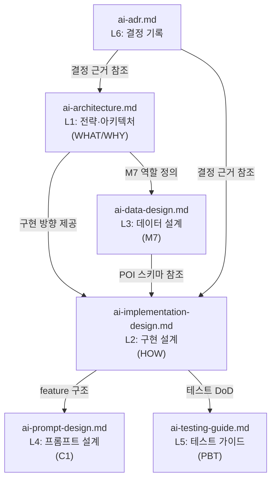

# AI 설계 문서 구조 (Design Artifacts)

> 본 디렉토리는 TripPilot AI 서비스의 **설계 정본**을 AI-DLC 구조로 정리한 것이다.
> 루트(`/`)에 있는 원본과 동일하며, aidlc-docs 내에서 참조 가능하도록 복사되어 있다.

---

## 문서 계층 구조

```
aidlc-docs/inception/design-artifacts/
+-- README.md                       <- 본 인덱스
+-- ai-architecture.md              <- L1: 전략·아키텍처 (WHAT/WHY)
+-- ai-implementation-design.md     <- L2: 구현 설계 (HOW)
+-- ai-data-design.md               <- L3: 데이터 설계 (M7)
+-- ai-prompt-design.md             <- L4: 프롬프트 설계 (C1 feature별)
+-- ai-testing-guide.md             <- L5: 테스트 가이드 (PBT·CI)
+-- ai-adr.md                       <- L6: 결정 기록 (ADR)
```

## 문서 간 의존 관계



## 문서별 역할과 읽는 시점

| 계층 | 문서 | 역할 | 읽어야 할 때 |
|---|---|---|---|
| L1 | ai-architecture.md | 전략·아키텍처 정본 | AI가 왜 이렇게 설계됐는지, 4대 불변식 이해 |
| L2 | ai-implementation-design.md | 구현 설계 (인터페이스·시퀀스·알고리즘) | 실제 코드 구조·인터페이스 설계 시 |
| L3 | ai-data-design.md | M7 데이터 계층 설계 | POI 스키마·후보 풀·캐싱 구현 시 |
| L4 | ai-prompt-design.md | C1 feature별 프롬프트 스펙 | LLM 프롬프트·OutputSchema 구현 시 |
| L5 | ai-testing-guide.md | PBT 속성·oracle·fake·CI | 테스트 코드 작성·CI 설정 시 |
| L6 | ai-adr.md | 아키텍처 결정 근거·이력 | 결정 배경 확인·새 결정 기록 시 |

## 외부 정본 참조

| 문서 (TripPilot 기획) | AI 관련 내용 |
|---|---|
| ~~`../TripPilot/docs/planning/{decisions,architecture,nfr}.md`~~ | **삭제됨 (2026-07-17)** — 아래 註 참조 |
| `../../../../aidlc/aidlc-docs/inception/` | 제품 요구사항·스토리·컴포넌트(C1–C17)·유닛(U0–U9) 현 정본 |

> **`aidlc-docs/planning/` 은 존재하지 않는다 (2026-07-17 팀 결정으로 삭제 — 루트 `CLAUDE.md` "never reference it").**
> 코드 체계별 현 소유자 (2026-08-25, TRIP-530 정정):
>
> | 코드 | 현 소유자 |
> |---|---|
> | `ADR-####` · `US-*` · `C1`–`C17` · `U0`–`U9` · `S1`–`S6` | `../aidlc/aidlc-docs/inception/` (requirements · user-stories · application-design) |
> | AI 축 결정 `AI-D0#` | 본 패키지 `ai-adr.md` (자체 소유) |
> | `D##` · `G###` · `M##` · `Δ#` · `N#` | **소유자 없음 — 역사적 코드.** 삭제된 planning 파일에 대해서만 해석되며 리포 어디에도 원문이 없다(`D38`·`G106`·`D27`·`D31`·`G181` 실측 확인). 근거가 필요하면 git 이력을 볼 것 |
>
> 아래 표기를 **결정 근거의 소재로 신뢰하지 말 것** — 인용 맥락 보존용으로만 남긴다.
