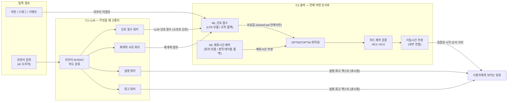
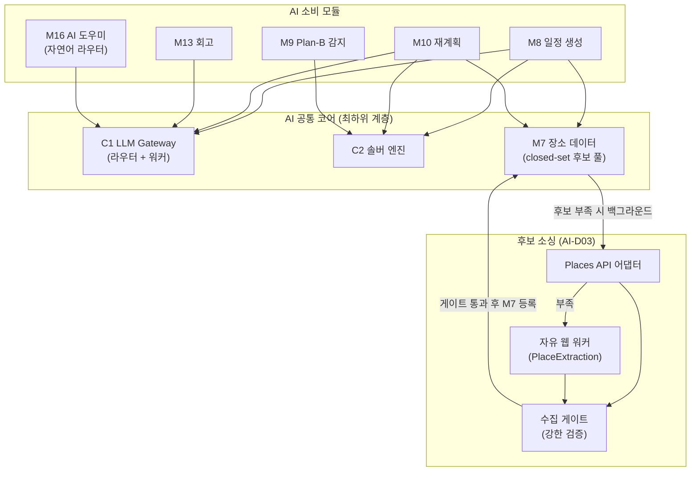
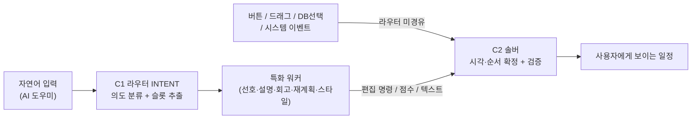

# TripPilot AI 아키텍처·전략

> 출처: TripPilot 기획 정본에서 2026-07-07 종합 — decisions.md(ADR-0008·0009·0011·0015, D11·D25·D27·D28·D29·D31·D37·D38, G106·G115·G181)·architecture.md(§1~§4)·nfr.md(§1.1·§3.5·§7)·aidlc(components.md, u5-itinerary/functional-design).
>
> ⚠️ **위 출처 경로(`aidlc-docs/planning/`)는 2026-07-17 팀 결정으로 삭제됐다** — 본 문서는 그 삭제 이전에
> 종합된 것이라 인용은 유효하나 **원문을 따라갈 수 없다**. 현 소유자는 §참고 문서 표의 註 참조 (TRIP-530).

이 문서는 TripPilot의 AI를 **하나의 관점으로 꿰는 전략 정본**이다. 제품 전반에 흩어진 AI 관련 결정(ADR·D)과 모듈(C1·C2·M7~M13·M16)을 모아 "TripPilot의 AI가 **무엇을 왜 그렇게** 하는가"를 규정한다.

모듈 경계·의존 매트릭스·포트 격리 같은 **구조적 상세는 architecture.md가**, 결정의 근거 전문은 decisions.md가, 성능·보안·테스트 기준은 nfr.md가 소유하며, 본 문서는 그것들을 AI 축으로 재구성하고 참조한다(정본 1소유자 원칙 — 중복 정의하지 않는다).

**적용 범위**: 1차 출시 AI 전반(일정 생성 U5·Plan-B 재계획 U6·회고/스타일 분석 U7·**AI 도우미 M16**, AI-D02). 후속 AI 기능은 §10 확장 여지.

---

## 1. AI가 푸는 문제와 설계 철학

### 1.1 AI의 임무

TripPilot의 AI는 '예약 다음'을 잇는 제품의 **중심축**이다. 세 가지를 푼다.

| # | 임무 | 담당 |
|---|---|---|
| 1 | 등록 숙소를 출발점으로 **실행 가능한 날짜별 일정**을 만든다 | 일정 생성 (U5 / M8) |
| 2 | 여행 중 변수(날씨·휴무·지연·체력)에 **Plan-B**를 제시한다 | 재계획 (U6 / M9·M10·M11) |
| 3 | 여행 후 기록을 **회고·스타일 분석**으로 남긴다 | 회고 (U7 / M13) |

여기에 **막힐 때 대화로 돕는** AI 도우미(M16)가 1차부터 얹힌다(§6.4, AI-D02).

### 1.2 핵심 철학 — "일정은 LLM 단독이 아니다" (ADR-0008)

TripPilot AI의 모든 설계는 하나의 결정에서 파생된다: **일정 생성은 LLM 단독이 아니다.** LLM은 영업시간·이동시간·시간 예산 같은 **하드 제약을 신뢰성 있게 만족시키지 못하며**, 없는 장소를 지어내거나(환각) 물리적으로 불가능한 시각을 자신 있게 제시한다. 실서비스(D01) 품질에서 이는 치명적이다.

> ADR-0008 결정 원문: "지도/장소/날씨 API와 규칙 기반 로직(이동 시간·운영 시간·동선 제약)을 **선연산**한 뒤, 그 결과를 바탕으로 일정을 구성한다. … 하드 제약은 결정론적 솔버가 보장."

그래서 TripPilot은 **LLM과 최적화 알고리즘(솔버)의 하이브리드**를 채택한다.



**분업의 원칙**: LLM은 **"무엇을 왜 고를지"**(취향 해석·선호 점수·설명)를, 솔버는 **"언제 어떤 순서로"**(선택·순서·시간 보장·검증)를 맡는다. 두 역할은 섞이지 않는다. 이 경계가 §3의 4대 불변식으로 강제된다.

---

## 2. AI 시스템 지도

AI는 두 공통 컴포넌트(C1·C2)와 이를 소비하는 기능 모듈로 구성된다. C1·C2·M7은 **어떤 기능 모듈에도 의존하지 않는 최하위 계층**이며, 그래서 여러 유닛(U5~U7, 후속 U9)이 재사용할 수 있다.

| ID | 컴포넌트 | AI에서의 역할 | 소비처 |
|---|---|---|---|
| **C1** | LLM Gateway | 단일 벤더 서버 경유 LLM 호출·**티어 라우팅·의도 라우팅(INTENT)·워커 디스패치**(AI-D02)·서버 재조회 컨텍스트 주입·출력 스키마 검증 | M8, M10, M13, M16 |
| **C2** | Solver Engine | OPTW/TOPTW 최적화·하드 제약 검증·이동시간 추정·결정론적 폴백 | M8, M9, M10, M18, (후속 M17) |
| M7 | Place Data | closed-set 후보 풀·POI 정본·영업시간·체류 기본값 공급·**웹 후보 소싱**(AI-D03) (LLM 그라운딩의 구조적 토대) | M8, M9, M10 |
| M8 | Itinerary Generation | 일정 생성 오케스트레이션(LLM 점수→솔버 배치) | — |
| M9 | Plan-B Detection | 자동 트리거 4종 감지 | — |
| M10 | Itinerary Recalculation | 재계획 후보 생성·검증 | — |
| M11 | Weather & Context | 기상청 예보·특보(트리거 입력) | — |
| M13 | AI Reflection | 회고·전체 요약·스타일 분석(상위 티어 LLM) | — |
| M16 | AI 도우미 | **자연어 의도 라우터 + 워커 디스패치**(통역·중개, 결정권 없음 — AI-D02·ADR-0015) | — |



> **역의존 방지**: C1·C2는 기능 모듈을 모른다. C1의 서버 재조회(D31)조차 호출자가 넘긴 조회 콜백/참조 해석기로 수행해 최하위 계층을 유지한다. 이 덕분에 LLM 벤더 교체·솔버 알고리즘 교체가 소비 모듈에 무영향이다(§10의 C1 프로세스 분리 여지도 여기서 나온다).

### 2.1 라우터 + 특화 워커 (AI-D02)

자연어 입력(**AI 도우미** 사이드 패널)에 한해 C1은 **2단 구조**로 동작한다.

- **라우터(의도 파악)** — C1 `INTENT` feature(경량 티어). 자연어의 의도를 분류하고 슬롯을 추출해 **어느 워커(들)를 부를지** 정한다.
- **특화 워커** — PreferenceScoring·Explanation·Reflection·재계획 사유 해석·스타일 분석. 각자 프롬프트·스키마·티어 고정. **"판단·생성"만** 한다.
- **솔버(C2)는 워커가 아니다** — 결정론 유지. 시각·순서 확정은 솔버 단독(INV-2). AI는 "무엇을", 솔버는 "몇 시에·어떤 순서로".



버튼·드래그·DB선택·시스템 이벤트는 라우터를 **거치지 않고** 기존 결정론 파이프라인으로 직행한다. 즉 **라우터는 자연어 진입에서만** 산다(AI-D02).

> **오타·엔티티(AI-D04)**: 의도·자유문장 오타는 라우터 LLM이 흡수하고, 지역·POI명은 **결정론 fuzzy match**로 해소한다 — 별도 교정 agent 없음, 애매하면 확인, 미해소는 웹 소싱(AI-D03)으로.

---

## 3. 역할 분담을 강제하는 4대 불변식

LLM과 솔버의 경계는 "권장"이 아니라 **구조로 강제되는 불변식**이다. 이를 어기는 설계는 재설계 대상이며, 각 불변식은 속성 기반 테스트(§8)로 검증한다.

### INV-1. closed-set 그라운딩 — LLM은 후보 풀 안에서만 선택한다

LLM은 M7이 만든 **후보 POI ID 집합(closed-set)** 안에서만 점수를 매기고 선택한다. 후보 밖 ID는 C1 출구에서 **드롭·계측**되어 최종 출력에 절대 포함되지 않는다(환각 0). 프롬프트로 "지어내지 마"라고 부탁하는 방식이 아니라 **출력 스키마 검증 + ID 화이트리스트 교차**로 구조적으로 보장한다. **웹서치 소싱(AI-D03)** POI도 예외가 아니다 — 수집 게이트를 통과해 M7에 등록된 뒤에만 후보가 되며, **웹 원본이 직접 후보가 되지 않으므로** closed-set은 유지된다.
- 근거: G115(POI 그라운딩 closed-set), AI-D03(웹 소싱은 게이트 경유 M7 등록 후에만 후보화), nfr.md §3.5, INV-SLOT1/INV-SCORE1, 속성 U5-P5(적대적 LLM 응답 오염에도 출력 POI ⊄ 후보 풀 = 0)

### INV-2. 솔버 검증값만 노출 — 사용자가 보는 시각·순서는 LLM이 만들지 않는다

사용자에게 보이는 **모든 시각·순서·이동 거리는 C2가 검증한 값**이다. LLM이 생성한 설명·이유는 표시용이며, 설명과 검증값이 불일치하면 **검증값이 우선**한다. LLM은 "추천 이유"를 쓸 뿐 "몇 시에 간다"를 정하지 않는다. **멀티 에이전트에서도 동일** — 라우터·워커는 **제안만** 반환하고, 확정은 반드시 솔버 `validate`/`solve`를 거친다(AI-D02). AI 도우미가 "사용자 대신 반영"해도 시각·순서는 솔버가 정한다.
- 근거: ADR-0008(사용자에게 보이는 시각·이동시간은 솔버 검증값만), AI-D02(라우터·워커 제안만·확정은 솔버), INV-SLOT2, PRD 06-5

### INV-3. 소요시간 미표시 — 거리만, 추정으로 (D25 / Δ1)

실시간 경로 API가 없으므로 이동시간 추정은 본질적으로 부정확하다. 따라서 **어떤 화면·알림·DTO에도 예상 소요시간을 표시하지 않고**, 거리·이동 수단만 범위/추정으로 고지한다. 소요시간 값은 C2 내부 계산 전용이며, 표시 DTO 스키마에 소요시간 필드가 **부재함을 정적으로 보장**한다.
- 근거: D25/Δ1, ADR-0009, INV-TRAVEL1, 속성 U5-P4(표시 DTO에 internalDuration 미포함)

### INV-4. 결정론적 폴백 — AI가 실패해도 침묵하지 않는다 (ADR-0011)

LLM·외부 API·솔버 어느 것이 실패해도 사용자는 **관찰 가능한 대체 경로**를 받는다. 핵심은 **결정론적 솔버 모드** — LLM 점수가 없어도 규칙 기반 점수로 유효한 일정을 만든다. 동일 입력은 동일 출력을 낸다(무작위성 제거·시드 고정). 멀티 에이전트가 늘린 실패 지점도 각자 폴백을 소유한다 — **라우터 실패** 시 기본 의도(일정 생성)/수동 편집 경로로, **특정 워커만 실패** 시 그 워커 몫만 규칙 기반 폴백(나머지 워커·솔버는 정상)한다(AI-D02).
- 근거: ADR-0011(침묵 실패 금지), D38, AI-D02(라우터·워커 폴백), INV-SOLVE2, 속성 U5-P3. 상세 폴백 계단은 §7.

---

## 4. C1 LLM Gateway — 판단·해석 계층

### 4.1 책임

- 단일 벤더 LLM을 **서버 경유 단일 경로**로 호출(D11) — 클라이언트 직접 호출 금지
- **티어 라우팅**(§4.2)
- **의도 라우팅·워커 디스패치**(AI-D02) — 자연어 진입에 한해 `INTENT` feature로 의도를 분류하고 특화 워커를 호출·조립. 버튼·이벤트 진입은 라우터 미경유
- **출력 스키마 검증 + closed-set 교차**(INV-1) — 검증 실패 시 폴백 신호 발행
- **서버 재조회 컨텍스트 주입**(D31) — 컨텍스트를 클라이언트 입력에 의존하지 않고, 클라이언트는 ID만 전달하며 서버가 요청자 권한으로 재조회해 주입. 타 계정 데이터·내부 운영 지표(제휴 수수료 등)는 애초에 LLM 입력에 미포함
- 사용자별 **rate-limit**(전역 레이트리미터 재사용, nfr.md §3.2)

### 4.2 모델 티어 전략 (D11)

기능 성격에 따라 두 티어로 분리해 비용과 품질을 맞바꾼다.

| 티어 | 용도 | 이유 |
|---|---|---|
| **경량** | 취향 해석·선호 점수(생성), 재질의(어시스턴트) | 고빈도·구조화 출력 — 저비용 우선. 전 일자 공용 1회 호출로 호출 수 최소화 |
| **상위** | 회고·전체 요약·추천 이유 설명 | 저빈도·서술 품질 중요 — 상위 모델. 비동기 생성이라 사용자 대기 미차단 |

### 4.3 보안·권한 경계 (SECURITY-11 / D31)

LLM에 넘기는 컨텍스트는 **목적 최소화**(G181)한다. 타 사용자 비공개 데이터·내부 지표는 프롬프트 거절에 의존하지 않고 **주입 단계의 권한 경계(서버측 필터)로 구조 차단**한다 — 애초에 LLM 입력에 포함하지 않아 프롬프트 주입으로 우회할 수 없다(D31, ADR-0015 계승). 국외 벤더 사용 시 개인정보 국외 이전·처리위탁 고지가 선결 과제(P6, G181).

### 4.4 배포 형태 — 독립 Python AI 서비스 (D11 분기)

AI 코어(C1 LLM 게이트웨이 + C2 솔버)는 **독립 Python AI 서비스**로 구축한다. TripPilot Kotlin 백엔드(M8·M9·M10)가 이 서비스를 API로 호출한다.

> **D11 대비 분기(중요)**: D11 원안은 C1만 프로세스 분리 여지를 두고 **C2(솔버)는 Kotlin 인프로세스로 유지**하도록 규정했다. AI를 전면 Python으로 개발하는 결정에 따라 C2도 Python AI 서비스로 이동하며, 이는 D11과 갈라진다. 결과로 M8→C2가 인프로세스 호출이 아니라 **서비스 간 호출**이 되므로 — (a) C2 앞에도 타임아웃·서킷 브레이커 필요(§5.4), (b) 지연 예산에 네트워크 홉 반영, (c) TripPilot 백엔드팀과 D11 개정으로 정합 필요. 결정 기록: [ai-adr.md](./ai-adr.md) AI-D01.

---

## 5. C2 Solver Engine — 선택·순서·시간 보장 계층

### 5.1 최적화 문제

여행 일정은 **시간창이 있는 순회 최적화(OPTW/TOPTW — Orienteering Problem with Time Windows)**로 모델링한다. 등록 숙소를 공간 앵커로, 취향 선호 점수를 수집하며 하드 제약을 만족하는 방문 순서·시각을 찾는다.

- **목적함수(소프트)**: LLM 선호 점수를 보상값으로 최대화 + **예산 소프트 가중치**(저예산일수록 저비용 카테고리 보상 증가). 예산은 하드 제약이 아니라 LLM 추천 소프트 가중치 + 숙소 필터 상한이며, 예산 초과 배치를 하드 차단하지 않는다(G37/G47, INV-SOLVE3)
  - **선호 점수는 ML 도입 1순위**(추천/LTR, AI-D05) — soft 보상값이라 솔버 하드 제약과 무관. LLM/규칙은 폴백.

**소프트 보정항 4종 (2026-08-25 추가 — 구현 정본 `solver_engine/config.py`)**: 선호 점수 위에 얹히는 결정론
가감점이다. 전부 **하드 제약이 아니다** — 재료가 없거나(풀에 식당 0개, `daily_rain_prob=None`, 행사 0건) 한쪽으로
치우친 풀에서도 일정은 나온다("정보 없음 ≠ 배제"). 가중 단위는 선호 점수와 같은 축(`score ∈ [0,1]`)이고, 크기는
전부 **"한 단 미만"** 으로 잡혀 있다 — 취향 점수 갭이 한 단(≥0.3) 이상이면 점수 서열이 그대로 이기고, 동률·근소
갭에서만 보정이 개입한다.

| 보정항 | 근거 | 규칙 | 크기 |
|---|---|---|---|
| 식사 시간대 | TRIP-379 | 점심 11:00~14:00 · 저녁 17:00~20:00 창에 `FOOD` 1개 배치 시 창당 보상, 창 밖 `FOOD`·`FOOD` 연속 배치는 건당 억제 | bonus 0.3 / penalty 0.2 |
| 우천 | TRIP-383 | 해당 날짜 강수확률이 `rain_threshold_pct` 이상이면 실외(`NATURE`·`NIGHT_VIEW`·`ACTIVITY`) 억제 · 실내(`CULTURE`·`CAFE`·`SHOPPING`) 소폭 보상. `FOOD`·`SIGHT`·`STAY`는 중립 | penalty 0.2 / bonus 0.1 |
| 행사 근접 | TRIP-421 | 행사 적합도×거리감쇠 `[0,1]` 에 스케일을 곱해 가점. **양수만 — 감점 경로 없음** | scale 0.15 |
| 일별 동일 카테고리 체감 | TRIP-531 | 하루 같은 카테고리 `category_free_count` 개까지 무페널티, 초과 1개당 감점 (편중 풀의 FOOD 7연속류 억제). 식사 보정과 직교 — 그쪽은 시각·인접, 이쪽은 **개수** | free 2 / 초과당 0.3 |

> ⚠️ **강수 임계 80 vs 60 — 다른 개념이다(혼동 주의)**:
> - **80** = Plan-B **트리거** 임계 (§6.2 (a)). "여행자에게 대안을 제안할 만큼 비가 확실한가"를 묻는다.
>   코드 정본은 `providers/weather.py::PRECIPITATION_TRIGGER_THRESHOLD = 80`.
> - **60** = 위 표 우천 보정의 **목적함수 임계** (`solver_engine/config.py::rain_threshold_pct = 60`).
>   "이 날 실내를 조금 더 선호할 것인가"를 묻는다. 알림을 띄우지 않고 배치 선호만 기울인다.
>
> 트리거보다 낮게 잡힌 것이 의도다 — 알릴 정도는 아니지만 기울일 만한 구간(60~80%)을 목적함수가 흡수한다.
> **한쪽을 다른 쪽 값으로 맞추지 말 것.**

### 5.2 하드 제약 4종 (위반 배치는 해에서 구조적으로 배제)

| ID | 제약 | 내용 |
|---|---|---|
| HC1 | 영업시간 | 방문은 POI 영업시간 내 배치 |
| HC2 | 이동 부등식 | `직전 endAt + 이동시간 ≤ 다음 startAt` |
| HC3 | 고정 블록 불가침 | 등록 숙소·시각 고정 필수 방문지의 시각 불변 |
| HC4 | 시간창 | 날짜별 이용 가능 시각(기본 09:00~21:00, D29) 귀속, 자정 초과=시작일(논리적 하루) |

- **CI 게이트**: 하드 제약 검증 테스트는 100% 통과 필수(머지 차단, G114). 소규모 인스턴스는 **무차별 대입(oracle)으로 이중 대조** — 유효 배치를 부당 배제하지 않고 위반 배치를 통과시키지 않음을 확인(속성 U5-P1)

### 5.3 이동시간 추정 (ADR-0009)

실시간 경로 API 없이, **도로 거리 우선 + 이동 수단별 안전계수**로 추정한다.

- **산출**: 도로 거리(가용 시) 우선 → 직선거리만 있으면 **우회계수 1.3** 보정 → 이동 수단별 **안전계수**(대중교통 ×1.5·도보 ×1.4, 대기·환승·신호 흡수) 적용. 어댑터 순서: **TMAP(1차 실측) → 하버사인 직선거리 추정(2차 폴백)** — 2단 (`solver_engine/adapters/tmap.py` · `chained_travel.py`, TRIP-382·405·422·432). 카카오모빌리티·네이버는 도입된 적이 없다(2026-08-25 정정)
- **이동 파라미터 초기값(G106, remote config)**: 대중교통 ×1.5 · 도보 ×1.4 · 우회계수 1.3 · **솔버 내부 버퍼 15분** · **자동 지연 트리거 30분**
- 추정은 부정확하므로 **단일값이 아닌 범위/추정으로** 다루고, 솔버 시간창에 안전 마진(버퍼)을 두며, 자동 트리거 임계를 오차 위(30분)로 설정한다(§6.2). 실제 길안내는 외부 지도 앱에 위임(ADR-0012)
- **결정성**: 동일 (from, to, mode, 파라미터)는 동일 출력, 라우팅 실패 시 직선거리 폴백+추정 플래그(속성 U5-P4)

### 5.4 결정론적 폴백

C2는 **결정론 코어**다 — 동일 입력이 동일 출력을 낸다. LLM 점수가 없으면 규칙 기반 점수로, TMAP 실측이 실패하면 내부 하버사인 직선거리 폴백으로 **일정 생성을 지속**한다. '해 없음/시간 초과'는 부분 초안 저장 + '이어서 생성'으로 우아하게 저하한다. C2는 **독립 Python AI 서비스**로 배포되며(§4.4, D11 분기), Kotlin 백엔드에서 서비스 간 호출로 접근하므로 C2 앞에도 타임아웃·서킷 브레이커를 둔다(과거 '인프로세스라 외부 다운 없음' 전제는 폐기).

---

## 6. 기능별 AI 파이프라인

### 6.1 일정 생성 (U5 / M8) — 제품의 심장

**파이프라인**: 컨텍스트 로드 → M7 closed-set 후보 풀(부족 시 웹 소싱 백그라운드 보강, AI-D03) → **C1 LLM 선호 점수(경량 티어, 전 일자 1회)** → **C2 솔버 배치(day별)** → 첫 1일 우선 반환 → 백그라운드 잔여 일자.

| 단계 | 내용 | 근거 |
|---|---|---|
| 점진 노출 | **첫 1일 5초 내** 우선 노출, **전체 20초** 한계, 단계·진행률 표시 | D38, nfr §1.1 |
| LLM 호출 | 경량 티어, 전 일자 공용 1회(타임아웃 2.5초, 초과 시 규칙 점수 폴백) | D11 |
| 취소 | 부분 일정 초안 보존 + '이어서 생성' | G161 |
| 생성 3방식 | 완전 AI / 같이 고르기(슬롯 단위) / 직접 만들기 | US-E5-10 |
| 숙소 나중 등록 | 동선 무게중심으로 숙소 권역 추천(무숙소 초안→등록→재정렬) | US-E5-11 |
| 후보 부족 보강 | Places API 우선→부족 시 자유 웹 워커, 수집 게이트 경유 M7 등록, **백그라운드**(생성 미차단) | AI-D03 |

상세 플로우(FLOW-1~5)·예외는 `../TripPilot/aidlc/aidlc-docs/construction/u5-itinerary/functional-design/business-logic-model.md` 참조.

### 6.2 Plan-B 재계획 (U6 / M9·M10·M11)

**감지(M9)**: 자동 트리거 4종을 하이브리드로 감지(D27)하되, **제안만** 한다(자동 변경 없음).

| 트리거 | 감지 방식 | 임계(기본, remote config) |
|---|---|---|
| (a) 날씨 | 서버 폴링(M11, 1시간) | 강수확률 **80%**↑ 또는 기상특보 (2026-08-25 정정 — 코드 정본 `providers/weather.py::PRECIPITATION_TRIGGER_THRESHOLD = 80`) |
| (b) 휴무·영업시간 | 서버 배치(M7, 당일 아침) | 변경 감지 |
| (c) 이동 지연 | 클라이언트 포그라운드 | 계획 대비 **30분 초과**(추정 오차 마진 위, G106) |
| (d) 체류 초과 | 클라이언트 포그라운드 | 20분 초과로 고정 일정 위협 |

- 빈도 상한(시간당 2회/하루 8회)·민감도 3단계·무시 학습 억제 — 전부 remote config
- **허위 알림 금지**: 외부 API 무응답 시 자동 알림을 **침묵**시키고 수동 경로만 유지("잘못된 정보로 행동 유도 금지" — 침묵 실패 금지의 정신)

**재계획(M10)**: 사유 해석(C1) → 후보 소싱(M7, 저장 장소 우선·RAG 그라운딩) → **C2 하드 제약 검증** → 후보 2~3개(10초 목표) → 전/후 비교 → 확정 시점 **솔버 재검증 1회** → current 갱신. 등록 숙소는 항상 불변 고정 제약(Plan-B는 예약 변경이 아니라 실행 보조 — ADR-0006). 워크로드 등급은 High(수동 수정 폴백 존재, nfr §2.1).

### 6.3 회고·스타일 분석 (U7 / M13)

- **당일 회고**: 일자 경계 트리거, 방문 수·이동 거리·사진·변경 이력 기반 초안 자동 생성(**상위 티어** C1). 수정본은 원본과 별도 저장.
- **전체 요약**: 여행 종료 트리거, 지도 히어로 + 통계 + 날짜별 하이라이트.
- **여행 스타일 분석**: **누적 방문 ≥ 10곳 단일 게이트**, 온보딩 취향 7종 축 택소노미로 분류. 미달 시 취향 기반 '임시 미리보기'(정식 아님 명시).
- **근거 그라운딩**: 회고는 실제 기록 데이터에 근거하며 없는 내용을 지어내지 않는다(nfr §7.5 #8).
- **폴백**: 생성 실패 시 '방문 N곳·이동 Nkm·사진 N장' **기본 카드** 제공, 사용자가 직접 작성 가능.

### 6.4 AI 도우미 (M16) `[1차 승격 — AI-D02]`

와이어프레임의 일정 편집(버튼·드래그앤드롭·DB선택) **옆에 붙는 사이드 패널**이다. 자연어 요청을 해석해 기존 모듈(M3·M8·M10)과 솔버를 **호출·조립·설명**한다. 핵심 원칙(ADR-0015): **통역·중개자이지 결정권자가 아니다.**

**동작 구조 (라우터 → 워커 → 솔버)**:
1. **라우터**(C1 `INTENT`, 경량): 자연어 의도 분류 + 슬롯 추출 → 워커 디스패치
2. **특화 워커**: 의도에 맞는 판단·생성(후보 재점수·사유 해석·설명 등)
3. **편집 명령 번역**: 워커 산출물을 **버튼·드래그가 쓰는 것과 동일한 편집 명령**으로 만들어, 동일한 솔버 검증 경로(`validate_edit`/`apply_edit`)로 흘려보낸다. **별도 반영 로직 없음** — AI는 "무엇을", 솔버가 "몇 시에·어떤 순서로".

**반영 방식 — 하이브리드 (AI-D02)**:

| 편집 성격 | 반영 | 예시 |
|---|---|---|
| 추가·경미한 조정 | **자동반영 + 되돌리기**(changelog) | "저녁 맛집 하나 넣어줘" |
| 삭제·대규모 재배치·Plan-B | **제안·확인 필수**(사용자 명시적 적용) | "이 날 통째로 다시 짜줘" |

- 실현가능성 판단·최종 시각·순서 확정을 **단독으로 내리지 않는다** — 전부 솔버 소유·검증값 인용(미검증 수치 생성 금지). 자동반영이라도 **솔버 검증을 반드시 거치므로 불가능한 일정은 나오지 않는다**(INV-2).
- dead-end 금지(모든 응답에 다음 행동 1개), 가드레일(역할 변경·지시 유출·유해 요청 거절, LLM rate-limit)
- **성능 목표**: 첫 응답 3초·전체 15초 타임아웃(nfr §1.1)
- **폴백**(INV-4): 라우터 실패 → 기본 의도/수동 편집, 워커 부분 실패 → 그 워커만 규칙 폴백(§7)

---

## 7. 폴백·복원력 — 침묵 실패 금지 (ADR-0011)

AI는 외부 데이터·LLM·솔버에 구조적으로 종속되므로, 각 기능은 **자기 폴백 계단**을 소유한다. 일정 생성(M8)의 계단이 시스템에서 가장 깊다.

| 실패 지점 | 폴백 | 사용자 고지 |
|---|---|---|
| LLM 점수 실패 | 규칙 점수 기반 **결정론적 솔버 모드** | "일부 추천이 기본 모드로 생성" |
| LLM 설명만 실패 | 일정은 정상 제공 | "추천 이유를 불러오지 못했어요" |
| POI·영업시간·거리 API 실패 | 캐시·직선거리 추정으로 결정론적 생성 지속 | "일부 정보 미확인" |
| 웹 소싱(Places API·자유 웹) 실패 | 현재 DB 후보로 정상 진행(보강만 보류) | (표시 없음 — 생성 무영향) |
| 전체 20초 초과 | 잔여 결정론 단독 모드 완성 | DETERMINISTIC_ONLY 고지 |
| 모든 경로 실패 | 숙소 + 시각 고정 필수 방문지만의 **최소 일정** | "다시 시도"(MINIMAL_ONLY) |
| Plan-B 대안 0개 | 건너뛰기 / 휴식 모드 / 수동 수정 진입 | 사유 한 줄 |
| Plan-B 외부 API 오류 | 수동 일정 수정 화면(숙소 제약은 수동에서도 위반 차단) | 누락 데이터 표기 |
| AI 도우미 라우터 실패 | 기본 의도(일정 생성)로 결정론 진입 · 버튼/수동 편집 경로 유지 | "지금은 직접 편집으로 진행" |
| 특화 워커 부분 실패 | 그 워커 몫만 규칙 기반 폴백(나머지 워커·솔버 정상) | 해당 항목만 "기본 모드" 표기 |
| 회고 생성 실패 | 통계 기본 카드 | 사용자 직접 작성 가능 |

**공통 원칙**: 폴백은 침묵 실패 없이 최소 일정까지 도달하고(INV-SESS4), 실패 자체는 관측 지표로 계측한다(§9, nfr §4). 핵심 여정은 LLM·어시스턴트 없이도 완결된다 — AI 실패가 여정을 인질로 잡지 못한다. 전 외부 호출에 타임아웃 + 서킷 브레이커 + 우아한 성능 저하(RESILIENCY-10).

---

## 8. 품질 보증 — AI를 신뢰할 수 있게 만드는 법

실서비스(D01) 품질에서 AI의 하드 제약과 상태 머신은 **속성 기반 테스트(PBT) 1급 대상**이다(전체 강제, PBT-01). U5에서 식별한 속성 12개(C2: 5 · C1: 2 · M8: 5)가 AI 코어를 방어한다.

| 속성 | 방어 대상 | AI 불변식 |
|---|---|---|
| U5-P1 | C2 하드 제약 4종 + **oracle 대조** | INV-2 (검증값만) |
| U5-P3 | 폴백 모드 결정성(동일 입력→동일 출력) | INV-4 (결정론 폴백) |
| U5-P4 | 이동 추정 결정성 + 소요시간 표시 게이트 | INV-3 (소요시간 미표시) |
| U5-P5 | closed-set 그라운딩(적대적 오염에도 환각 0) | INV-1 (그라운딩) |
| U5-P2 | warm-start 고정 블록 보존·멱등 | HC3 |
| U5-P6 | 예산 소프트 가중치 단조성(하드 차단 아님) | 목적함수 |
| U5-P7~P10 | plan 불변성·current 분리·상태 전이·직렬화 왕복 | 일정 상태 머신 |

- **계층 분리 테스트(D37)**: PR CI는 LLM·외부 API를 모킹(어댑터 Port fake), **솔버·하드 제약 검증은 실코드**로 테스트한다. **실 LLM 회귀 평가는 릴리스 파이프라인에서만** 수행한다.
- **oracle 테스트**: C2는 소규모 인스턴스에서 무차별 대입 전수 열거로 해를 이중 확인한다(부당 통과 0·부당 배제 0).
- **테스트 철학**: LLM이 만든 문장의 표현 품질을 절대 평가하지 않는다(nfr §7.7). 검증 대상은 "사용자에게 도달한 결과가 필수 조건(그라운딩·무충돌·폴백 복구)을 충족했는가"다(nfr §7.4).

---

## 9. 비용·성능·관측

AI는 반복적 외부 호출(LLM·지도·날씨)로 비용·rate-limit·배터리에 직결되므로 상한을 둔다.

| 축 | 정책 | 근거 |
|---|---|---|
| **지연 예산** | 생성 첫날 5초·전체 20초 · Plan-B 10초 · 어시스턴트 첫 3초/전체 15초 · LLM 호출 타임아웃 2.5초 | D38, nfr §1.1 |
| **LLM 호출 최소화** | 전 일자 공용 1회 점수 호출, 티어 분리로 상위 모델은 저빈도만 | D11 |
| **rate-limit** | 사용자별 호출 상한·과도 연속 호출 차단(전역 레이트리미터 재사용) | SECURITY-11, nfr §3.2 |
| **캐싱** | POI 정본은 약관 허용 TTL 캐시(가격은 캐싱 금지), 날씨는 폴링 주기 정합 TTL | D13, G195 |
| **Plan-B 폴링 상한** | 날씨 1시간·휴무 당일 아침 1회, 빈도 상한·민감도로 조절 | D27, G58 |
| **규모 가정** | DAU 1천 / **동시 일정 생성 10건** / 지역당 POI 후보 5천(MVP 검증 규모) | G142 |
| **관측** | LLM 비용 계측 메트릭·외부 API 쿼터 80% 알람·어댑터 실패율/서킷 오픈·**Places API 쿼터·웹 소싱 비용·게이트 격리율**(AI-D03) (침묵 실패 계측) | shared-infrastructure §8(A11·A12), nfr §4 |

LLM API 키는 Secrets Manager(U5 확정), 비용 대시보드는 CloudWatch `ops` 대시보드의 확장 슬롯으로 예약되어 있다.

---

## 10. 후속 확장 여지

1차는 AI 코어(C1·C2)를 프로덕션 품질로 완성하고, 후속 AI 기능이 **아키텍처를 재설계 없이** 얹히도록 여지를 확보한다.

| 후속 | 1차 선반영 | 재설계 없이 가능한 이유 |
|---|---|---|
| **C1·C2 Python AI 서비스** | 처음부터 독립 Python 서비스로 구축(D11 분기 — ai-adr.md AI-D01) | Kotlin 백엔드는 API 클라이언트 · C2도 Python(과거 Kotlin 인프로세스 전제 폐기) |
| 추가 워커·다중 벤더(M16 확장) | C1 라우터/워커 디스패치·티어 라우팅(AI-D02) | 새 의도→새 워커 등록만, 라우터·솔버 무변경 |
| 공동편집 AI 재검증(M17) | C2 `validate` 재사용 | 모든 편집이 이미 솔버 재검증 경유 |
| ML 도입(선호점수·체류시간, AI-D05) | soft 신호 계층 + 규칙 폴백 이미 존재 | ML은 규칙 위에 얹힘·실패 시 폴백, 솔버 하드 제약 무변경 |

### 10.1 M16 AI 도우미 확장 설계 여지

M16 AI 도우미는 **1차 범위로 승격**됐다(AI-D02). C1 위에 얹히는 순수 소비자 계층이라, 이후 확장(새 의도·새 워커·다중 벤더)도 **라우터에 의도→워커 매핑을 추가**하는 것으로 끝난다 — 솔버·기존 워커는 무변경.

```
사용자 자연어 입력
        |
        v
+------------------+
|   M16 Assistant  |  <-- 통역·중개만. 결정권 없음
|  (C1 소비자)     |
+------------------+
        |  해석된 의도 + ResourceRef
        v
+------------------+     +------------------+
|   C1 LLM GW      | --> |   C2 Solver      |
|  (판단·해석)     |     |  (검증·확정)     |
+------------------+     +------------------+
        |                        |
        v                        v
   추천 이유 텍스트          검증된 시각·순서
        |________________________|
                   |
                   v
           사용자에게 보이는 응답
```

**M16 가드레일 (ADR-0015)**:
- 미검증 수치(시각·거리) 직접 생성 금지 — C2 검증값만 인용
- 제안 변경은 사용자 명시적 적용 후 M8/M10 재검증 경유
- 모든 응답에 다음 행동 1개 포함(dead-end 금지)
- 역할 변경·지시 유출·유해 요청 거절(시스템 프롬프트 가드레일)

### 10.2 LLM 계층 분리 시점 판단 기준

C1을 별도 파이썬 서비스로 분리하는 시점은 다음 중 하나가 충족될 때다:

| 트리거 | 기준 |
|---|---|
| 모델 다양화 | 벤더 2개 이상 동시 운용 필요 |
| 프롬프트 실험 빈도 | 주 2회 이상 프롬프트 변경 배포 |
| LLM 전용 스케일링 | 솔버(C2)와 독립 스케일 필요 |
| 팀 분리 | AI 전담 팀이 별도 배포 주기 요구 |

분리 전까지는 C1 인터페이스를 **프로세스 경계로 설계**만 해두고 인프로세스로 유지한다.

---

## 11. 미해결·선결 과제

| # | 과제 | 상태 |
|---|---|---|
| P6 | LLM 벤더 **계약·비용 산정** + 개인정보 국외 이전·처리위탁 고지 문안(G181) | 출시 선결(비개발) |
| — | Places API 벤더 + 자유 웹 스크래핑·저장 **약관 검토**(가격 미캐싱) | 웹 소싱(AI-D03) 선결 |
| — | 구체 LLM 벤더·모델명 | **운영 결정 미확정** — D11은 "단일 관리형 벤더·티어 2종"까지만 확정 |
| — | C1의 별도 서비스(파이썬) 분리 시점 | 후속 여지 — 1차는 인터페이스만 프로세스 교체 가능하게 유지(D11) |
| — | 체류 시간 정적 테이블(카테고리 20~30종) 실측 보정 | 출시 후 보정(G51) |
| — | 이동 안전계수·자동 트리거 임계 초기값(G106) | remote config, 실측 후 튜닝 |
| — | 데이터 커버리지 정량 게이트(좌표 95%·영업시간 70%) | 출시 게이트(G192) — AI 감지 범위는 커버리지에 비례 |

> **정합성 메모(해결됨)**: 이동 지연 트리거 임계는 decisions.md **G106의 30분이 정본**이다(15분은 솔버 내부 버퍼값이며 트리거 임계가 아니다). 2026-07-07 기준 TripPilot 원본에서 트리거를 15분으로 잘못 적은 6개 문서(architecture.md·flows.md·services.md·components.md·u6-execution.md 2종)를 30분으로 정정 완료. "버퍼 15분"·"A10 잡 적체 >15분"은 별개 값이라 유지.

---

## 12. 더 읽을 문서 (TripPilot 기획 정본)

| 문서 | 내용 |
|---|---|
| ~~../TripPilot/aidlc/aidlc-docs/planning/{architecture,decisions,nfr,overview,epics}.md~~ | **삭제됨 (2026-07-17)** — 아래 註 참조 |
| ../aidlc/aidlc-docs/inception/requirements/requirements.md | 제품 요구사항 정본 |
| ../aidlc/aidlc-docs/inception/application-design/ | 컴포넌트 C1–C17 · 서비스 S1–S6 · 유닛 U0–U9 |
| ../aidlc/aidlc-docs/inception/user-stories/ | 페르소나·스토리 (US-*) |

> **`aidlc-docs/planning/` 은 존재하지 않는다 (2026-07-17 팀 결정으로 삭제 — 루트 `CLAUDE.md` "never reference it").**
> 코드 체계별 현 소유자 (2026-08-25, TRIP-530 정정):
>
> | 코드 | 현 소유자 |
> |---|---|
> | `ADR-####` · `US-*` · `C1`–`C17` · `U0`–`U9` · `S1`–`S6` | `../aidlc/aidlc-docs/inception/` (requirements · user-stories · application-design) |
> | AI 축 결정 `AI-D0#` | 본 패키지 `ai-adr.md` (자체 소유) |
> | `D##` · `G###` · `M##` · `Δ#` · `N#` | **소유자 없음 — 역사적 코드.** 삭제된 planning 파일에 대해서만 해석되며 리포 어디에도 원문이 없다(`D38`·`G106`·`D27`·`D31`·`G181` 실측 확인). 근거가 필요하면 git 이력을 볼 것 |
>
> 아래 표기를 **결정 근거의 소재로 신뢰하지 말 것** — 인용 맥락 보존용으로만 남긴다.
| ../TripPilot/aidlc/.../u5-itinerary/functional-design/business-logic-model.md | 일정 생성 FLOW-1~5·PBT 속성 상세 |
