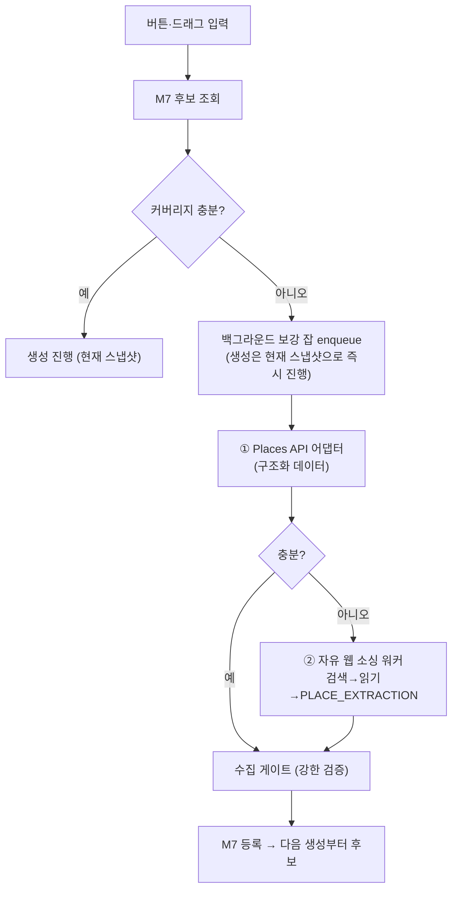
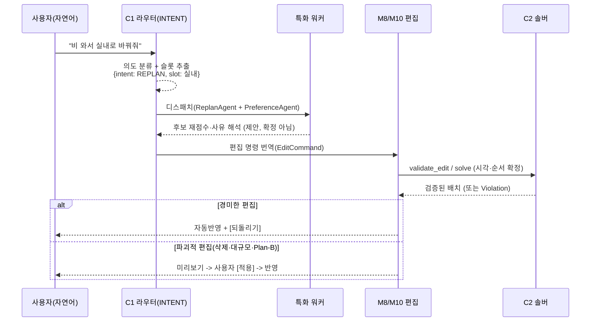

# TripPilot AI 구현 설계

> 짝 문서: [ai-architecture.md](./ai-architecture.md)(전략·원칙). 본 문서는 그 위의 **구현 설계(HOW)** 다 — 인터페이스 계약·시퀀스·알고리즘·테스트 DoD.
> 출처: TripPilot 기획 정본(../TripPilot/aidlc/aidlc-docs/inception/application-design/component-methods.md·components.md·services.md, construction/u5-itinerary)에서 2026-07-07 종합.
> 표기: `[정본]` = TripPilot 문서에 명시된 계약 · `[설계권고]` = 문서에 없어 본 문서가 제안하는 구현 방식(착수 시 확정 대상).

---

## 1. 인터페이스 계약 (공개 퍼사드)

Python 표기. C1·C2는 각각 독립 서비스로 분리 가능한 인터페이스로 설계한다(D11).

### 1.1 C1 LLM Gateway `[정본]`

> **註 (2026-08-25, TRIP-530) — 아래 `LlmFeature` 스니펫은 인터페이스 예시이지 값 목록의 정본이 아니다.**
> 값 목록의 구현 정본은 `src/trippilot/domain/llm.py::LlmFeature`(**12종**)이고, 티어 매핑 정본은
> `llm_gateway/config.py::default_tier_map`(경량 6·상위 6)이다. 설계 정본은
> `aidlc-docs/construction/u4-c1-gateway/functional-design/domain-entities.md` §1.
> 특히 아래 `CONVERSATION`·`REQUERY` 는 **코드에 존재하지 않는다**. 사유 해석 자리에 실재하는 값은
> `REASON_INTERPRETATION` 이지만 그쪽도 프롬프트·게이트·워커가 없어 **호출 경로가 없다** —
> **양쪽 다 미완이라 어느 쪽도 동작하지 않는다.** 어느 이름이 맞는지는 본 註가 판정하지 않는다.

```python
from typing import TypeVar, Generic
from dataclasses import dataclass
from enum import Enum

class LlmFeature(Enum):
    INTENT             = "intent"                # 경량 티어 — 라우터(의도 파악, 자연어 진입 전용)
    PREFERENCE_SCORING = "preference_scoring"   # 경량 티어 — 워커
    EXPLANATION        = "explanation"           # 상위 티어 — 워커
    REFLECTION         = "reflection"            # 상위 티어 — 워커
    PLACE_EXTRACTION   = "place_extraction"     # 상위 티어 — 워커(자유 웹 텍스트 → 구조화 POI, AI-D03)
    CONVERSATION       = "conversation"          # ⚠️ 코드에 없음 (아래 註)
    REQUERY            = "requery"               # ⚠️ 코드에 없음 (아래 註)

T = TypeVar("T")

class C1LlmGateway(Protocol):
    def call(
        self,
        feature: LlmFeature,
        context_refs: list[ResourceRef],   # 원본 데이터 아님 — 참조 ID만 (D31)
        prompt: PromptSpec,
        schema: OutputSchema[T],           # 출력은 이 스키마로 강제 검증
    ) -> TypedResult[T]: ...

    def resolve_context(
        self,
        requester: Principal,
        refs: list[ResourceRef],
    ) -> InjectedContext: ...
    # 권한 밖 참조 -> PermissionDeniedError (조용한 제외 금지)

    def route(
        self,
        utterance: str,                    # 자연어 입력 — AI 도우미 전용
        context_refs: list[ResourceRef],
        requester: Principal,
    ) -> Dispatch: ...
    # 라우터 — INTENT(경량)로 의도 분류·슬롯 추출 후 워커 호출 계획(Dispatch) 반환 (AI-D02)
    # 버튼·이벤트 진입은 route를 거치지 않고 워커 call()을 직접 호출
```

**핵심**: 호출자는 데이터를 넘기지 않고 **참조 ID(`ResourceRef`)만** 넘긴다. C1이 `resolve_context`로 요청자 권한 하에 재조회해 주입한다(D31·SECURITY-11).

### 1.2 C2 Solver Engine `[정본]`

```python
class C2SolverEngine(Protocol):
    def solve(
        self,
        problem: ItineraryProblem,
    ) -> ItinerarySolution: ...
    # 선택·순서·시각 배치 최적화

    def validate(
        self,
        itinerary: ItineraryLike,
        constraints: ConstraintSet,
    ) -> list[Violation]: ...
    # 서버 확정 검증 단일 진입점

    def repair(
        self,
        itinerary: ItineraryLike,
        violations: list[Violation],
        policy: MinimalChangePolicy,
    ) -> RepairResult: ...
    # 시각·순서만 최소 조정 (POI 불변)

    def estimate_travel(
        self,
        from_point: GeoPoint,
        to_point: GeoPoint,
        mode: TransportMode,
    ) -> TravelEstimate: ...
    # 거리 기반 추정 — 내부 전용, DTO 미노출 (D25)
```

**핵심**: `estimate_travel`의 시간값은 **내부 계산 전용**이며 어떤 표시 DTO에도 나가지 않는다(D25).

### 1.3 소비 모듈 주요 메서드 `[정본]`

| 모듈 | 메서드 | 역할 |
|---|---|---|
| M8 | `generate_itinerary(trip_id, mode)` → `GenerationSession` | 생성 세션 시작(mode=FULL_AUTO\|TOGETHER\|MANUAL) |
| M8 | `stream_generation_progress` / `cancel_generation` / `resume_generation` | 점진 노출·취소·이어서 생성 |
| M8 | `validate_edit` / `apply_edit` / `get_insertable_slots` | 편집 재검증(클라 경량+서버 확정) |
| M8 | `regenerate(itinerary_id, scope)` | warm-start 재생성(고정 블록 보존) |
| M8 | `export_client_validation_spec` | 클라 경량 검증기용 `ConstraintSpec`(버전 있음) 발행 |
| M8 | `recommend_stay_zone(trip_id)` | 동선 무게중심 기반 숙소 권역 추천 |
| M10 | `start_replan` / `get_alternatives` / `confirm_replan` | Plan-B 세션 |
| M13 | `generate_daily_reflection` / `generate_trip_summary` / `regenerate_*` | 회고·요약(상위 티어 C1) |

---

## 2. 일정 생성 시퀀스 (제품의 심장)

M8이 오케스트레이션하고, LLM 점수(C1)→솔버 배치(C2)로 이어진다. **LLM은 전 일자 1회만**, 솔버는 day별로 돈다.

```mermaid
sequenceDiagram
    participant U as 사용자
    participant KB as Kotlin 백엔드(M8)
    participant M7 as M7 PlaceData
    participant AI as Python AI 서비스
    participant C1 as C1 LLM Gateway
    participant C2 as C2 Solver Engine

    U->>KB: generate_itinerary(trip_id, mode)
    KB->>M7: get_candidate_pool(trip_id)
    Note over M7: closed-set 후보 풀 생성<br/>(반경·예산·영업일 필터)
    M7-->>KB: CandidatePool(poi_ids, pois)

    KB->>AI: score_preferences(candidate_pool, user_prefs)
    AI->>C1: call(PREFERENCE_SCORING, refs, schema)
    Note over C1: 경량 티어 · 타임아웃 2.5s<br/>출력 ID 후보 풀 교차 검증(INV-1)
    alt LLM 성공
        C1-->>AI: List[{poi_id, score}]
    else 타임아웃·스키마 위반
        C1-->>AI: FallbackSignal
        Note over AI: 규칙 점수로 전환(INV-4)
    end
    AI-->>KB: ScoredCandidates(is_fallback)

    KB->>AI: solve_day(day1_problem)
    AI->>C2: solve(ItineraryProblem)
    Note over C2: HC1~HC4 하드 제약<br/>위반 배치 구조적 배제
    C2-->>AI: ItinerarySolution(day1)
    AI-->>KB: day1 검증 배치
    KB-->>U: 첫 1일 응답 (5초 게이트, TX 독립)

    loop 잔여 일자 백그라운드
        KB->>AI: solve_day(dayN_problem)
        Note over AI: LLM 재호출 없음<br/>day1 점수 재사용
        AI->>C2: solve(dayN_problem)
        C2-->>AI: ItinerarySolution(dayN)
        AI-->>KB: dayN 검증 배치
    end
    KB-->>U: 전체 완료 (20초 한계)
    Note over KB: outbox: ItineraryGenerated 발행
```



**TX 경계** `[정본]`: day1은 독립 TX로 저장하고 즉시 반환(5초 게이트), 잔여 일자도 일자별 독립 TX, 전체 완료 시에만 `ItineraryGenerated` 발행. 취소 시 부분 초안 보존(`CANCELLED_KEPT`)+`resumeGeneration`.

### 2.1 후보 소싱 파이프라인 — 계층형 웹서치 + 백그라운드 (AI-D03) `[설계권고]`

M7 후보가 부족한 지역·카테고리를 웹에서 보강한다. **웹 원본은 수집 게이트를 통과해 M7에 등록된 뒤에만 후보**가 된다(INV-1 유지).



**계층형 어댑터 (이동추정 순서와 동형)**:
```python
def source_candidates(region, category, needed: int) -> list[SourcedPoi]:
    pois = places_api.search(region, category)                     # ① 구조화 우선
    if coverage(pois) < needed:
        pois += web_search_worker.search_and_extract(region, category)  # ② 자유 웹(LLM 추출)
    return pois   # 아직 후보 아님 — 게이트 통과 필요
```

**수집 게이트 — 5단 (웹 원본 직접 후보화 금지)**:
```python
def ingest_gate(poi: SourcedPoi) -> IngestResult:
    # 1. 스키마 검증 — 솔버 필수 필드
    if poi.coord is None or poi.hours is None or poi.category is None:
        return IngestResult.quarantine("missing_required_field")     # 후보 제외
    # 2. 실재 검증 — 지오코딩 + 가능하면 Places API 교차확인
    if not geocode_resolves(poi.coord) or not exists_crosscheck(poi):
        return IngestResult.quarantine("existence_unverified")
    # 3. 중복 제거 — 이름+좌표 근접 동일 카테고리
    if dup := m7.find_duplicate(poi, radius_m=50):
        return IngestResult.merge(dup, poi)
    # 4. 신뢰 태깅 — 웹 출처 표시
    poi = poi.with_flags(source="WEB", confidence=score_confidence(poi))
    # 5. 정책 — 가격 미캐싱(D13), 약관 허용 TTL
    return IngestResult.register(m7.upsert(poi.without_price(), ttl=POLICY_TTL))
```

**타이밍 — 백그라운드**:
- 생성은 **현재 M7 스냅샷**으로 즉시 진행(day1 5초 미차단). 보강 잡은 비동기로 M7을 두텁게 → 다음 생성/재생성에 반영.
- 예외: 커버리지 바닥 지역만 1회 온디맨드 + "지역 정보 수집 중" 진행 화면(D38).

**폴백(INV-4)**: Places API·자유 웹·게이트 어디서 실패해도 **현재 DB 후보로 생성 정상 진행** — 웹은 보강이지 의존이 아니다.

---

## 3. C1 구현 상세

### 3.1 티어 라우팅 + 라우터/워커 `[정본 매핑]`

`feature`가 티어와 역할(라우터/워커)을 결정한다. **라우터**(`INTENT`)는 자연어 진입에서만 돌고, 나머지는 **워커**다. 모델명은 D11 미확정(운영 결정)이므로 플레이스홀더로 둔다.

| feature | 역할 | 티어 | 모델(플레이스홀더) | 출력 스키마 |
|---|---|---|---|---|
| **INTENT** | **라우터** | 경량 | `{light-model}` | `{intent, slots, dispatch[]}` — 자연어 진입 전용 |
| PreferenceScoring | 워커 | 경량 | `{light-model}` | `List<{poiId, score}>` — 전 일자 공용 1회 |
| Explanation | 워커 | 상위 | `{heavy-model}` | 슬롯별 추천 이유 텍스트(표시용) |
| Reflection | 워커 | 상위 | `{heavy-model}` | 회고/요약 서술 |
| PlaceExtraction | 워커 | 상위 | `{heavy-model}` | 웹 텍스트 → `{name, coord?, hours?, category?}` (AI-D03) |
| Conversation | 워커 | 경량 | `{light-model}` | 대화 응답 + 다음 행동 1 |
| Requery(후속) | 워커 | 경량 | `{light-model}` | 필터/입력값 변환 DTO |

### 3.2 closed-set 검증 (환각 0) — 출구 게이트 `[정본]`

```
LLM 원출력 ─▶ ① OutputSchema<T> 파싱(형식 위반 드롭)
            ─▶ ② poiId ∈ 후보 풀 화이트리스트 교차(밖이면 드롭·계측)
            ─▶ ③ 통과분만 TypedResult<T>
            실패/전량 드롭 ─▶ isFallback=true 신호 → M8이 규칙 점수 폴백
```

- 이 게이트는 프롬프트가 아니라 **코드**다. 적대적 LLM 응답(후보 밖 ID·인젝션 페이로드·중복)에도 최종 출력 POI ⊄ 후보 풀 = 0을 보장(속성 U5-P5).

### 3.3 컨텍스트 권한 경계 `[정본]`

`resolveContext(requester, refs)`는 요청자 권한으로 참조를 재조회하고, 권한 밖 참조는 `PermissionDenied`를 던진다(조용한 제외 금지). 내부 지표(제휴 수수료 등)는 애초에 주입 대상에서 배제(SECURITY-11). LLM 전송 필드는 목적 최소화(G181).

### 3.4 라우터·워커 디스패치 — AI 도우미 (M16 / AI-D02) `[설계권고]`

자연어 진입(AI 도우미 사이드 패널)에서만 도는 2단 오케스트레이션. 버튼·드래그·DB선택·시스템 이벤트는 이 경로를 **거치지 않고** 기존 결정론 파이프라인으로 직행한다.



**슬롯 엔티티 해소 (AI-D04)**: 라우터가 뽑은 슬롯 중 **지역·POI명은 결정론적 fuzzy match**로 M7·지역 목록에 해소한다(LLM 임의 교정 아님). 오타·표기 흔들림을 실제 `poi_id`/지역 코드로 매핑 — 입력단 closed-set 그라운딩.

```python
def resolve_entities(slots: Slots) -> ResolvedSlots:
    for name in slots.entity_names:               # 지역·POI명
        match, score = m7.fuzzy_match(name, kind)  # edit-distance 기반, 결정론
        if score >= AUTO_ACCEPT:
            slots.bind(name, match.id)             # 자동 확정
        elif score >= CONFIRM_THRESHOLD:
            slots.pending_confirm(name, match)     # "강릉 맞나요?" 확인
        else:
            slots.unresolved(name)                 # M7에 없음 → AI-D03 웹 소싱 후보
    return slots
```

의도·자유문장 오타는 라우터 LLM이 흡수하므로 **별도 교정 단계 없음**(D11). `unresolved` 엔티티는 AI-D03 웹 소싱으로 넘겨 후보를 확보한다.

**핵심 계약**:
- 워커·라우터는 `EditCommand`(의도 표현)만 만들고, **시각·순서·검증은 M8/M10 → C2**가 한다. 새 반영 경로를 만들지 않고 버튼·드래그가 쓰는 `validate_edit`/`apply_edit`(§1.3)를 재사용한다 — AI는 "무엇을", 솔버가 "몇 시에·어떤 순서로"(INV-2).
- **반영 정책(하이브리드)** — 편집 명령의 성격으로 반영 모드를 코드가 강제한다:

```python
class ApplyMode(Enum):
    AUTO_APPLY       = "auto_apply"        # 자동반영 + 되돌리기(changelog)
    CONFIRM_REQUIRED = "confirm_required"  # 사용자 명시적 적용 필요

DESTRUCTIVE_OPS = {"remove_slot", "clear_day", "reorder_day", "replan"}
AUTO_APPLY_LIMIT = 1   # 영향 슬롯 수 상한 (remote config)

def resolve_apply_mode(cmd: EditCommand) -> ApplyMode:
    if cmd.op in DESTRUCTIVE_OPS or cmd.affected_slots > AUTO_APPLY_LIMIT:
        return ApplyMode.CONFIRM_REQUIRED   # 삭제·대규모·Plan-B -> 확인
    return ApplyMode.AUTO_APPLY             # 추가·경미 -> 자동반영
```

- 자동반영이라도 **반드시 솔버 검증을 거치므로 불가능한 일정은 나오지 않는다**. 검증 실패(`Violation`) 시 자동반영을 취소하고 미리보기로 강등한다.
- **가드레일(ADR-0015)**: 미검증 수치 생성 금지, 역할 변경·지시 유출·유해 요청 거절, 모든 응답에 다음 행동 1개(dead-end 금지).

**폴백 계단**:
```
라우터 실패(의도 분류 불가/타임아웃) -> 기본 의도(일정 생성) 또는 "직접 편집으로 진행" 안내
워커 부분 실패                       -> 그 워커 몫만 규칙 기반 폴백(나머지 워커·솔버 정상)
편집 명령 솔버 검증 실패(Violation)  -> 자동반영 취소·미리보기로 강등, 위반 사유 한 줄
```

---

## 4. C2 구현 상세

### 4.1 문제 모델 `[설계권고]`

정본이 `ItineraryProblem`/`ItinerarySolution` 타입만 명명하므로, 내부 구조는 다음을 권고한다(착수 시 확정).

```python
from dataclasses import dataclass
from datetime import date, time
from enum import Enum

class SolveMode(Enum):
    FULL_AI       = "full_ai"
    DETERMINISTIC = "deterministic"
    MINIMAL       = "minimal"

@dataclass(frozen=True)
class ItineraryProblem:
    anchor: BaseAnchor              # 등록 숙소(구간별) — 공간 앵커, HC3
    time_windows: list[DayWindow]   # 기본 09:00~21:00 (D29)
    candidates: list[ScoredPoi]     # M7 closed-set + C1 선호 점수
    fixed_blocks: list[FixedBlock]  # 시각 고정 필수 방문지·숙소 (HC3)
    travel_params: TravelParams     # G106: 우회 1.3·대중교통 1.5·도보 1.4·버퍼 15분
    budget_weight: BudgetWeight     # 소프트 가중치 (하드 아님)

@dataclass(frozen=True)
class ItinerarySolution:
    days: list[DaySolution]
    is_fallback: bool               # 규칙 점수 폴백 여부
    solve_mode: SolveMode           # FULL_AI | DETERMINISTIC | MINIMAL

@dataclass(frozen=True)
class DaySolution:
    date: date
    slots: list[VisitSlot]

@dataclass(frozen=True)
class VisitSlot:
    poi_id: str
    start_at: time
    end_at: time
    internal_duration_min: int      # 내부 전용 — 표시 DTO 변환 시 제거 (INV-3)
    travel_from_prev: TravelEstimate
    is_fixed: bool                  # HC3 고정 블록 여부

# 표시 DTO — internal_duration 필드 없음
@dataclass(frozen=True)
class VisitSlotDisplay:
    poi_id: str
    start_at: time
    end_at: time
    distance_range: DistanceRange   # "약 1.2km · 도보 추정"
    is_fixed: bool
    # internal_duration_min 없음 — INV-3 보장
```

### 4.2 하드 제약 4종 (코드화) `[정본]`

| ID | 검증식 |
|---|---|
| HC1 | `visit.startAt ≥ poi.open ∧ visit.endAt ≤ poi.close` |
| HC2 | `prev.endAt + estimateTravel(prev,next).time ≤ next.startAt` |
| HC3 | `fixedBlock.time == input.time` (불변) |
| HC4 | `visit ∈ dayWindow`, 자정 초과 활동은 시작일 귀속 |

위반 배치는 해 공간에서 **구조적으로 배제**(INV-SOLVE1). CI에서 100% 통과 필수(G114), 소규모는 oracle 전수 대조.

### 4.3 알고리즘 `[설계권고]`

정본은 "OPTW/TOPTW·특화 알고리즘(TOPTW/최단경로)"까지만 규정. 규모(동시 생성 10건·지역당 후보 5천, G142)와 지연 예산(day1 5초)에 맞춰 다음을 권고:

**단계 1 — 구성 휴리스틱 (초기해 빠르게 산출)**
```
1. 고정 블록을 시간순으로 정렬해 슬롯 고정
2. 나머지 슬롯에 선호 점수 내림차순으로 후보 삽입 시도
3. HC1~HC4 위반 시 해당 후보 스킵, 다음 후보로
4. 삽입 불가 시 슬롯 비워둠 (해 없음 아님)
```

**단계 2 — 지역 탐색 (시간 여유 시 개선)**
```
2-opt: 연속된 두 방문지 순서 교환 -> HC2 재검증 -> 목적함수 개선 시 유지
or-opt: 단일 방문지를 다른 슬롯으로 이동 -> 시간상 유효하면 유지
시간 제한: day1 잔여 시간이 3초 이상 남았을 때만 실행
```

**warm-start (regenerate 시)**
```python
class LockType(Enum):
    ACCOMMODATION   = "accommodation"
    USER_FIXED_TIME = "user_fixed_time"
    USER_ADDED      = "user_added"
    STAY_FIXED      = "stay_fixed"

def regenerate(
    problem: ItineraryProblem,
    locked_slots: list[VisitSlot],  # start_at·end_at 불변, 나머지만 재배치 (U5-P2 멱등)
) -> ItinerarySolution: ...
```

**결정론 모드 (LLM 점수 부재 시)**
```python
import random

def build_rule_score(
    poi: Poi,
    budget_weight: BudgetWeight,
    seed: int,   # 시드 고정 -> 동일 입력 -> 동일 출력 보장 (U5-P3)
) -> float:
    rng = random.Random(seed)
    return (
        CATEGORY_WEIGHT[poi.category]
        + normalize_rating(poi.rating)
        + budget_fit(poi.avg_cost, budget_weight)
        - distance_penalty(poi.location, problem.anchor.location)
    )
```

> **ML 후보 1순위 (AI-D05)**: 이 손튜닝 규칙 점수는 **선호 점수 ML(추천/LTR)**의 폴백이다. 유저 피드백이 쌓이면 `build_rule_score`를 학습된 랭킹 모델로 대체하되, **실패 시 이 규칙으로 폴백**(INV-4)하고 closed-set 게이트(INV-1)는 그대로 적용한다.

**라이브러리 선택 기준 (착수 시 확정)**

| 옵션 | 장점 | 단점 | 권고 조건 |
|---|---|---|---|
| 자체 구현 (Python) | 제약 커스텀 자유, 코어 통합 용이 | 구현 공수·성능 튜닝 부담 | 팀 알고리즘 역량 충분 시 |
| OR-Tools (Python) | 검증된 CP-SAT/라우팅 솔버, `ortools` pip 네이티브(바인딩 불요) | 제약 DSL 학습 | 빠른 MVP·성능 필요 시 |
| Timefold (Python) | 제약 스트리밍 DSL, OptaPlanner 후속의 Python SDK | 상대적 신생 | 제약 변경 빈도 높을 시 |

### 4.4 이동시간 추정 `[정본]`

```python
def estimate_travel(from_point, to_point, mode):
    dist = kakao_road_distance(from_point, to_point) \
        or straight_line(from_point, to_point) * 1.3   # 폴백 시 estimated=True
    time = dist / SPEED[mode] * SAFETY[mode] + BUFFER_MIN  # 대중교통 1.5·도보 1.4·버퍼 15분
    return TravelEstimate(distance_range, time)   # time은 내부 전용, DTO 미노출(D25)
```

- 자동 재계획 **지연 트리거는 30분**(버퍼 15분과 구분, G106). 파라미터 전부 remote config.

---

## 5. Plan-B 재계획 구현

### 5.1 감지 시퀀스 (M9) `[정본]`

판정 로직을 **clock·외부 데이터 주입 순수 함수**로 분리(G116)해 결정적 테스트 가능.

```
[클라이언트 포그라운드 — 이동 지연·체류 초과]

     tick(currentTime, currentLocation)
              |
              v
     +------------------+
     | TriggerEvaluator |  <- 순수 함수. clock·위치 주입
     | (M9 코어)        |
     +------------------+
              |
     HC2 이동 부등식 재계산
     (현재위치 -> 다음 POI 추정 이동시간 + currentTime > nextSlot.startAt + 30분?)
              |
        YES --+-- NO
        |              |
   TriggerEvent    침묵 유지
   발행 (제안만)
        |
        v
   빈도 상한 체크 (시간당 2회 / 하루 8회)
        |
   상한 초과 -> 침묵
   상한 이내 -> 사용자에게 Plan-B 제안 알림

[서버 폴링 — 날씨·휴무]

   M11 날씨 폴링 (1시간 주기)
              |
   강수확률 >= 80% OR 기상특보          # 2026-08-25 정정 (코드 정본: providers/weather.py)
              |
   외부 API 무응답 -> 트리거 침묵 + 실패율 계측 (허위 알림 금지)
   응답 정상   -> TriggerEvent 발행
```

**트리거 판정 순수 함수 시그니처**:
```python
# 외부 의존 없음 — clock·데이터 모두 주입 -> 결정적 테스트 가능 (G116)
def evaluate_trigger(
    current_time: datetime,
    current_location: GeoPoint,
    remaining_slots: list[VisitSlot],
    weather_data: WeatherSnapshot | None,    # None = API 무응답 -> 침묵
    poi_status: dict[str, PoiStatus],        # 휴무·영업시간 변경
    params: TriggerParams,                   # remote config (G106)
) -> TriggerEvalResult:  # TRIGGERED(reason) | SILENT
    ...
```

### 5.2 재계획 시퀀스 (M10) `[정본]`

```
사용자가 Plan-B 제안 수락
         |
         v
  startReplan(context)
  context = {
    currentTime, currentLocation,
    remainingSlots,       // 아직 방문 안 한 슬롯
    fixedConstraints,     // 숙소·시각 고정 (항상 불변)
    triggerReason,        // 날씨|휴무|지연|체류초과
  }
         |
         v
  +------------------+
  | C1 사유 해석     |  경량 티어
  | (LLM)           |  triggerReason -> 재계획 범위·우선순위 결정
  +------------------+
         |
         v
  +------------------+
  | M7 후보 소싱     |  저장 장소 우선 (RAG 그라운딩)
  | (closed-set)    |  현재 위치 반경 내 대안 POI 풀
  +------------------+
         |
         v
  +------------------+
  | C2 하드 제약     |  후보별 HC1~HC4 검증
  | 검증             |  위반 배치 구조적 배제
  +------------------+
         |
         v
  후보 2~3개 생성 (10초 목표)
  전/후 비교 화면 제공
         |
  사용자 선택
         |
         v
  confirmReplan(selectedAlternative)
         |
  C2 재검증 1회 (확정 시점)
         |
  current 갱신 + changelog 기록
  숙소 제약은 수동 수정에서도 위반 차단
```

**폴백 계단**:
```
후보 0개        -> 건너뛰기 / 휴식 모드 / 수동 수정 진입
C1 실패         -> M7 소싱 + C2 검증만으로 후보 생성 (설명 없이)
외부 API 오류   -> 수동 일정 수정 화면 (숙소 제약은 수동에서도 위반 차단)
10초 초과       -> 생성된 후보까지만 제공 (부분 결과)
```

---

## 6. 회고 구현 (M13) `[정본]`

### 6.1 상태 머신

```
                   일자 경계 트리거
                        |
                        v
               +----------------+
               |   PENDING      |  <- 당일 방문 기록 수집 중
               +----------------+
                        |
               방문 기록 1건 이상
                        |
                        v
               +----------------+
               |  GENERATING    |  <- C1 상위 티어 호출 중
               +----------------+
                /              \
          성공 /                \ 실패·타임아웃
             /                  \
            v                    v
  +----------------+    +------------------+
  |    DRAFT       |    |  FALLBACK_CARD   |  <- 통계 기본 카드
  +----------------+    +------------------+
          |                      |
  사용자 수정                사용자 직접 작성
          |                      |
          v                      v
  +----------------+    +------------------+
  |   EDITED       |    |   USER_WRITTEN   |
  +----------------+    +------------------+
          |                      |
          +----------+-----------+
                     |
                     v
             +---------------+
             |   PUBLISHED   |  <- 여행 종료 후 공유 가능
             +---------------+

재생성 요청:
  DRAFT | EDITED -> overwriteConfirmed 게이트 -> GENERATING
  원본은 별도 저장 (수정본과 분리)
```

### 6.2 트리거 조건

| 트리거 | 조건 | 비고 |
|---|---|---|
| 당일 회고 | 일자 경계(자정) + 방문 기록 ≥ 1건 | 방문 0건이면 PENDING 유지 |
| 전체 요약 | 여행 종료 이벤트 | `TripCompleted` 이벤트 수신 |
| 스타일 분석 | 누적 방문 ≥ 10곳 (단일 게이트) | 미달 시 임시 미리보기만 |

### 6.3 메서드 상세

```python
# M13 회고 서비스 (Python — C1 상위 티어 소비자)

def generate_daily_reflection(trip_id: str, date: date) -> Reflection | FallbackCard:
    """
    입력: 실제 방문 기록 (방문 poiId + 체류시간 + 사진 수 + 변경 이력 + 날씨)
    출력: Reflection(title, body, highlights, mood) | FallbackCard(통계)
    티어: C1 상위
    폴백: 생성 실패 시 FallbackCard 반환 (침묵 실패 금지)
    """

def generate_trip_summary(trip_id: str) -> TripSummary:
    """
    입력: 전체 방문 기록 + 일자별 하이라이트
    출력: TripSummary(mapHero, stats, dailyHighlights)
    재생성: overwrite_confirmed=True 게이트 필수
    """

def analyze_travel_style(user_id: str) -> StyleAnalysis | StylePreview:
    """
    누적 방문 >= 10곳: StyleAnalysis (7축 택소노미 정식 분류)
    누적 방문 < 10곳:  StylePreview  (임시 미리보기, '정식 아님' 명시)
    근거 그라운딩: 실제 방문 데이터만 사용, 없는 내용 생성 금지 (nfr §7.5)
    """
```

### 6.4 FallbackCard 구조

```python
@dataclass
class FallbackCard:
    visit_count: int
    distance_km: float
    photo_count: int
    plan_b_count: int   # Plan-B 적용 횟수
    # 사용자가 직접 작성 가능 -> USER_WRITTEN 상태로 전이
```

---

## 7. 폴백 구현 계단 `[정본]`

M8 생성 계단(가장 깊음)을 상태로 구현한다. 각 단계는 사용자 고지 문구와 플래그를 남긴다.

| 트리거 조건 | 전이 | 플래그·고지 |
|---|---|---|
| C1 타임아웃(2.5s)·스키마 위반 | 규칙 점수 폴백 | `isFallback=true` · "기본 모드로 생성" |
| M7/거리 API 실패 | 캐시·직선거리로 지속 | "일부 정보 미확인" |
| 전체 20s 초과 | 결정론 단독 완성 | `DETERMINISTIC_ONLY` |
| 전 경로 실패 | 숙소+시각 고정 필수만 최소 일정 | `MINIMAL_ONLY` · "다시 시도" |
| 라우터 의도 분류 실패(AI 도우미) | 기본 의도/수동 편집 경로 | "직접 편집으로 진행" |
| 특화 워커 부분 실패 | 그 워커만 규칙 폴백 | 해당 항목 "기본 모드" |
| 웹 소싱(Places API·자유 웹) 실패 | 현재 DB 후보로 정상 진행 | (생성 무영향) |

원칙: **침묵 실패 없이 최소 일정까지 도달**(INV-SESS4). 전 외부 호출에 타임아웃+서킷 브레이커(RESILIENCY-10).

---

## 8. 테스트 구현 DoD (PBT-01·D37)

AI 코어의 완료 기준은 **속성 테스트 존재·통과**다. U5 식별 12속성(C2:5·C1:2·M8:5)을 구현 DoD로 삼는다.

- **계층 분리(D37)**: PR CI = 솔버·closed-set **실코드** + 외부 LLM·거리 API만 fake. **실 LLM 회귀 평가는 릴리스 파이프라인만**.
- **oracle**: C2 소규모 인스턴스 무차별 대입 이중 확인(부당 통과 0·부당 배제 0, U5-P1).
- **필수 속성 체크리스트**: U5-P1(하드 제약)·P2(warm-start 멱등)·P3(폴백 결정성)·P4(이동 추정·소요시간 게이트)·P5(closed-set 환각 0)·P6(예산 단조)·P7~P10(plan 불변·current 분리·상태 전이·직렬화)·P11(반경)·P12(클라↔서버 규칙 동치).
- **프레임워크**: Python pytest + Hypothesis (서버 PBT) · fast-check (클라 JS), 시드 로깅·수축 필수(PBT-08).

---

## 9. 배포·운영

- **AI 서비스(C1+C2) = 독립 Python 서비스**: LLM 게이트웨이(C1)와 솔버(C2)를 하나의 Python 서비스로 구축하고, Kotlin 백엔드(M8·M9·M10)가 API로 호출한다. **D11 대비 분기** — D11 원안은 C2를 Kotlin 인프로세스로 규정했으나 AI 전면 Python 결정으로 갈라진다([ai-adr.md](./ai-adr.md) AI-D01). 결과: M8→C2가 서비스 간 호출이 되므로 C2 앞에도 타임아웃·서킷 브레이커를 두고, 지연 예산(day1 5초·전체 20초)에 네트워크 홉을 반영한다.
- **시크릿**: LLM API 키 = Secrets Manager(U5 확정). 국외 벤더 시 국외 이전·처리위탁 고지(P6·G181).
- **rate-limit**: 사용자별 상한(전역 레이트리미터 재사용, nfr §3.2).
- **관측**: LLM 비용 계측 메트릭 + 외부 API 쿼터 80% 알람(A11) + 어댑터 실패율/서킷(A12) + 침묵 실패 계측(nfr §4). CloudWatch `ops` 대시보드 확장 슬롯.
- **규모**: DAU 1천·동시 생성 10건·지역당 후보 5천(G142) — 과설계 금지.

---

## 10. 착수 시 확정 필요 (Open)

| # | 항목 | 현재 상태 | 확정 방법 |
|---|---|---|---|
| 1 | LLM 벤더·모델(경량/상위 실체) | 미확정 — §3.1 플레이스홀더 | 벤더 계약 후 `{light-model}` / `{heavy-model}` 치환. 후보: GPT-4o-mini(경량) / GPT-4o(상위) 또는 Claude Haiku/Sonnet |
| 2 | 솔버 알고리즘 구현 방식 | §4.3 권고(휴리스틱+지역탐색) | 자체 구현 vs OR-Tools(Python)/Timefold 라이브러리 벤치마크. day1 5초 게이트 통과 여부로 결정 |
| 3 | 프롬프트·OutputSchema 실체 | feature별 미작성 | `ai-prompt-design.md` 참조. U5 착수 시 closed-set 검증과 함께 확정 |
| 4 | 이동 파라미터 초기값 캘리브레이션 | G106 기본값(remote config) | 출시 전 서울 샘플 구간 20개 실측 → 안전계수 보정. `ai-testing-guide.md` §5 참조 |
| 5 | 취향 7축 택소노미 실체 | M13 스타일 분석용 미정의 | 온보딩 UX팀과 협의. 예: 자연/도시·활동/휴식·맛집/관광·혼자/함께·아침형/저녁형·절약/여유·계획/즉흥 |
| 6 | Places API 벤더 + 자유 웹 추출 검증 규칙 | AI-D03 결정, 구현 미정 | 벤더 선정 + 게이트 임계(confidence·dup 반경 50m) 캘리브레이션 |

### 10.1 의사결정 로그

| 날짜 | 항목 | 결정 | 결정자 |
|---|---|---|---|
| 2026-07-07 | 이동 지연 트리거 임계 | 30분 (15분은 솔버 내부 버퍼) | G106 정정 |
| — | 추가 결정 사항 기록 | — | — |
