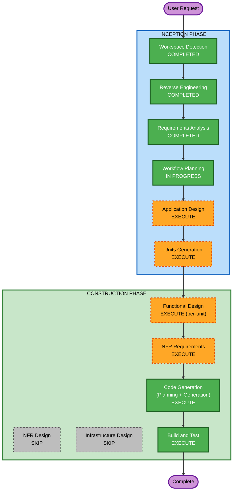

# Execution Plan — TripPilot AI 서비스

> **범위**: Python AI 서비스 (C1 + C2 + M7 + API Layer)
> **역할**: AI Engineer
> **기반**: requirements.md + reverse-engineering 산출물 + ai-*.md 설계 정본

---

## Detailed Analysis Summary

### Transformation Scope
- **Transformation Type**: Greenfield implementation (설계 완료, 코드 미작성)
- **Primary Changes**: Python AI 서비스 전체 구현 (C1 LLM Gateway + C2 Assembly + M7 Place Data + API)
- **Related Components**: Kotlin 백엔드 (M8~M16) — 본 저장소 범위 밖, API 계약만 정의

### Change Impact Assessment
- **User-facing changes**: Yes — 일정 생성·재계획·회고의 AI 품질 결정
- **Structural changes**: Yes — 신규 서비스 생성 (독립 배포 단위)
- **Data model changes**: Yes — POI 스키마, ItineraryProblem/Solution, VisitSlot 등 전체 정의
- **API changes**: Yes — AI 서비스 외부 API 전체 정의
- **NFR impact**: Yes — 성능(5초/20초), 신뢰성(결정론 폴백), 보안(권한 경계)

### Risk Assessment
- **Risk Level**: Medium-High
- **주요 리스크**: LLM 벤더 미확정, 어셈블리 5초 게이트 달성 불확실, 외부 API 약관 미검토
- **완화 전략**: Port 격리 + fake로 벤더 독립 개발, 어셈블리 벤치마크 우선 실행
- **Rollback Complexity**: Low (신규 서비스, 기존 시스템 무영향)

---

## Workflow Visualization



---

## Phases to Execute

### INCEPTION PHASE
- [x] Workspace Detection (COMPLETED)
- [x] Reverse Engineering (COMPLETED) — 설계 문서 6개 분석, 산출물 8개 생성
- [x] Requirements Analysis (COMPLETED) — 기능 FR 5그룹 + 비기능 NFR 6그룹
- [x] Workflow Planning (IN PROGRESS)
- [ ] **Application Design — EXECUTE**
  - **Rationale**: 설계 문서에 인터페이스는 있으나, 컴포넌트 간 상세 메서드·비즈니스 규칙이 코드 수준으로 구체화 필요
- [ ] **Units Generation — EXECUTE**
  - **Rationale**: C1·C2·M7·API Layer·테스트를 독립 유닛으로 분해하여 순차 구현 가능하게 함

### CONSTRUCTION PHASE
- [ ] **Functional Design — EXECUTE** (per-unit)
  - **Rationale**: 각 유닛별로 비즈니스 로직 상세 설계 필요 (어셈블리 알고리즘, 게이트 로직, 파이프라인 흐름)
- [ ] **NFR Requirements — EXECUTE**
  - **Rationale**: 성능(5초 게이트)·보안(권한 경계)·복원력(서킷 브레이커) 기술 선택 필요
- [ ] NFR Design — **SKIP**
  - **Rationale**: NFR Requirements에서 기술 선택까지 커버. 별도 NFR Design은 과도 — 설계 문서에 이미 패턴 정의됨
- [ ] Infrastructure Design — **SKIP**
  - **Rationale**: 1차는 로컬 개발 + CI 기준. 배포 인프라(ECS/EKS)는 출시 직전에 별도 결정. AI Engineer 범위 아님
- [ ] **Code Generation — EXECUTE** (per-unit, ALWAYS)
  - **Rationale**: 각 유닛별 코드 생성. Planning → Generation 2단계
- [ ] **Build and Test — EXECUTE** (ALWAYS)
  - **Rationale**: PBT 12+ 속성 전부 통과 확인, CI 설정

---

## Proposed Units of Work

기존 설계 문서와 의존 관계를 기반으로 다음 유닛 분해를 제안합니다:

| Unit | 이름 | 내용 | 의존 |
|---|---|---|---|
| U1 | **Domain & Ports** | 도메인 모델 (Poi, ItineraryProblem/Solution, VisitSlot 등) + Port 인터페이스 (LlmPort, TravelPort 등) | 없음 |
| U2 | **C2 Assembly Core** | 하드 제약 검증(HC1~HC4) + 휴리스틱 최적화 + 이동추정 + 결정론 폴백 | U1 |
| U3 | **M7 Place Data Core** | POI 정본 + closed-set 후보 풀 생성 + 캐싱 | U1 |
| U4 | **C1 LLM Gateway** | LLM 호출 + closed-set 게이트 + 티어 라우팅 + PreferenceScoring 워커 | U1, U3 |
| U5 | **AI Orchestration & API** | score→solve 파이프라인 + 폴백 계단 + HTTP 엔드포인트 | U2, U3, U4 |
| U6 | **Extended Features** | 의도 라우팅(INTENT) + 엔티티 해소 + 웹 소싱 + 추가 워커 | U3, U4 |

### 구현 순서 (의존 기반)

```
U1 (Domain & Ports)
 |
 +---> U2 (C2 Assembly) ----+
 |                         |
 +---> U3 (M7 Place Data) -+--> U5 (Orchestration & API)
 |                         |
 +---> U4 (C1 Gateway) ---+
                           |
                           +--> U6 (Extended Features)
```

- **U1**은 다른 모든 유닛의 선행 조건
- **U2·U3·U4**는 병렬 개발 가능 (서로 Port로만 참조)
- **U5**는 U2·U3·U4 완료 후 통합
- **U6**는 U5 이후 확장

---

## Estimated Timeline

| Unit | 예상 소요 | 비고 |
|---|---|---|
| U1 Domain & Ports | 2~3일 | 스키마·인터페이스만, PBT generators 포함 |
| U2 C2 Assembly Core | 5~7일 | 알고리즘 + PBT 5속성 + oracle |
| U3 M7 Place Data | 3~5일 | 필터 파이프라인 + 캐싱 |
| U4 C1 LLM Gateway | 4~5일 | 게이트 + fake + PBT 2속성 |
| U5 Orchestration & API | 3~4일 | 통합 + HTTP + 폴백 계단 |
| U6 Extended Features | 5~7일 | 라우터 + 엔티티 해소 + 소싱 |
| **Total** | **22~31일** | 1인 AI Engineer 기준 |

---

## Success Criteria

- **Primary Goal**: TripPilot Python AI 서비스 1차 출시 범위 구현 완료
- **Key Deliverables**:
  - C2 Assembly: 하드 제약 4종 100% 보장, day1 ≤ 3초
  - C1 Gateway: closed-set 환각 0, 폴백 동작
  - M7 Place Data: 후보 풀 생성 정상, 커버리지 게이트 통과
  - API Layer: Kotlin 백엔드 연동 가능한 엔드포인트
  - PBT: 12+ 속성 전부 PR CI 통과
- **Quality Gates**:
  - U5-P1 하드 제약 PBT 100% (G114)
  - U5-P5 closed-set 게이트 PBT 100%
  - LLM·거리 API fake 사용 확인 (실 API 호출 0)
  - 결정론 폴백: 동일 입력→동일 출력 확인 (U5-P3)


---

## 구현 책임 분류 (유닛별)

### U1 Domain & Ports — 직접 구현
| 항목 | 난이도 | 비고 |
|---|---|---|
| 도메인 모델 (dataclass) | 낮음 | Poi, ItineraryProblem/Solution, VisitSlot 등 |
| Port 인터페이스 (Protocol) | 낮음 | LlmPort, TravelPort, AssemblyPort 등 |
| PBT Generators | 낮음 | Hypothesis strategies |
| Fake 어댑터 | 낮음 | FakeLlm, FakeTravel, InMemoryPoi |

### U2 C2 Assembly Core — 직접 구현 (핵심 난이도)
| 항목 | 난이도 | 비고 |
|---|---|---|
| OR-Tools VRPTW 구현 | **높음** | RoutingModel + TimeWindows + Disjunction |
| HC1~HC4 검증 | 중간 | 순수 함수 4종 |
| 이동시간 추정 체인 | 중간 | 카카오→네이버→직선거리 어댑터 |
| 결정론 폴백 (규칙 점수) | 낮음 | 시드 고정 점수 계산 |
| Bedrock Assembly (2차) | 중간 | LangChain ChatBedrock 래핑 + HC 검증 연결 |
| repair 알고리즘 | 중간 | 시각·순서 최소 조정 |

### U3 M7 Place Data — 직접 구현
| 항목 | 난이도 | 비고 |
|---|---|---|
| 6단계 필터 파이프라인 | 중간 | 반경→예산→영업→품질→인기→상한 |
| POI Repository (DB 접근) | 낮음 | CRUD + 공간 쿼리 |
| 엔티티 해소 (fuzzy match) | 중간 | edit-distance + 자모 유사 |
| 캐싱 로직 | 낮음 | TTL 정책 (가격 금지) |

### U4 C1 LLM Gateway — LangChain 활용 + 직접 구현 혼합
| 항목 | 난이도 | LangChain? | 비고 |
|---|---|---|---|
| Bedrock LLM 호출 | 낮음 | **O** | `ChatBedrock` 래핑 |
| 프롬프트 정의 (6종) | 중간 | X (내용 직접) | LangChain이 실행은 해줌 |
| closed-set 출구 게이트 | 중간 | X | poi_id ∈ whitelist 교차 (직접) |
| 티어 라우팅 | 낮음 | X | feature → 모델 매핑 (직접) |
| 컨텍스트 재조회 | 중간 | X | 권한 검증 로직 (직접) |

### U5 Orchestration & API — 직접 구현
| 항목 | 난이도 | 비고 |
|---|---|---|
| Orchestrator (Fast Path + Delegate) | 중간 | 의도 파악 + 복잡도 판단 + 분기 |
| 에이전트 병렬 디스패치 | 낮음 | asyncio.gather |
| HTTP 엔드포인트 | 낮음 | FastAPI routes |
| 폴백 계단 통합 | 중간 | 에이전트별 실패 분기 조립 |
| rate-limit / 헬스체크 | 낮음 | 미들웨어 |

### U6 Extended — LangChain 활용 (RAG) + 직접 구현 혼합
| 항목 | 난이도 | LangChain? | 비고 |
|---|---|---|---|
| PlanBAgent RAG 파이프라인 | 중간 | **O** | RetrievalQA + PGVector |
| 벡터 스토어 (pgvector) 연동 | 낮음 | **O** | LangChain PGVector |
| 임베딩 (Titan v2) | 낮음 | **O** | BedrockEmbeddings |
| KB retrieve 함수 3종 | 낮음 | **O** | Retriever 설정 |
| 수집 게이트 5단 | 중간~높음 | X | 스키마·실재·중복·신뢰·정책 (직접) |
| Places API 어댑터 | 중간 | X | 외부 API 연동 (직접) |
| 의도 라우팅 (IntentRouter) | 중간 | X | 분류 로직 (직접) |
| ReflectAgent (1차 A) | 낮음 | **O** (LLM 호출만) | DB 조회(직접) + Bedrock 호출(LangChain) |

### 전체 요약

| 구분 | 항목 수 | 비율 |
|---|---|---|
| **직접 구현** (비즈니스 로직·알고리즘·검증) | ~20개 | 65% |
| **LangChain 활용** (LLM 호출·RAG·벡터·임베딩) | ~10개 | 35% |
| **프롬프트 작성** (내용은 직접, 실행은 LangChain) | 6개 | — |
