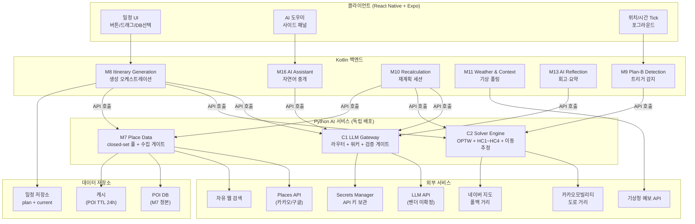
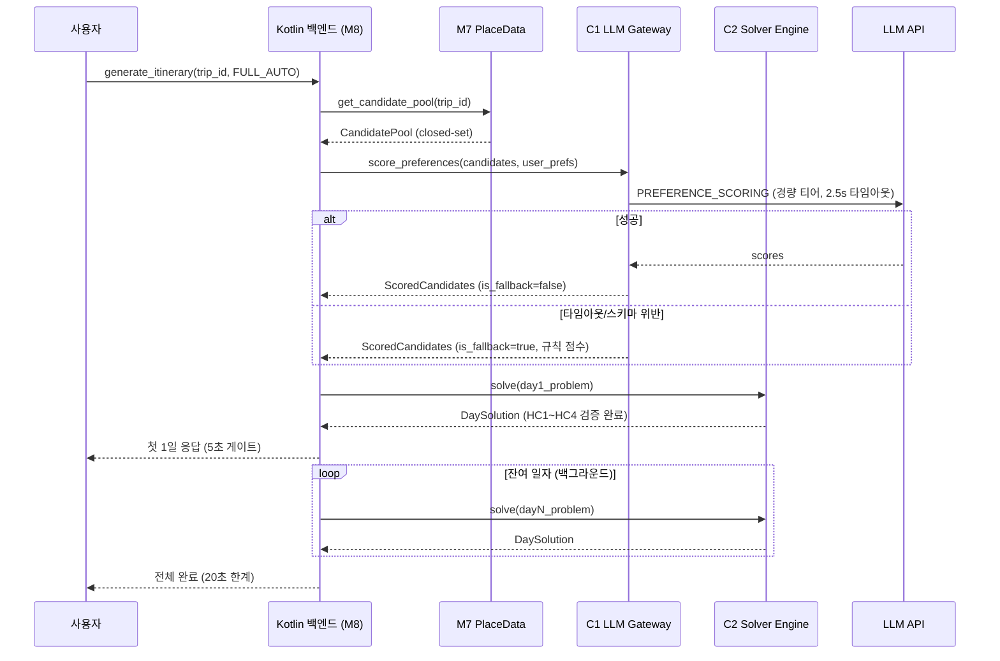

# System Architecture

## System Overview

TripPilot AI는 **LLM + 최적화 솔버 하이브리드** 아키텍처다. 독립 Python AI 서비스(C1 LLM Gateway + C2 Solver Engine + M7 Place Data)를 중심으로, Kotlin 백엔드가 기능별 오케스트레이션(M8·M9·M10·M13·M16)을 수행한다. 4대 불변식(INV-1~4)이 LLM과 솔버의 역할 경계를 구조적으로 강제한다.

## Architecture Diagram

## Component Descriptions

### C1 LLM Gateway
- **Purpose**: LLM 판단·해석 계층 (자연어 의도 분류, 선호 점수, 설명, 회고, 웹 텍스트 추출)
- **Responsibilities**: 티어 라우팅, 의도 라우팅(INTENT), 워커 디스패치, OutputSchema 검증 + closed-set 교차, 서버 재조회 컨텍스트 주입, rate-limit
- **Dependencies**: LLM API, Secrets Manager, M7 (closed-set 화이트리스트)
- **Type**: Application (AI Core)

### C2 Solver Engine
- **Purpose**: 선택·순서·시각 보장 계층 (최적화 + 하드 제약 검증)
- **Responsibilities**: OPTW/TOPTW 최적화, HC1~HC4 검증, 이동시간 추정(카카오→네이버→직선거리), 결정론 폴백, repair, warm-start
- **Dependencies**: 카카오모빌리티 API, 네이버 지도 API (이동시간 추정용)
- **Type**: Application (AI Core)

### M7 Place Data
- **Purpose**: POI 정본 + closed-set 후보 풀 + 수집 게이트
- **Responsibilities**: POI CRUD, 후보 풀 생성(6단계 필터), 영업시간 감지, 웹 후보 소싱, 수집 게이트(5단), 엔티티 해소, 캐싱
- **Dependencies**: Places API, 자유 웹 검색, POI DB, 캐시
- **Type**: Application (Data Layer)

### M8 Itinerary Generation (Kotlin)
- **Purpose**: 일정 생성 오케스트레이션
- **Dependencies**: C1, C2, M7, 일정 저장소
- **Type**: Application (Orchestration)

### M9 Plan-B Detection (Kotlin)
- **Purpose**: 자동 트리거 4종 감지
- **Dependencies**: C2 (이동 부등식 계산), M11 (날씨)
- **Type**: Application (Event Processing)

### M10 Itinerary Recalculation (Kotlin)
- **Purpose**: 재계획 후보 생성·검증·확정
- **Dependencies**: C1, C2, M7
- **Type**: Application (Orchestration)

### M11 Weather & Context (Kotlin)
- **Purpose**: 기상청 예보·특보 폴링
- **Dependencies**: 기상청 API
- **Type**: Application (Data Provider)

### M13 AI Reflection (Kotlin)
- **Purpose**: 회고·전체 요약·스타일 분석
- **Dependencies**: C1 (상위 티어)
- **Type**: Application (AI Consumer)

### M16 AI Assistant (Kotlin)
- **Purpose**: 자연어 통역·중개
- **Dependencies**: C1 (라우터 + 워커), M8/M10 (편집 반영)
- **Type**: Application (AI Consumer)

## Data Flow — 일정 생성 (핵심 플로우)

## Integration Points

- **External APIs**:
  - LLM API (벤더 미확정) — 취향 해석·선호 점수·설명·회고·웹 텍스트 추출
  - 카카오모빌리티 — 도로 거리 (이동시간 추정 1순위)
  - 네이버 지도 — 도로 거리 (2순위 폴백)
  - Places API (카카오/구글) — POI 구조화 데이터 (웹 소싱 1단계)
  - 기상청 예보 API — 날씨 트리거 (1시간 폴링)
  - 자유 웹 검색 — POI 비정형 데이터 (웹 소싱 2단계)

- **Databases**:
  - POI DB (M7 정본) — 좌표·영업시간·카테고리·체류 기본값
  - 일정 저장소 — plan(불변) + current(수정 가능) 분리 저장
  - 캐시 (POI TTL 24h, 영업시간 TTL 6h, 가격 캐싱 금지)

- **Third-party Services**:
  - Secrets Manager — LLM API 키 보관
  - CloudWatch — 비용 계측·쿼터 알람·어댑터 실패율 관측

## Infrastructure Components
- **Deployment Model**: Python AI 서비스 (독립 배포) + Kotlin 백엔드 (별도 배포)
- **Service Communication**: REST/gRPC (미확정 — AI-D01 후속)
- **Scaling**: DAU 1천 / 동시 생성 10건 / 지역당 POI 5천 (MVP 규모, 과설계 금지)
- **Resilience**: 전 외부 호출에 타임아웃 + 서킷 브레이커 + 우아한 성능 저하
