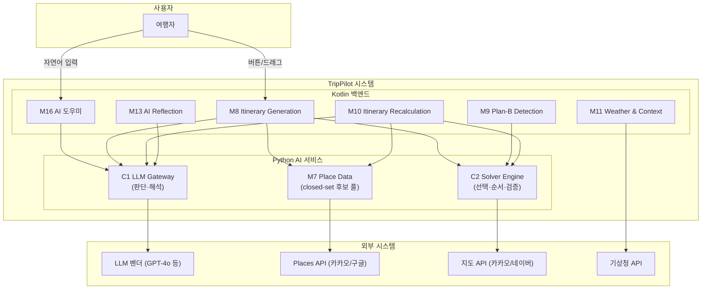

# Business Overview

## Business Context Diagram

## Business Description

- **Business Description**: TripPilot은 '예약 다음'을 잇는 여행 AI 서비스다. 숙소 예약 후 **실행 가능한 여행 일정을 자동 생성**하고, 여행 중 변수(날씨·휴무·지연·체력)에 대응하는 **Plan-B 재계획**을 제안하며, 여행 후 **회고·스타일 분석**을 제공한다. LLM과 최적화 솔버의 하이브리드로 취향을 반영하면서도 물리적 제약(영업시간·이동시간)을 보장하는 것이 핵심 차별점이다.

- **Business Transactions**:

| # | 비즈니스 트랜잭션 | 설명 |
|---|---|---|
| BT-1 | 일정 생성 (Itinerary Generation) | 등록 숙소를 앵커로, 사용자 취향과 시간·공간 제약을 만족하는 날짜별 일정을 자동 생성 |
| BT-2 | Plan-B 재계획 (Replan) | 날씨·휴무·이동 지연·체류 초과 감지 시 대안 일정 2~3개를 제안 |
| BT-3 | 일정 편집 (Edit) | 사용자가 버튼·드래그·자연어로 일정을 수정하면 솔버가 재검증·시각 재배치 |
| BT-4 | 회고 생성 (Reflection) | 여행 일자 종료 시 방문 기록 기반 당일 회고 자동 생성 |
| BT-5 | 전체 요약 (Trip Summary) | 여행 종료 시 지도 히어로 + 통계 + 하이라이트 생성 |
| BT-6 | 여행 스타일 분석 | 누적 방문 10곳 이상 시 7축 택소노미 기반 취향 분류 |
| BT-7 | AI 도우미 대화 (Assistant) | 자연어로 일정 관련 요청을 해석해 적절한 워커+솔버를 호출·조립 |
| BT-8 | 후보 소싱 (Candidate Sourcing) | M7 후보 부족 시 Places API/자유 웹에서 POI를 보강해 closed-set 풀 확장 |

- **Business Dictionary**:

| 용어 | 의미 |
|---|---|
| closed-set 후보 풀 | M7이 여행 조건으로 필터링한 POI ID 집합. LLM은 이 안에서만 선택 가능 (INV-1) |
| 하드 제약 (HC1~HC4) | 영업시간·이동 부등식·고정 블록·시간창 — 위반 배치는 해에서 구조적 배제 |
| 소프트 신호 | LLM 선호 점수·ML 점수 — 목적함수 보상값. 하드 제약과 분리 |
| 결정론적 폴백 | AI 실패 시 규칙 점수로 동일 입력→동일 출력을 보장하는 대체 모드 |
| 수집 게이트 | 웹 소싱 POI가 M7에 등록되기 위해 통과해야 하는 5단 검증 (스키마·실재·중복·신뢰·정책) |
| 라우터 | C1 INTENT feature. 자연어 의도 분류 + 슬롯 추출 → 워커 디스패치 |
| 워커 | C1의 특화 feature (PreferenceScoring·Explanation 등). 판단·생성만 하고 확정하지 않음 |
| warm-start | 고정 블록을 보존한 채 나머지 슬롯만 재배치하는 재생성 |
| Plan-B | 여행 중 변수에 대한 자동 감지 + 대안 일정 제안 (자동 변경 없음, 제안만) |

## Component Level Business Descriptions

### C1 LLM Gateway
- **Purpose**: 사용자 취향을 해석하고, 후보 POI에 선호 점수를 부여하며, 추천 이유와 회고를 생성하는 판단 계층
- **Responsibilities**: 티어 라우팅(경량/상위), 의도 라우팅(INTENT), 워커 디스패치, 출력 스키마 검증 + closed-set 교차, 서버 재조회 컨텍스트 주입, rate-limit

### C2 Solver Engine
- **Purpose**: LLM이 부여한 점수를 기반으로 시간·공간 제약을 만족하는 최적 방문 순서·시각을 확정하는 사실 계층
- **Responsibilities**: OPTW/TOPTW 최적화, 하드 제약 4종 검증, 이동시간 추정, 결정론적 폴백, warm-start 재생성

### M7 Place Data
- **Purpose**: AI 파이프라인의 그라운딩 토대. POI 정본 관리 및 closed-set 후보 풀 생성
- **Responsibilities**: POI 정본 관리, 후보 풀 생성(반경·예산·영업일 필터), 영업시간·휴무 감지, 저장 장소 우선 소싱, 웹 후보 소싱·수집 게이트, 엔티티 해소(fuzzy match)

### M8 Itinerary Generation
- **Purpose**: 일정 생성의 오케스트레이션. 사용자 요청을 받아 C1(점수)→C2(배치) 파이프라인을 조율
- **Responsibilities**: 생성 세션 관리, 점진 노출(첫 1일 5초), 편집 재검증, warm-start 재생성, 숙소 권역 추천

### M9 Plan-B Detection
- **Purpose**: 여행 중 변수(날씨·휴무·이동 지연·체류 초과) 감지 및 Plan-B 제안 트리거
- **Responsibilities**: 트리거 평가(순수 함수), 빈도 상한 체크, 허위 알림 방지

### M10 Itinerary Recalculation
- **Purpose**: Plan-B 제안 수락 시 대안 일정 생성 및 확정
- **Responsibilities**: 사유 해석(C1), 후보 소싱(M7), 하드 제약 검증(C2), 대안 2~3개 생성, 확정 시 재검증

### M13 AI Reflection
- **Purpose**: 여행 후 기록 기반 회고·전체 요약·스타일 분석 생성
- **Responsibilities**: 당일 회고 자동 생성(상위 티어), 전체 요약, 여행 스타일 분석(7축), 폴백 카드

### M16 AI 도우미
- **Purpose**: 자연어 요청을 해석해 기존 모듈과 솔버를 호출·조립·설명하는 통역·중개자
- **Responsibilities**: 라우터(의도 분류), 워커 디스패치, 편집 명령 번역, 하이브리드 반영(자동/확인), 가드레일
