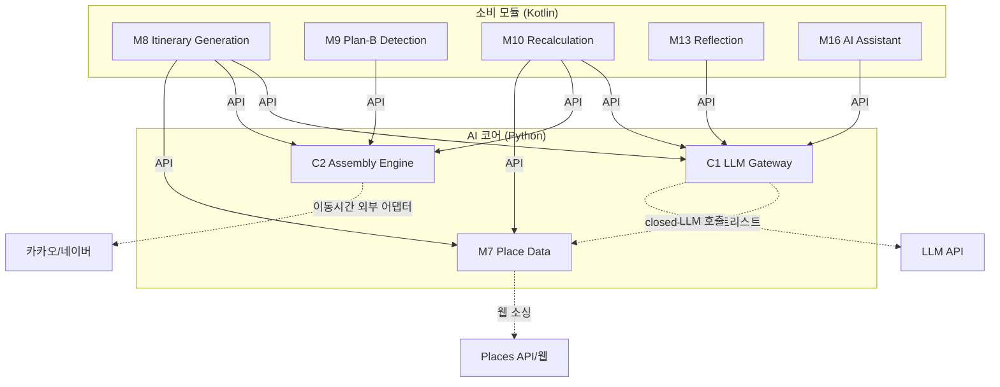

# Dependencies

## Internal Dependencies (컴포넌트 간)

### 의존 방향 규칙

- **C1·C2·M7은 소비 모듈(M8~M16)을 모른다** — 최하위 계층
- **소비 모듈 → AI 코어**: 항상 API 호출 (서비스 간)
- **AI 코어 내부**: C1은 검증 시 M7의 poi_ids(화이트리스트)만 참조. C2는 M7 직접 참조 없음.
- **역의존 방지**: C1의 서버 재조회(D31)조차 호출자가 넘긴 참조 해석기로 수행

### M8 depends on C1, C2, M7
- **Type**: Runtime (서비스 간 API 호출)
- **Reason**: 일정 생성 오케스트레이션 — 선호 점수(C1) → 어셈블리 배치(C2) → 후보 풀(M7)

### M10 depends on C1, C2, M7
- **Type**: Runtime (서비스 간 API 호출)
- **Reason**: 재계획 세션 — 사유 해석(C1) → 후보 소싱(M7) → 검증(C2)

### M13 depends on C1
- **Type**: Runtime (서비스 간 API 호출)
- **Reason**: 회고 생성 — 상위 티어 LLM 호출

### M16 depends on C1
- **Type**: Runtime (서비스 간 API 호출)
- **Reason**: 자연어 라우팅 — INTENT feature + 워커 디스패치

### M9 depends on C2
- **Type**: Runtime (서비스 간 API 호출)
- **Reason**: 이동 지연 판정 — HC2 이동 부등식 재계산

### C1 depends on M7 (논리적)
- **Type**: Runtime (프로세스 내)
- **Reason**: closed-set 검증 게이트에서 poi_ids 화이트리스트 교차 (INV-1)

## External Dependencies

### LLM API (벤더 미확정)
- **Version**: TBD
- **Purpose**: 취향 해석·의도 분류·설명·회고·웹 텍스트 추출
- **License**: 상업 API (유료)
- **Criticality**: 핵심 (폴백: 규칙 점수)

### 카카오모빌리티 API
- **Version**: v1
- **Purpose**: 도로 거리 기반 이동시간 추정 (1순위)
- **License**: 상업 API
- **Criticality**: 핵심 (폴백: 네이버 → 직선거리)

### 네이버 지도 API
- **Version**: v5
- **Purpose**: 도로 거리 (2순위 폴백)
- **License**: 상업 API
- **Criticality**: 폴백

### Places API (카카오/구글)
- **Version**: TBD
- **Purpose**: POI 구조화 데이터 (웹 소싱 1단계)
- **License**: 상업 API (약관 검토 필요)
- **Criticality**: 보강 (생성 미차단)

### 기상청 예보 API
- **Version**: 공공데이터
- **Purpose**: 강수확률·기상특보 (Plan-B 트리거)
- **License**: 공공 (무료)
- **Criticality**: Plan-B 한정

### pytest
- **Version**: latest
- **Purpose**: 테스트 프레임워크
- **License**: MIT

### Hypothesis
- **Version**: latest
- **Purpose**: Property-Based Testing
- **License**: Mozilla Public License 2.0

### pydantic
- **Version**: v2+
- **Purpose**: 스키마 검증·직렬화·도메인 모델
- **License**: MIT
