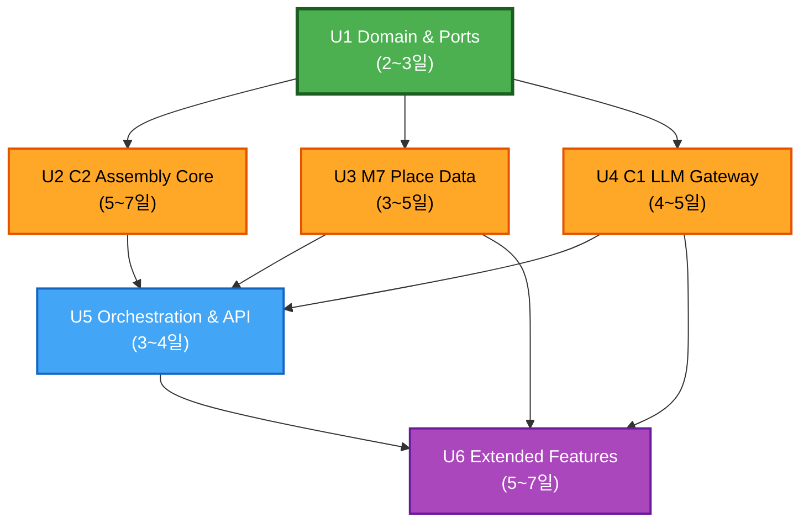

# Units of Work — Dependency & Sequencing

> 유닛 간 의존 관계, 병렬 가능 영역, 구현 순서를 정의한다.

---

## 1. 의존 그래프



---

## 2. 의존 상세

| From | To | 의존 내용 | 유형 |
|---|---|---|---|
| U2 | U1 | 도메인 모델(ItineraryProblem, VisitSlot 등) + TravelPort | 컴파일 타임 |
| U3 | U1 | 도메인 모델(Poi, CandidatePool 등) + PoiDbPort, CachePort | 컴파일 타임 |
| U4 | U1 | 도메인 모델(TypedResult, ScoredPoi 등) + LlmPort | 컴파일 타임 |
| U5 | U2 | AssemblyFacade.solve/validate (API 호출) | 런타임 |
| U5 | U3 | CandidatePoolBuilder.get_candidate_pool (API 호출) | 런타임 |
| U5 | U4 | GatewayFacade.call (API 호출) | 런타임 |
| U6 | U3 | PoiRepository + IngestGate (웹 소싱 등록 대상) | 런타임 |
| U6 | U4 | GatewayFacade.call + route (라우터·워커 확장) | 런타임 |
| U6 | U5 | 오케스트레이션 인프라(API, 폴백 계단) 재사용 | 런타임 |

---

## 3. 병렬 가능 영역

### Phase A: Foundation (U1)
```
[U1 Domain & Ports] — 단독 실행, 다른 유닛의 선행 조건
```

### Phase B: Core Components (U2 + U3 + U4 — 병렬)
```
U1 완료 후:
  [U2 C2 Assembly]     ←── 독립 개발 가능 (Port fake 사용)
  [U3 M7 Place Data] ←── 독립 개발 가능 (InMemory fake 사용)
  [U4 C1 Gateway]    ←── 독립 개발 가능 (FakeLlm 사용)

  ※ 세 유닛은 서로 직접 의존 없음 — 완전 병렬
```

### Phase C: Integration (U5)
```
U2 + U3 + U4 완료 후:
  [U5 Orchestration & API] — 세 컴포넌트를 통합·연결
```

### Phase D: Extension (U6)
```
U5 완료 후:
  [U6 Extended Features] — 라우터·워커·소싱 확장
```

---

## 4. 구현 순서 (1인 개발 기준)

1인 AI Engineer라면 병렬 불가하므로 **임계 경로** 기준 순서:

| 순서 | Unit | 이유 |
|---|---|---|
| 1 | **U1** Domain & Ports | 모든 유닛의 타입·인터페이스 기반 |
| 2 | **U2** C2 Assembly Core | 가장 복잡+리스크 높음 (알고리즘+5초 게이트). 일찍 검증 |
| 3 | **U3** M7 Place Data | C2와 독립이지만, U5 통합 전에 후보 풀 필요 |
| 4 | **U4** C1 LLM Gateway | M7 화이트리스트 필요 (U3 이후가 통합 테스트 용이) |
| 5 | **U5** Orchestration & API | 세 컴포넌트 통합 + end-to-end 검증 |
| 6 | **U6** Extended Features | 핵심 파이프라인 안정 후 확장 |

### Critical Path

```
U1(3일) → U2(7일) → U5(4일) → U6(7일) = 21일 (최단)
         → U3(5일) ↗
         → U4(5일) ↗
```

최장 경로: U1 → U2 → U5 → U6 = **21일** (1인 순차 시 전체 ~28일)

---

## 5. 유닛 간 계약 (Interface Contract)

각 유닛은 Port/Protocol을 통해서만 소통한다. 계약 변경 시 영향 범위:

| 계약 | 소유 유닛 | 소비 유닛 | 변경 영향 |
|---|---|---|---|
| `ItineraryProblem` / `Solution` | U1 | U2, U5 | 어셈블리 입출력 스키마 변경 |
| `CandidatePool` / `Poi` | U1 | U3, U4(게이트), U5 | 후보 풀·게이트 계약 변경 |
| `TypedResult[T]` | U1 | U4, U5 | LLM 결과 래핑 변경 |
| `AssemblyFacade` API | U2 | U5, U6 | 어셈블리 호출 시그니처 변경 |
| `CandidatePoolBuilder` API | U3 | U5 | 후보 풀 조회 시그니처 변경 |
| `GatewayFacade` API | U4 | U5, U6 | LLM 호출 시그니처 변경 |

**규칙**: U1의 도메인 타입을 변경하면 모든 유닛에 파급 → U1은 초기에 안정화 우선.
