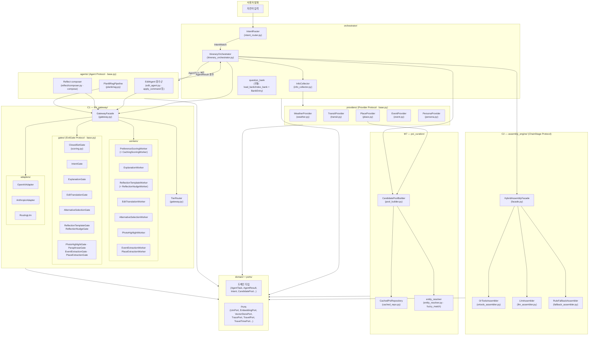

# 전체 계층 구조

> 코드 구조도 — 노드 라벨은 `ai/src/trippilot/` 실제 클래스·모듈명, 괄호는 파일/패키지 경로.

```mermaid
graph TB
    subgraph User["사용자 발화"]
        utterance["자연어 입력"]
    end

    subgraph Orchestrator["orchestrator/"]
        IR["IntentRouter<br/>(intent_router.py)"]
        IO["ItineraryOrchestrator<br/>(itinerary_orchestrator.py)"]
        IC["InfoCollector<br/>(info_collector.py)"]
        QB["question_bank<br/>(모듈: load_bank/index_bank + BankEntry)"]
    end

    subgraph Agents["agents/ (Agent Protocol · base.py)"]
        PA["PlanBRagPipeline<br/>(planb/rag.py)"]
        RA["Reflect composer<br/>(reflect/composer.py · compose)"]
        EA["EditAgent 함수군<br/>(edit_agent.py · apply_command 등)"]
    end

    subgraph Providers["providers/ (Provider Protocol · base.py)"]
        WP["WeatherProvider<br/>(weather.py)"]
        TP["TransitProvider<br/>(transit.py)"]
        PP["PlaceProvider<br/>(place.py)"]
        EP["EventProvider<br/>(event.py)"]
        PSP["PersonaProvider<br/>(persona.py)"]
    end

    subgraph C1["C1 — llm_gateway/"]
        GF["GatewayFacade<br/>(gateway.py)"]
        TR["TierRouter<br/>(gateway.py)"]
        subgraph Workers["workers/"]
            W1["PreferenceScoringWorker<br/>(+ CachingScoringWorker)"]
            W2["ExplanationWorker"]
            W3["ReflectionTemplateWorker<br/>(+ ReflectionNudgeWorker)"]
            W4["EditTranslationWorker"]
            W5["AlternativeSelectionWorker"]
            W6["PhotoHighlightWorker"]
            W7["EventExtractionWorker<br/>PlaceExtractionWorker"]
        end
        subgraph Gates["gates/ (ExitGate Protocol · base.py)"]
            G1["ClosedSetGate<br/>(scoring.py)"]
            G2["IntentGate"]
            G3["ExplanationGate"]
            G4["EditTranslationGate"]
            G5["AlternativeSelectionGate"]
            G6["ReflectionTemplateGate<br/>ReflectionNudgeGate"]
            G7["PhotoHighlightGate · ParaphraseGate<br/>EventExtractionGate · PlaceExtractionGate"]
        end
        subgraph Adapters["adapters/"]
            AD1["OpenAIAdapter"]
            AD2["AnthropicAdapter"]
            AD3["RoutingLlm"]
        end
    end

    subgraph C2["C2 — assembly_engine/ (ChainStage Protocol)"]
        SF["HybridAssemblyFacade<br/>(facade.py)"]
        ORT["OrToolsAssembler<br/>(ortools_assembler.py)"]
        LLM_S["LlmAssembler<br/>(llm_assembler.py)"]
        RULE["RuleFallbackAssembler<br/>(fallback_assembler.py)"]
    end

    subgraph M7["M7 — poi_curation/"]
        PB["CandidatePoolBuilder<br/>(pool_builder.py)"]
        CR["CachedPoiRepository<br/>(cached_repo.py)"]
        ER["entity_resolver<br/>(entity_resolver.py · fuzzy_match)"]
    end

    subgraph Domain["domain/ + ports/"]
        DT["도메인 타입<br/>(AgentTask, AgentResult,<br/>Intent, CandidatePool...)"]
        PT["Ports<br/>(LlmPort, EmbeddingPort, VectorStorePort,<br/>TracePort, TravelPort, TravelTimePort...)"]
    end

    utterance --> IR
    IR --> |IntentMatch| IO
    IO --> |AgentTask 봉투| Agents
    Agents --> |AgentResult 봉투| IO

    PA --> GF
    RA --> GF
    EA --> GF

    IO --> IC
    IC --> Providers
    IO --> PB
    IO --> GF
    IO --> SF

    GF --> TR
    GF --> Workers
    GF --> Gates
    GF --> Adapters

    SF --> ORT
    SF --> LLM_S
    SF --> RULE

    PP --> PB
    PB --> CR
    PB --> ER

    C1 --> Domain
    C2 --> Domain
    M7 --> Domain
    Agents --> Domain
    Providers --> Domain
    Orchestrator --> Domain
```
