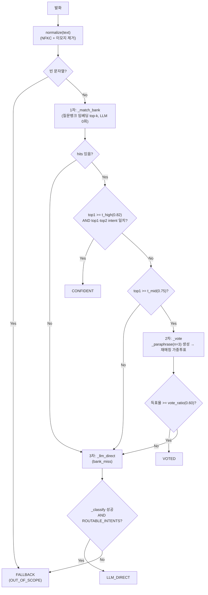

# 의도 라우팅 흐름 (IntentRouter.route — 3단 매칭)

> 코드 구조도 — `orchestrator/intent_router.py`의 `_route` 실제 분기. 임계값은 `IntentRouterConfig` 초기값.

```mermaid
flowchart TD
    A["발화"] --> B["normalize(text)<br/>(NFKC + 이모지 제거)"]
    B --> C{"빈 문자열?"}
    C -->|Yes| F["FALLBACK<br/>(OUT_OF_SCOPE)"]
    C -->|No| D["1차: _match_bank<br/>(질문뱅크 임베딩 top-k, LLM 0회)"]
    D --> DH{"hits 있음?"}
    DH -->|No| K["3차: _llm_direct<br/>(bank_miss)"]
    DH -->|Yes| E{"top1 >= t_high(0.82)<br/>AND top1·top2 intent 일치?"}
    E -->|Yes| G["CONFIDENT"]
    E -->|No| H{"top1 >= t_mid(0.75)?"}
    H -->|No| K
    H -->|Yes| I["2차: _vote<br/>_paraphrase(n=3) 생성 → 재매칭 가중투표"]
    I --> J{"득표율 >= vote_ratio(0.60)?"}
    J -->|Yes| L["VOTED"]
    J -->|No| K
    K --> M{"_classify 성공<br/>AND ROUTABLE_INTENTS?"}
    M -->|Yes| N["LLM_DIRECT"]
    M -->|No| F
```
