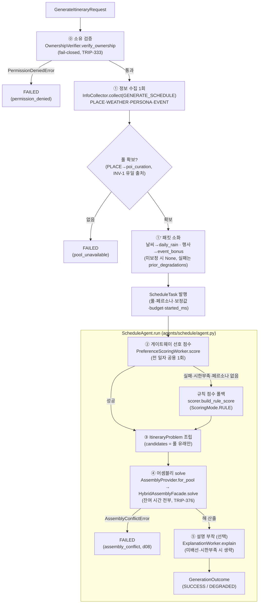

# 일정 생성 파이프라인 (ItineraryOrchestrator.generate → ScheduleAgent.run)

> 코드 구조도 — ⓪·①·①′ 은 `orchestrator/itinerary_orchestrator.py`, ②~⑤ 는 `agents/schedule/agent.py`(ScheduleAgent). 재료는 `ScheduleTask` 봉투로 넘어간다.

