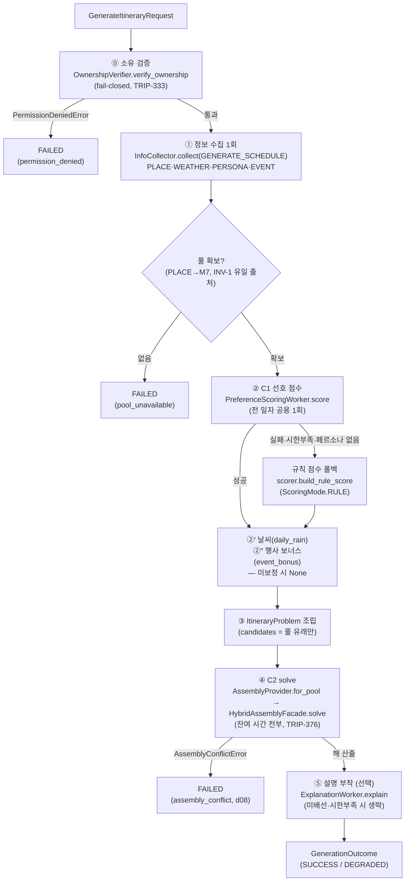

# 일정 생성 파이프라인 (ItineraryOrchestrator.generate)

> 코드 구조도 — `orchestrator/itinerary_orchestrator.py`의 `_generate` 실제 단계(⓪~⑤).

```mermaid
flowchart TD
    REQ["GenerateItineraryRequest"] --> V0["⓪ 소유 검증<br/>OwnershipVerifier.verify_ownership<br/>(fail-closed, TRIP-333)"]
    V0 -->|PermissionDeniedError| FAIL["FAILED<br/>(permission_denied)"]
    V0 -->|통과| S1["① 정보 수집 1회<br/>InfoCollector.collect(GENERATE_SCHEDULE)<br/>PLACE·WEATHER·PERSONA·EVENT"]
    S1 --> POOL{"풀 확보?<br/>(PLACE→M7, INV-1 유일 출처)"}
    POOL -->|없음| FAILP["FAILED<br/>(pool_unavailable)"]
    POOL -->|확보| S2["② C1 선호 점수<br/>PreferenceScoringWorker.score<br/>(전 일자 공용 1회)"]
    S2 -->|실패·시한부족·페르소나 없음| S2F["규칙 점수 폴백<br/>scorer.build_rule_score<br/>(ScoringMode.RULE)"]
    S2 -->|성공| S2W
    S2F --> S2W["②′ 날씨(daily_rain)<br/>②″ 행사 보너스(event_bonus)<br/>— 미보정 시 None"]
    S2W --> S3["③ ItineraryProblem 조립<br/>(candidates = 풀 유래만)"]
    S3 --> S4["④ C2 solve<br/>AssemblyProvider.for_pool → HybridAssemblyFacade.solve<br/>(잔여 시간 전부, TRIP-376)"]
    S4 -->|AssemblyConflictError| FAIL2["FAILED<br/>(assembly_conflict, d08)"]
    S4 -->|해 산출| S5["⑤ 설명 부착 (선택)<br/>ExplanationWorker.explain<br/>(미배선·시한부족 시 생략)"]
    S5 --> OUT["GenerationOutcome<br/>(SUCCESS / DEGRADED)"]
```
