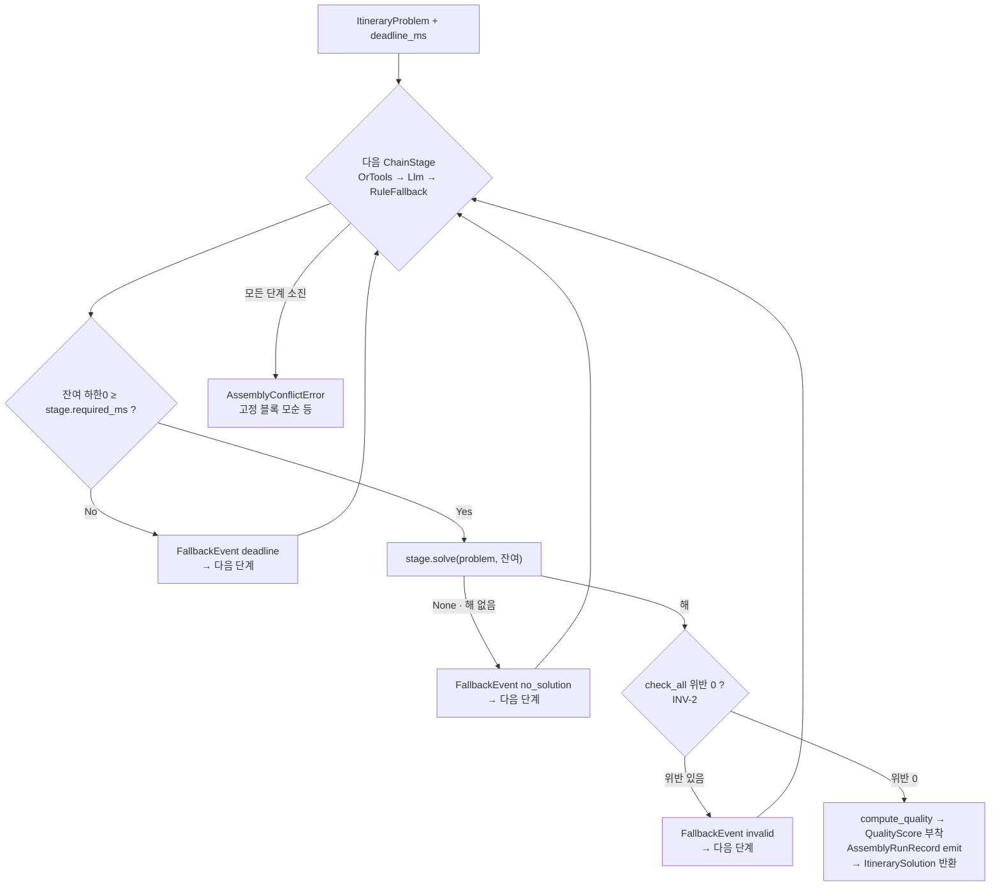

# C2 어셈블리 체인 (HybridAssemblyFacade.solve)

> 코드 구조도 — `assembly_engine/facade.py`의 `solve` 체인 로직(ChainStage 순회, DL-2 시한 회계).

참고: `RuleFallbackAssembler`(required_ms=0)가 체인 마지막에 있으면 시한과 무관하게 항상 해를 반환하므로, `AssemblyConflictError` 도달은 "시간 부족"이 아니라 "유효 해 자체가 없음"(모순 입력)을 뜻한다(TRIP-291, INV-4).
