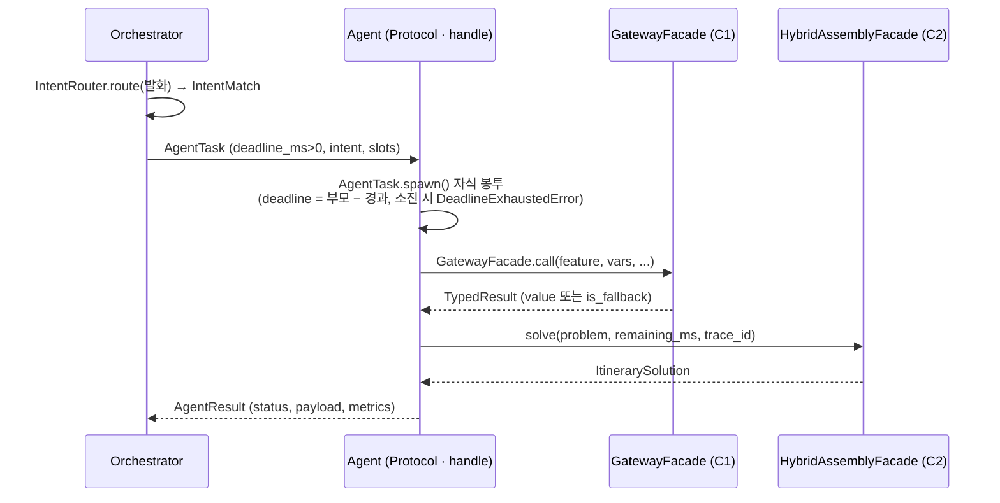

# 위임 봉투 생명주기

> 코드 구조도 — `domain/delegation.py`(AgentTask/AgentResult/spawn), `agents/base.py`(Agent Protocol).
>
> ⚠️ 이 봉투(AgentTask/spawn/AgentResult)를 실제로 타는 에이전트는 아직 없다. ScheduleAgent(2026-09-09)는
> 오케스트레이터→에이전트 재료 봉투 `ScheduleTask`(`agents/schedule/agent.py`)로 재료를 받고 `GenerationOutcome` 을
> 돌려준다 — 아래 게이트웨이·어셈블리 호출 순서(점수 → solve)는 ScheduleAgent 가 그대로 실현한다.

