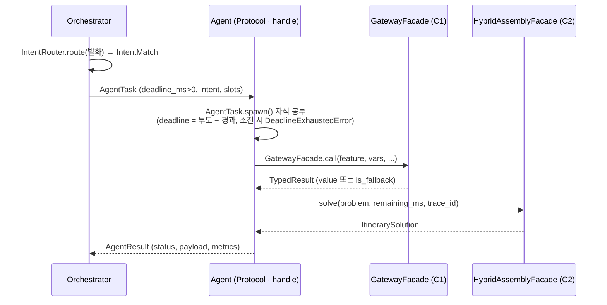

# 위임 봉투 생명주기

> 코드 구조도 — `domain/delegation.py`(AgentTask/AgentResult/spawn), `agents/base.py`(Agent Protocol).

```mermaid
sequenceDiagram
    participant O as Orchestrator
    participant A as Agent (Protocol · handle)
    participant C1 as GatewayFacade (C1)
    participant C2 as HybridAssemblyFacade (C2)

    O->>O: IntentRouter.route(발화) → IntentMatch
    O->>A: AgentTask (deadline_ms>0, intent, slots)
    A->>A: AgentTask.spawn() 자식 봉투<br/>(deadline = 부모 − 경과, 소진 시 DeadlineExhaustedError)
    A->>C1: GatewayFacade.call(feature, vars, ...)
    C1-->>A: TypedResult (value 또는 is_fallback)
    A->>C2: solve(problem, remaining_ms, trace_id)
    C2-->>A: ItinerarySolution
    A-->>O: AgentResult (status, payload, metrics)
```
