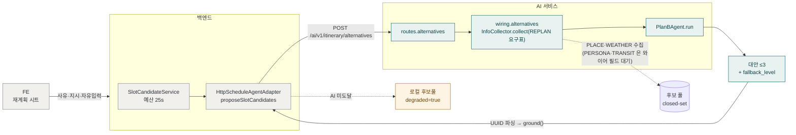

# Plan-B ① 요청이 지나는 길

> 코드 구조도 — FE 재계획 시트에서 AI `alternatives` 경계까지. 슬롯 교체 후보(h08)
> 경로이며, AI 미도달 시 백엔드 로컬 후보풀 degraded 분기를 함께 그린다.
> 기준: origin/develop (a9648b7e), 2026-09-26.

수집이 `InfoCollector` 경유인 것은 2026-09-16 부터다 — 종전에는 풀 빌더를 직접 불러
`INFO_REQUIREMENTS[REPLAN]` 이 있는데도 날씨를 안 봤다(팀 결정: "replan 은 무조건
날씨를 본다"). 표 4종 중 지금 채워지는 것은 PLACE·WEATHER 둘이고, PERSONA·TRANSIT 은
와이어에 필드가 없어 백엔드가 보내주기 전에는 수집할 수 없다(`wiring.alternatives`
docstring 이 정본).
