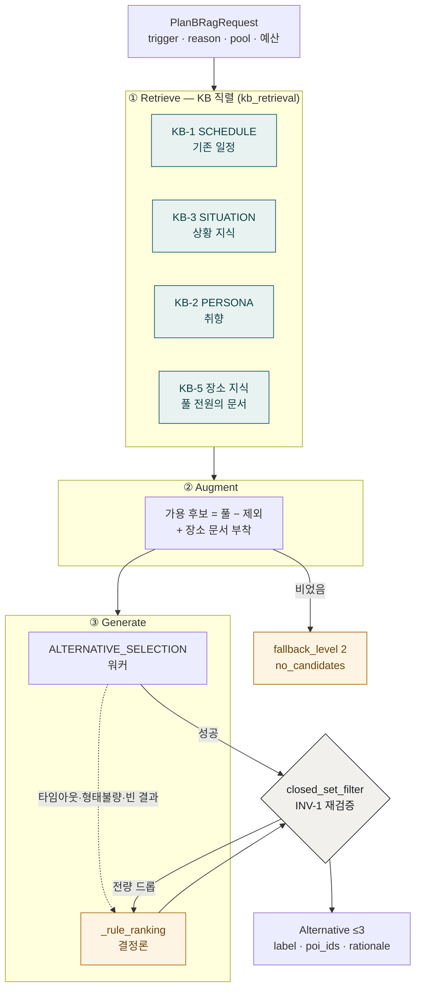

# Plan-B ② RAG 단계

> 코드 구조도 — `PlanBAgent` 안쪽의 Retrieve → Augment → Generate.
> `closed_set_filter`(INV-1 재검증)와 규칙 랭킹 폴백이 어디서 갈라지는지를 그린다.
> 호출자 둘 — `/alternatives`(h08)와 `/replan`(i06, #744 부터).
> 기준: origin/develop (6e1c5857), 2026-09-26.

KB-1 SCHEDULE 은 2026-09-26 기준 **실 적재 문서 0건**이다(`ai/data/` 에 SCHEDULE
파일 자체가 없다) — 박스가 있다고 작동 중으로 읽지 말 것. `/replan` 에서는 기존
일정이 요청 봉투(`current_slots`)로 오므로 검색으로 가져올 이유도 없다 — KB-1 의
존재 의의 재검토는 PlanB 트랙 미결이다.

KB-5 는 앞 셋과 성질이 다르다 — 상황에 맞는 몇 건이 아니라 **후보 풀 전원의 문서**를
가져와 후보에 붙인다(`place_knowledge.py`). 실패해도 예외를 안 올린다: 문서 없이
도는 것이 정상 동작이지 실패가 아니다.
