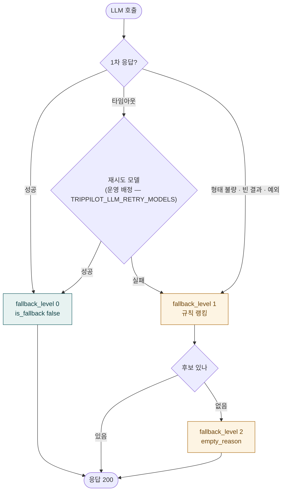

# Plan-B ③ 폴백 사다리

> 코드 구조도 — LLM 1차 → 재시도 모델 → 규칙 랭킹 → 빈 결과.
> `fallback_level` 0·1·2 가 어느 실패에서 매겨지는지를 그린다(INV-4, 침묵 실패 금지).
> 기준: origin/develop (a9648b7e), 2026-09-26.

재시도 모델은 기능별 운영 배정이다(`TRIPPILOT_LLM_RETRY_MODELS`, 1차와 파서 공유).
"다른 벤더로" 는 opus 시절 근거라 그림에서 뺐다 — 2026-09-12 팀 결정으로 현행은
terra(여유 우선)이고, 배정이 바뀌면 그림이 아니라 env 가 정본이다.
