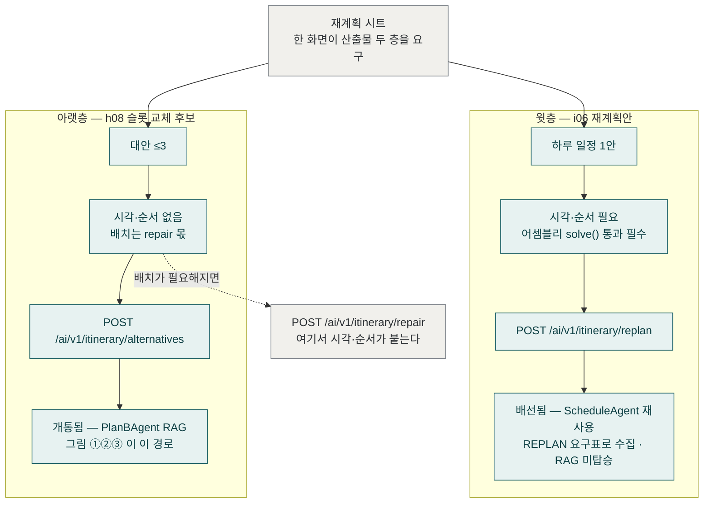

# Plan-B ④ 산출물 두 층

> 코드 구조도 — 재계획 시트 한 화면이 서로 다른 두 산출물을 요구한다.
> 윗층 i06(하루 재계획안 — 시각 있음, `ScheduleAgent` 재사용)과 아랫층 h08
> (슬롯 교체 후보 — 시각 없음, `PlanBAgent` RAG). 그림 ①②③ 은 모두 아랫층 경로다.
> 기준: origin/develop (a9648b7e), 2026-09-26.

윗층이 미배선 503 이던 것은 2026-09-19 기준의 사실이고 지금은 아니다 —
`WiredItineraryOrchestrator.replan` 이 `ScheduleAgent` 를 그대로 재사용한다
(요구표가 채워진 뒤라 점수·solve 복제가 없다). 두 층의 실제 차이는 이제
"배선 여부"가 아니라 **에이전트가 다르다**는 것이다: 윗층은 ScheduleAgent
(어셈블리 solve → 시각·순서 확정), 아랫층은 PlanBAgent(RAG·상황 지식 탑승,
시각 없음). RAG 는 아랫층만 탄다 — ScheduleAgent 는 KB 검색을 안 한다.
