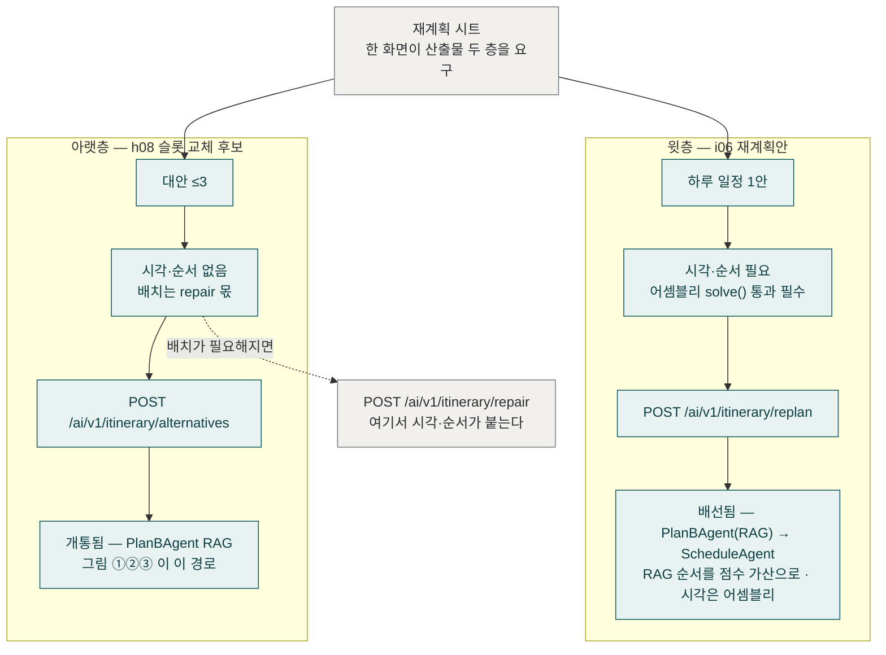

# Plan-B ④ 산출물 두 층

> 코드 구조도 — 재계획 시트 한 화면이 서로 다른 두 산출물을 요구한다.
> 윗층 i06(하루 재계획안 — 시각 있음, PlanBAgent→ScheduleAgent 합성)과 아랫층 h08
> (슬롯 교체 후보 — 시각 없음, `PlanBAgent` RAG). RAG 는 양쪽 다 탄다.
> 기준: origin/develop (6e1c5857), 2026-09-26.

윗층이 미배선 503 이던 것은 2026-09-19 의 사실이고, "ScheduleAgent 단독 재사용"은
2026-09-26 오전까지의 사실이다 — #744(`6e1c5857`)가 정본 배정을 복원했다(PlanBAgent
= 여행 중 변수 대응, ScheduleAgent = 백지 생성. 배선이 반대로 붙어 있었고
`ReplanResponse.retrieved` 가 항상 빈 dict 인 것이 증거였다).

두 층의 차이는 이제 **어셈블리를 타는가**다. 윗층은 **두 에이전트를 합성한다** —
PlanBAgent(RAG)가 상황 지식으로 순서를 내고(`ranked_poi_ids`), 그 순서가
`ScheduleTask.planb_rank` 로 실려 ScheduleAgent 점수에 **가산**(`planb_rank_lift`,
덧셈 한 단)으로 들어가고, 어셈블리 `solve()` 가 시각·순서를 확정한다. 아랫층은
PlanBAgent 만 돌아 순서까지만 낸다(시각 없음 — 배치는 `repair` 몫). 합성이 덧셈인
이유: 점수 원점이 둘(LLM 0~1 클램프 · 규칙 음수 허용)이라 배율은 뜻이 갈리고,
PlanB 가 LLM 을 못 쓰면 랭킹을 안 넘긴다 — 규칙 랭킹은 `build_rule_score` 가 이미
보는 신호라 두 번 세는 것이 된다.
