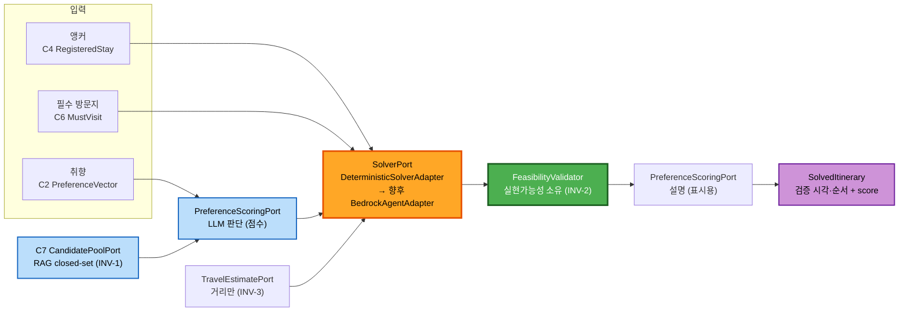

# Application Design — Component Dependency & Data Flow

> 규칙: 모듈 간 **다른 모듈의 `api`(facade·DTO·event)만 의존**. 동기 = public facade 호출, 비동기 = 도메인 이벤트(트랜잭셔널 아웃박스·at-least-once·멱등 구독). **순환 동기 의존 금지**(상태 전파는 이벤트로).

---

## 1. 의존성 매트릭스 (동기 facade 호출: 행 → 열)

| 소비 \ 제공 | C1 Auth | C2 Prof | C3 Search | C4 Stay | C5 Aff | C6 Trip | C7 Place | C8 Gen | C9 Detect | C10 Recalc | C11 Ctx | C12 Arch | C13 Refl | C14 Notif |
|---|:-:|:-:|:-:|:-:|:-:|:-:|:-:|:-:|:-:|:-:|:-:|:-:|:-:|:-:|
| C3 Search | ● | ● | | | ● | | | | | | | | | |
| C4 Stay | ● | | ● | | ● | | | | | | | | | |
| C6 Trip | ● | ● | | ● | | | ● | | | | | | | |
| C8 Gen | | ● | | ● | | ● | ● | | | | | | | |
| C9 Detect | | | | ● | | | ● | | | | ● | ● | | |
| C10 Recalc | | ● | | ● | | | ● | | ● | | | | | |
| C13 Refl | | ● | | | | ● | | | | | | ● | | |
| C15 Community* | ● | ● | | ● | | ● | | ● | | | | ● | ● | |
| C16 Assistant* | | ● | ● | ● | | ● | ● | ● | | ● | | | ● | |
| C17 Collab* | ● | | | ● | | ● | | ● | | | | ● | | |

`*` = 후속 게이트(인터페이스만). **C14 Notification은 어떤 것도 동기 호출하지 않고 이벤트만 구독**(단방향, 순환 차단).

**포트 소비(일정 지능)**: C8·C10 → `SolverPort`·`PreferenceScoringPort`·`CandidatePoolPort`(C7)·`TravelEstimatePort`. C13·C16 → `PreferenceScoringPort`(재사용).

---

## 2. 도메인 이벤트 카탈로그 (비동기·아웃박스)

| 이벤트 | 발행 | 구독 | 용도 |
|---|---|---|---|
| `AccountCreated` | C1 | C2 | 프로필 초기화 |
| `AccountDeletionRequested` | C1 | C4·C6·C12·C15 | 삭제 캐스케이드 |
| `PreferencesUpdated` | C2 | C8·C13 | 재개인화 |
| `StayRegistered` | C4 | C6·C14 | 일정 생성 유도·알림 |
| `StayUpdated` | C4 | C8 | 재생성 여부 질의 |
| `TripCreated` | C6 | — | (기록) |
| `MustVisitChanged` | C6 | C8 | 해당 날짜 재계산 |
| `PlanBTriggered` | C9 | C14·C10 | 알림·재계획 제안 |
| `ItineraryChanged` | C8·C10 | C12 | change log 반영 |
| `VisitChecked` | C12 | C9 | 체류 초과 트리거 입력 |
| `TripEnded` | C12 | C13·C14 | 회고 생성·알림 |
| `ReflectionReady` | C13 | C14 | 회고 완료 알림 |
| `CommunityReaction`* | C15 | C14 | 좋아요·댓글 알림(묶기) |

> at-least-once → **멱등 구독**(예: Affiliate 포스트백·재고성 이벤트). 부작용은 이벤트 ID 기준 1회 적용.

---

## 3. 데이터 흐름 — 솔버 파이프라인 (S2) ★


- **판단(파랑 SCORE)** ↔ **진실(초록 VALID)** 분리. **교체 지점 = 주황 SOLVE 어댑터만.** 사용자 노출값은 항상 VALID 통과분.

## 4. 데이터 흐름 — 사진 저장 (2026-07-12 결정)
```
촬영/선택 → C12 LocalPhotoAssetPort (기기 로컬 참조)
          → 서버: PhotoMetadata만 저장 (자산 ID·촬영 시각·EXIF 위치·연결 장소)
          → [커뮤니티 공개 선택 시만] EXIF GPS 제거 → ObjectStoragePort(S3) 업로드 → 타 사용자 열람
멀티 디바이스 미지원: 기기 변경 시 로컬 사진 유실 · 메타데이터만 잔존
```

## 5. 외부 어댑터 포트 (1 API = 1 포트/어댑터)
| 포트 | 소유 | 벤더(가정) | 약관·폴백 |
|---|---|---|---|
| `SocialOAuthPort` | C1 | 카카오·네이버·Google·Apple | 취소/장애 복구 |
| `MailPort` | C1 | (미정) | 재발송 |
| `AccommodationContentPort` | C3 | 글로벌 OTA·TourAPI | 정적 캐싱 허용 |
| `LivePricePort` | C3 | OTA | **가격 캐싱 금지** |
| `OtaDeeplinkPort` | C5 | OTA 제휴 | 포스트백 멱등·링크 실패 우회 |
| `MapPlacePort` | C7 | 카카오/네이버/TMap·Google | **영구 캐싱 금지·실시간·출처**, 실패 시 폴백 |
| `TravelEstimatePort` | C7/공용 | (거리 산출) | 직선거리 폴백 |
| `WeatherPort` | C11 | 공공데이터포털/OpenWeather | 실패 시 무발화 |
| `LlmGatewayPort` | 공용(C8·C13·C16) | AWS Bedrock(가정) | rate-limit·가드레일·권한 경계·결정론적 폴백 |
| `SolverPort` | C8·C10 | 별도 솔버 서비스(Python) | 결정론적 폴백(내장) |
| `PushPort`/`RealtimePort` | C14 | FCM/APNs·WS/SSE | catch-up |
| `ObjectStoragePort` | C12 | AWS S3 | 공개 사진만·EXIF 제거 |

> 모든 외부 포트는 **침묵 실패 금지(ADR-0011)** 폴백을 어댑터 경계에서 강제.

## 6. 순환 의존 방지
- 상태 전파(예: 등록→일정, 방문→트리거, 반응→알림)는 **이벤트**로 단방향. 동기 호출은 상위→하위(조회) 방향만. C14는 순수 구독자.
