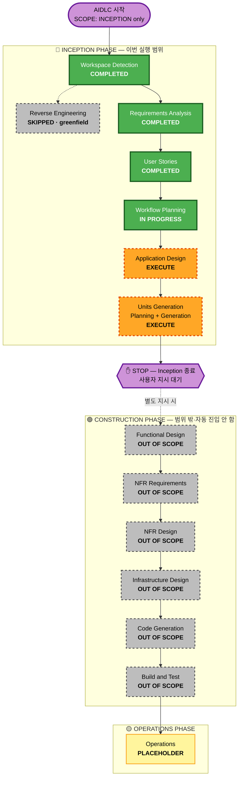

# Execution Plan — TripPilot

> **범위 경계(정본)**: `docs/SCOPE.md` — 이번 실행은 **INCEPTION 단계 완료(Units Generation 승인)까지**. 이후 CONSTRUCTION·Operations는 **자동 진입하지 않으며 별도 사용자 지시 필요**.
> **프로젝트 유형**: Greenfield (기존 코드 0줄) → Reverse Engineering·브라운필드 분석 N/A.

## Detailed Analysis Summary

### Change Impact Assessment (Greenfield 신규 구축)
- **User-facing changes**: **Yes** — B2C 여행자 앱 전체(온보딩·탐색·AI 일정·Plan-B·기록/회고·알림). 4 페르소나.
- **Structural changes**: **Yes** — 17개 모듈(핵심 8 테스트 대상) 아키텍처 신규 정의.
- **Data model changes**: **Yes** — 여행·등록 숙소·일정(plan/actual/change-log)·필수 방문지·기록·**사진 메타데이터(로컬 참조·커뮤니티만 S3)**·커뮤니티·공동편집 등.
- **API changes**: **Yes** — 전 모듈 신규 엔드포인트/계약.
- **NFR impact**: **Yes** — 성능·가용성(단일 리전·다중 AZ)·보안(SECURITY-01~15)·복원력(RESILIENCY)·PBT(Partial)·법적 선결(위치정보법·지도 API).

### Risk Assessment (이번 실행 = 문서 산출물)
- **Risk Level**: **Low** — 이번 범위는 설계 문서(코드 미생성)라 롤백 용이·부작용 없음. (단, *제품 자체*의 구현 복잡도는 High — 하이브리드 솔버·실시간 Plan-B·UGC·공동편집·법적 선결.)
- **Rollback Complexity**: Easy (문서 되돌리기).
- **Testing Complexity**: N/A this run (구현 단계에서 Simple→Complex).

### 핵심 설계 입력 (확정)
- 솔버 = **Phase 1 결정론적(OPTW/TOPTW) → 향후 조건부 Bedrock 교체**(FR-SOLVER).
- 스코핑(Q4) = 1차 핵심 여정 9모듈 + 후속 게이트 3모듈(어시스턴트·커뮤니티·공동편집)은 분리 게이트.
- 복원력 = 단일 리전·다중 AZ / 변경관리 Jira·Slack·Git / 경량 장애대응.
- 사진 = 로컬 참조+메타데이터, 커뮤니티 공개만 S3, 멀티 디바이스 미지원.

## Workflow Visualization

## Phases to Execute

### 🔵 INCEPTION PHASE
- [x] Workspace Detection — **COMPLETED** (Greenfield 확정)
- [x] Reverse Engineering — **SKIPPED** (그린필드, 기존 코드 없음)
- [x] Requirements Analysis — **COMPLETED** (승인 2026-07-12)
- [x] User Stories — **COMPLETED** (승인 2026-07-12)
- [x] Workflow Planning — **IN PROGRESS** (본 문서)
- [ ] Application Design — **EXECUTE**
  - **Rationale**: 17개 신규 모듈의 컴포넌트·메서드·비즈니스 규칙·의존성·모듈 경계(핵심 8 vs 후속 3)와 **솔버↔검증도구 계약**, 이중 진입/앵커, 사진 저장 데이터 흐름을 정의해야 한다. 신규 컴포넌트·서비스 다수 → 실행.
- [ ] Units Generation — **EXECUTE**
  - **Rationale**: 시스템을 다수 유닛(모듈·데이터 모델·API·상태 관리)으로 분해해야 하며 복잡도가 높다. 핵심 여정 유닛 + 후속 게이트 유닛 분리 → 실행.
- [ ] **STOP** — Inception 종료. Units Generation 승인 후 전체 요약 제시하고 멈춤(SCOPE.md).

### 🟢 CONSTRUCTION PHASE — 범위 밖 (이번 실행 자동 진입 안 함)
- [ ] Functional Design — **OUT OF SCOPE (this run)** · 별도 지시 시 유닛별 실행
- [ ] NFR Requirements — **OUT OF SCOPE (this run)** · (RESILIENCY-04 CI/CD·롤백·배포 질의는 이 단계)
- [ ] NFR Design — **OUT OF SCOPE (this run)** · (RESILIENCY-14 복원력 테스트 질의는 이 단계)
- [ ] Infrastructure Design — **OUT OF SCOPE (this run)**
- [ ] Code Generation — **OUT OF SCOPE (this run)** (템플릿 기본은 ALWAYS이나 SCOPE.md가 우선)
- [ ] Build and Test — **OUT OF SCOPE (this run)**

### 🟡 OPERATIONS PHASE
- [ ] Operations — **PLACEHOLDER**

## Estimated Timeline (이번 실행)
- **이번 실행 남은 단계**: 2개 (Application Design → Units Generation) + STOP.
- 각 단계는 승인 게이트 포함. CONSTRUCTION 이후는 별도 실행.

## Success Criteria (이번 실행)
- **Primary Goal**: INCEPTION 산출물 완성 — requirements·user-stories·application-design·units까지 정합된 설계 정본 확보.
- **Key Deliverables**: `application-design/` 산출물, `units`(유닛 분해). (기 완료: requirements.md·stories.md·personas.md·PRD-lean.md)
- **Quality Gates**: 단계별 사용자 승인 · 확장 규칙(보안·복원력·PBT) 준수 요약 · content-validation.
- **경계 준수**: Units Generation 승인 후 **STOP** — CONSTRUCTION 자동 진입 금지.
