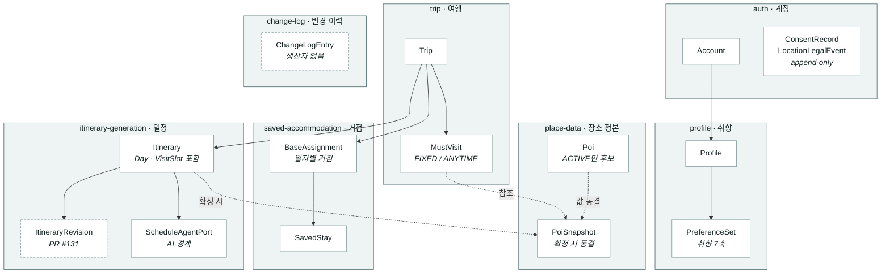
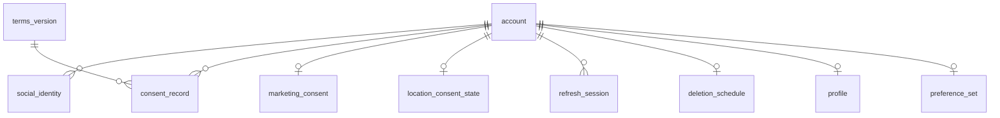
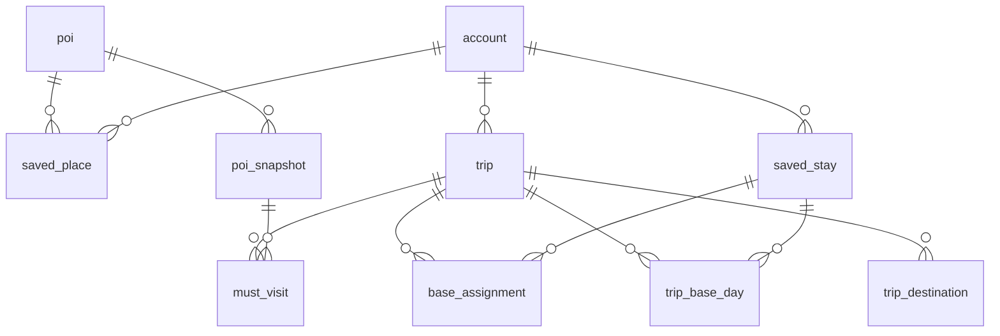
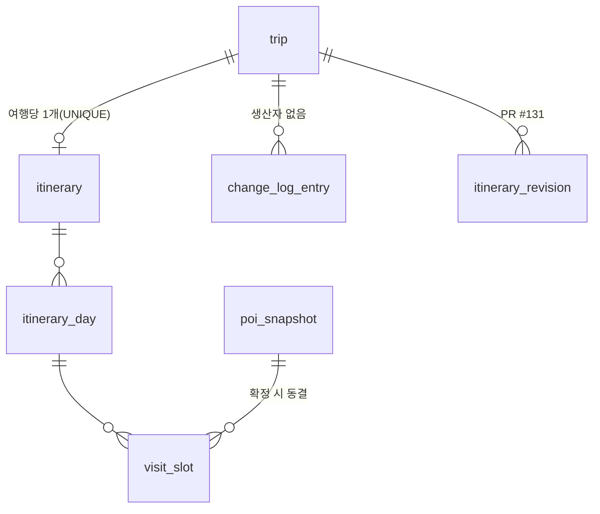
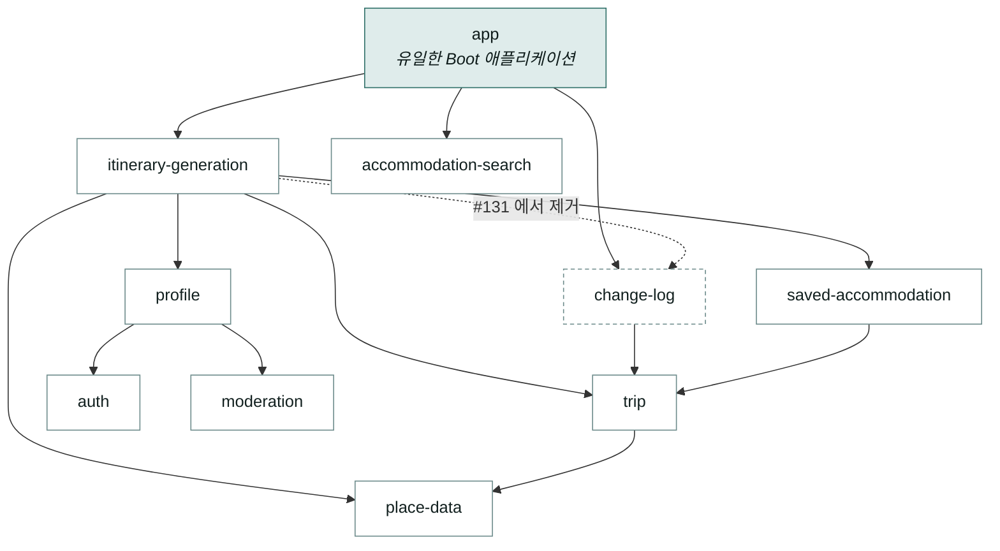
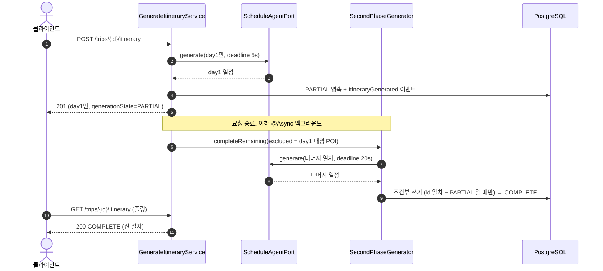
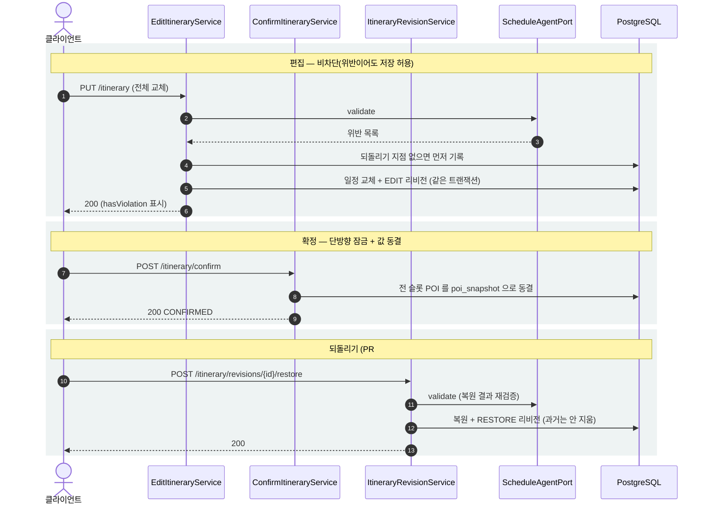
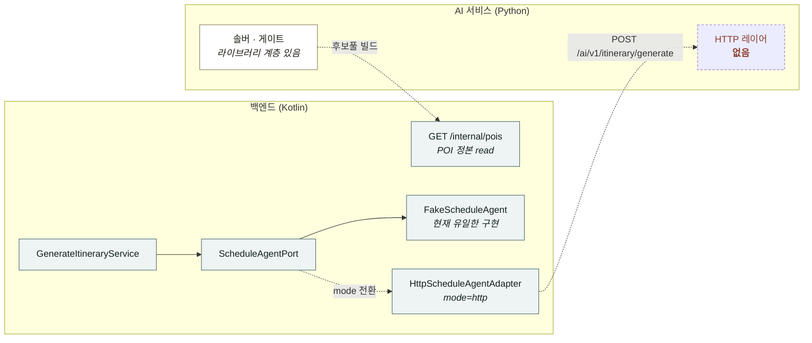

# 구현 실측 다이어그램 (2026-08-08)

> **성격**: 설계 의도가 아니라 **지금 코드에 실재하는 것**을 그린다. 마이그레이션·`build.gradle.kts`·도메인 패키지에서 기계적으로 뽑고 관계만 사람이 정리했다.
> **설계 기준 ERD는 별도**: `전체-도메인-ERD.md`(밴드 a~j 전체, 미구현 포함, 2026-07-06). 이 문서는 그 하위집합의 **현재 상태**다.
> **보는 법**: VSCode + Markdown Preview Mermaid Support. 프리뷰(`⇧⌘V`)에서 렌더된다.
> **기준 커밋**: `develop` — PR #131(ItineraryRevision)은 아직 미머지라 해당 부분만 별도 표기.

---

## 1. 도메인 모델 — 애그리거트와 모듈 소유

모듈 간 관계는 전부 상대 모듈의 `api` 퍼사드를 통하고, **DB 연관이 아니라 plain UUID 참조**다.

**실선** = 소유·구성 · **점선** = 참조(FK 미강제 포함) · **점선 테두리** = 아직 살아 있지 않은 것(미머지 / 생산자 없음)

### 애그리거트 경계에서 내린 선택

- **`Itinerary`가 Day·Slot을 품는다** — 편집이 항상 전체를 함께 바꾸므로 한 덩어리로 다룬다.
- **`PoiSnapshot`은 별도 애그리거트** — 확정 시 장소 값을 동결해 원본이 폐업·개명해도 확정 일정이 흔들리지 않는다(INV-U1-03).
- **동의·위치 로그는 append-only** — 앱 롤에서 `UPDATE`/`DELETE` 권한을 회수했다.

---

## 2. DB 스키마 — 실재 테이블 28개

Flyway **SQL-first · forward-only**. 마이그레이션 파일이 스키마 정본이다(V1.0~V2.13, 25개 파일).

### 2.1 계정 · 약관 · 동의

- `consent_record` · `location_legal_log` — **append-only**(법정 보존). 앱 롤 `UPDATE`/`DELETE` 회수.
- `location_legal_log`는 **FK를 걸지 않았다** — 계정 파기 후에도 남아야 하므로.
- `deletion_schedule` — 탈퇴 예약. 실제 파기는 후속 배치.

### 2.2 장소 · 여행 · 거점

- `poi_snapshot.source_poi_id`는 **FK 미강제** — 원본이 삭제돼도 스냅숏은 살아야 한다.
- `saved_place` — `UNIQUE (account_id, poi_id)`.
- `stay_price_snapshot`은 독립(숙소 탐색 캐시) — 위 그래프에서 생략.

### 2.3 일정 · 이력

- `visit_slot.poi_snapshot_id`는 **확정 전 NULL**.
- `visit_slot`은 `ends_next_day`(자정 넘김) · `distance_range` · `placement_reason`을 보유.
- `itinerary_revision`이 `itinerary`가 아니라 **`trip`에 매달린 이유** → 아래 3.2.

### 2.4 아직 테이블이 없는 것

설계 문서(`전체-최소-스키마.dbml`) 34개 중 **15개 미구현**.

| 영역 | 테이블 | 유닛 |
|---|---|---|
| Plan-B 재계획 | `replan_session` `alternative` `trigger_event` `execution_state` | U4 |
| 여행 중 기록 | `visit_record` `photo` `memo` `gps_track` | U5 |
| 회고 · 아카이브 | `reflection` `trip_summary` `style_analysis` `plan_snapshot` | U5 |
| 생성 세션 | `generation_session` | U3 (다음 티켓) |
| 제휴 · 정산 | `ota_partner` `outbound_click` | 후속 |

이름이 달라진 것 2건: `day_schedule` → `itinerary_day`, `slot` → `visit_slot`.

---

## 3. 도메인과 DB가 갈린 지점

### 3.1 대조

| 도메인 | DB | 왜 갈랐나 |
|---|---|---|
| `Itinerary` 애그리거트 1개 | `itinerary` + `itinerary_day` + `visit_slot` | 플랫 엔티티 3개로 분해하고 어댑터가 조립. JPA 연관 대신 plain UUID |
| `ItineraryRevision`은 **일정**의 이력 | `itinerary_revision.trip_id` | **정본을 바꿨다** — 아래 3.2 |
| `PoiSnapshot` ← 슬롯이 참조 | `visit_slot.poi_snapshot_id` (FK 有) | 단 `poi_snapshot.source_poi_id`는 FK 미강제 — 폐업해도 확정 일정 유지 |
| `ChangeLogEntry` 모듈 존재 | `change_log_entry` 존재 | **생산자 없음** — 편집 이력이 U3로 옮겨가 U4·U5 원천 대기 |
| 값객체(`AccountId` 등) | `uuid` 컬럼 | 평탄화 |
| 불변식(도메인 검증) | `CHECK` · `UNIQUE` · 권한 회수 | 앱에서만 지키지 않고 DB에서도 강제 |

### 3.2 `itinerary_revision`을 여행에 매단 이유

정본(`aidlc/.../u3-ai-itinerary/functional-design/domain-entities.md` §2.1)은 리비전을 `itineraryId`에 매달았으나, 이 코드베이스에선 동작하지 않는다.

- 일정 저장이 **전체 교체**(`replaceForTrip` = DELETE→INSERT)라 `itinerary` 행이 매번 새로 생긴다 → `itinerary_id` FK CASCADE면 **편집 한 번에 이력이 전부 소멸**.
- **재생성은 새 `itinerary_id`를 발급**한다 → `itinerary_id`로 묶으면 재생성 순간 과거 이력과 끊겨 "재생성 전으로 되돌리기"가 불가능해진다.

`trip_id`를 소유 키로, `itinerary_id`는 "어느 일정의 버전이었나"를 남기는 참고 값(FK 미강제)으로 뒀다. **정본 문서도 함께 정정**(§2.1 · INV-U3-06).

---

## 4. 모듈 의존

단일 배포 모듈러 모놀리스. Gradle 모듈 13개(`app` · `common` 3 · 기능 9).

> 모든 모듈이 `common:core`에 의존하고 `auth`는 `common:security`에도 의존한다 — 선이 뭉치므로 그래프에서 생략했다.
> `app`은 전 기능 모듈에 의존한다(조립 담당). 위에서는 최상위 3개만 그렸다.

### 빌드에서 강제되는 규칙

| 규칙 | 내용 | 검사 |
|---|---|---|
| **R1** | 타 모듈은 `..api..`만 참조. 내부(`domain`·`application`·`adapter`) 직접 참조 금지 | ArchUnit `slices()` |
| **R2** | `domain`은 프레임워크 무의존(Spring·JPA·Jackson import 금지) | Konsist |
| **R5** | 의존 방향 `app → modules → common`, 역방향 금지 | ArchUnit |

⚠️ **주의**: `slices()`는 **매칭되는 클래스만** 슬라이스로 잡는다. 새 모듈을 목록에 등록하지 않으면 위반해도 아무 일이 안 난다(vacuous pass). `change-log` 신설 때 실제로 그렇게 뚫렸다.

---

## 5. 흐름 — 일정 생성 (day1 조기 노출 2단계)

전체 생성 20초를 사용자가 기다리지 않도록, **첫날만 5초 안에 돌려주고** 나머지는 백그라운드로 채운다. AI는 stateless 동기 REST를 유지하고 진행 상태·재시도·노출 책임은 백엔드가 진다.

### 여기서 막아야 했던 것

| 위험 | 처리 |
|---|---|
| 2차 결과가 **재생성된 일정을 덮어씀** | `itineraryId` 일치 + `PARTIAL`일 때만 반영. 아니면 폐기 |
| **사용자 변경 유실** | `PARTIAL` 동안 편집·확정을 409로 차단(안 막으면 2차가 편집을 덮어씀) |
| 배포·재시작으로 **2차 중단** | 일정이 영구 `PARTIAL`이 되어 확정·편집이 둘 다 잠김 → 스윕이 `FAILED`로 정리 |
| 2차 실패 시 **침묵** | 1차와 대칭으로 결정론 폴백. 두 호출 중 **낮은 품질 등급**으로 기록(INV-4) |

---

## 6. 흐름 — 편집 · 확정 · 되돌리기

- **편집은 비차단** — 하드 제약 위반이어도 저장을 허용하고 표시만 한다(ADR-0011).
- **되돌리기는 과거를 지우지 않고 새 리비전을 쌓는다** → 되돌리기의 되돌리기가 가능.
- **고정 블록이 복원값을 이긴다** — 되돌린다고 숙소 체크인 시각이 흔들리면 안 된다.
- ⚠️ **낙관적 락이 없다** — `version` 컬럼 없이 조건부 쓰기로만 버티고 있다.

---

## 7. 흐름 — AI 경계

경계는 **딱 두 개**다. 포워드(일정 생성 요청)와 리버스(AI가 POI 정본을 읽는 것). 조각 조립 경계는 두지 않았다.

AI가 HTTP를 못 내는 동안 **계약을 먼저 굳히고 Fake로 소비자 쪽을 다 만들었다.** 덕분에 확정·편집·되돌리기가 AI를 기다리지 않고 진행됐지만, **실 연동 검증은 전부 미뤄져 있다.**

미확정 계약 3점(회신 대기): `explanations` 키 규약 · `candidates_summary` 형태 · `solve_mode` 값 집합.
