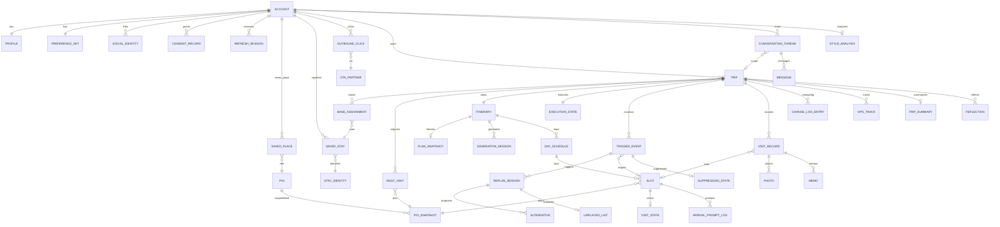

# TripPilot 전체 도메인 · 통합 ERD (밴드 a~j · 개요)

> 기준일 2026-07-06 · 스코프: 와이어프레임 밴드 a,b,c,d,e,g,h,i,j (k 커뮤니티·l 알림/마이/설정·m 공동편집 제외)
> 근거: `aidlc/aidlc-docs/inception/application-design/`(도메인 정본; 구 `planning/domain.md`는 2026-07-17 제거) + 와이어프레임 전수 전사(a·b·c·d·e·g·h01–h23·i·j)
> 깊이: **개요** — 엔티티·관계·핵심 속성. 전체 필드·불변식·DDL은 유닛별 후속(U1은 완료).
> [동기화 2026-07-24] 밴드 c(계정·프로필)+인프라는 구현(마이그레이션 V1.0~V1.7)과 대조 완료 — 엔티티·관계 일치. **AppConfig는 DB 테이블 아닌 설정(BootstrapProperties)으로 구현.** 컬럼·PK 상세는 `전체-최소-스키마.dbml`(동기화됨)·마이그레이션 참조.

## 0. 도메인 중심선

`Account`가 전체를 소유하고, **POI/숙소 → 여행(Trip) → 일정(4계층 plan/current/actual/changelog) → 방문/기록**이 핵심 축이다. 일정 4계층 분리(plan 불변 스냅샷 · current 가변 · actual 실측 · changelog 이력)가 "계획 vs 실제" 대조와 감사가능성의 근간이다(ADR-0013).

## 1. 바운디드 컨텍스트(모듈) 지도

| 모듈 | 영역 | 밴드 | MVP |
|---|---|---|---|
| M1 Auth / M2 Profile / C3 | 계정·동의·프로필·금칙어 | c | ✅ (U1 완료) |
| app · M1(U2) | 앱셸·부트스트랩·홈 집계 | a | ✅ |
| M16 Assistant | AI 어시스턴트 | b | 🔶 1차 포함이나 **타 팀원 담당·본 설계 제외** |
| M7 Place | POI·장소 저장 | d | ✅ |
| M3·M4·M5 | 숙소 탐색·등록·제휴 | e | ✅ |
| M6 Trip | 여행 생성·거점·필수방문지 | g | ✅ |
| M8 Itinerary | AI 일정 생성 4계층 | h | ✅ |
| M9·M10·M11·M18 | 트리거·재계획·날씨·실행 | i | ✅ |
| M12·M13 | 기록·회고·요약·분석 | j | ✅ |

## 2. 통합 ERD (핵심 엔티티·관계)

> 표기: `||--||`1:1, `||--o{`1:N, `}o--||`N:1, `}o--o|`N:0..1. 앱셸(AppConfig·BootstrapInfo·HomeDashboard·TabNav)은 집계/DTO/클라 상태라 ERD 생략. LocationLegalLog·ConsentRecord append-only.
> **VisitState는 별도 물리 테이블 아님** — 실행상태를 `visit_record.status`에 흡수(CurrentItinerary=day_schedule/slot과 동일한 논리≠물리 처리). ERD 노드는 논리 관계 표기용.

### 2.1 일정 4계층 물리 모델 (🔴 결정 2026-07-06)

plan/current/actual/changelog를 다음과 같이 물리 저장한다(ADR-0013 정합).

| 계층 | 저장 | 근거 |
|---|---|---|
| **current** | 정규 테이블 `day_schedule` + `slot` (가변) | 편집·Plan-B가 슬롯 단위로 빈번히 변경 → 정규화 필요. DRAFT~INTRIP 내내 이 테이블이 '작업본' |
| **plan** | `plan_snapshot` (JSONB 동결·불변) | 확정 시점 current를 통째로 스냅샷. 회고 대조 읽기 전용이라 불변 blob이 '동결본'에 직합·스키마 중복 회피 |
| **actual** | `visit_record`(+photo·memo·gps_track) | M12 실측 |
| **changelog** | `change_log_entry` (append-only diff) | plan→current·Plan-B·어시스턴트 변경 통합 이력 |

- **slot에 layer/version 컬럼 없음** — 계층 구분은 테이블로. current 편집 = slot 직접 mutate + change_log_entry append.
- 확정(`/confirm`) 시 current를 `plan_snapshot`으로 동결, 재확정 시 새 스냅샷. 비교 뷰(j02) = plan_snapshot(JSON) + slot(current) + change_log_entry 대조.
- **CurrentItinerary는 별도 테이블 아님** — day_schedule/slot 정규 테이블이 곧 current(ERD에서 별도 노드 제거).
- 대안(비채택): slot에 layer 컬럼으로 plan/current 행 공존 → 편집·인덱스 복잡, 불변성 강제 약함.

## 3. 모듈별 엔티티 개요

### c — M1/M2/C3 (U1 완료, 참조)
Account, SocialIdentity, TermsVersion, ConsentRecord, MarketingConsent, LocationConsentState, LocationLegalLog, RefreshSession, DeletionSchedule, Profile, PreferenceSet(7축), BannedWordDictionary. (email_verification·password_hash는 소셜전용 이연.)

### a — 앱셸·홈
| 엔티티 | 성격 | 핵심 |
|---|---|---|
| AppConfig | 설정(BootstrapProperties · DB 테이블 아님) | minSupportedVersion/recommendedVersion(강제·권장 업데이트 게이트) |
| BootstrapInfo | DTO(M1 공급) | sessionState·onboardingComplete·reconsentRequired·forceUpdate (우선순위 분기) |
| HomeDashboardModel | 읽기 BFF | 슬롯: activeTrip·upcomingTrip·trending·memory·preferencePrompt·알림배지. 부분 응답 |
| TabNavigationState | 클라 세션 | 5탭 스택(세션 한정) |

와이어프레임(a01): 홈 분기 = 여행 보유 여부 × 취향 온보딩 완료 × 진행/예정 상태. 진행 중이면 "지금 일정"(현재시각 vs 슬롯) 계산. **communityRecordCard(커뮤니티 기록 슬롯)는 커뮤니티 제외 스코프 정합상 1차 미노출.**

### b — M16 어시스턴트 🔶 (본 설계 범위 외)
> **1차 포함하되 타 팀원 담당** — ConversationThread/Message 계약은 담당자 설계. 아래는 참조 개요만.

| 엔티티 | 핵심 |
|---|---|
| ConversationThread | accountId, tripId?(nullable=no-context), mode/컨텍스트 라벨 |
| Message | role(user/assistant), contentType(text/card), cardPayload, meta(warning/info/scope/guardrail) |

와이어프레임(b): 어시스턴트는 기존 모듈(숙소검색·솔버·요약·OTA딥링크) 호출만. **경계**: 예약·결제 불가(외부 위임), guardrail 거절, 검증값 없으면 시각 추정 금지(ADR-0011), 결과 fabricate 금지. action-apply=적용 전 pending→솔버 재검증 후 커밋. history=대화+변경 로그(≠확정 일정).

### d — M7 장소
| 엔티티 | 핵심 |
|---|---|
| Poi | canonicalPoiId, nameKo+aliasEn, coord, category, openingHours?, stayRange, dataStatus(ACTIVE/UNVERIFIED/LOST/CLOSED) |
| PoiSnapshot | 확정 시점 불변 사본 + sourceAttribution |
| SavedPlace | accountId, poiRef, savedAt, 순번 — "가고 싶은 곳" 위시(여행 생성 시드) |
| TrendingAggregate | region, poiId, weightedScore(7일), 일1회 배치 |
| StayTimeTable | category별 min/rec/max 체류 기본값(정적) — 일정 솔버 입력 |

와이어프레임(d02): 저장 장소 카운트 0이면 CTA 비활성. 저장 목록 → 여행 생성 시드.

### e — M3/M4/M5 숙소
| 엔티티 | 핵심 |
|---|---|
| WishlistItem | **후속 이연**(숙소 위시리스트 보류·e04). 1차 숙소 흐름 = 등록(SavedStay) 불러오기 / 없으면 검색→등록 |
| StayStaticCache | stayRef, name·coord·type·amenities·priceBand, fetchedAt+TTL |
| SavedStay | accountId, stayIdentityRef, placeSnapshot(등록시점 동결), checkIn/Out, party, ota?, coordConfirmed |
| StayIdentity | canonicalStayId, externalIds, matchConfidence |
| OutboundClick | accountId, stayRef, otaPartner, clickedAt, 표시가격 스냅샷 |
| OtaPartner | partnerCode, deeplinkTemplate, policyNote |

와이어프레임(e): 검색 결과 카드 가격 nullable(partial-failure "가격 미확인"). filter-zero는 원인 facet 반환. 등록 3경로(지도검색·URL·핀)+multi-candidate/conflict/error-mapapi → 좌표 nullable+수동확정. affiliate-sheet=OTA별{가격,딥링크} 선택→OutboundClick+어필리에이트 고지.

### g — M6 여행
| 엔티티 | 핵심 |
|---|---|
| Trip | title(자동생성+C3), destination(국내강제), startDate/endDate(겹침차단·활성1개), party, budgetTotal(항공제외·1인/1일 파생), attributes{companion,transport,budgetTier}, perDayWindows, status(PLANNED→CONFIRMED→ACTIVE→ENDED), deletedAt |
| MustVisit | tripId, poiSnapshotRef(사본복제), type(ANYTIME 포함고정/FIXED 시각고정), fixedDate/fixedStart, dwell, 한도 하루3곳×일수 |
| BaseAssignment | savedStayId, tripId, dateRange, isSmartDefault |

와이어프레임(g): 거점 날짜 커버리지 gap(공백=직전숙소/여행지중심 택1)·overlap(겹침=날짜별 primary 택1) → **날짜 단위 기준 거점** 레코드가 일정 생성 입력.

### h — M8 일정 (4계층)
| 엔티티 | 계층 | 핵심 |
|---|---|---|
| Itinerary | — | tripId, mode(fully_ai/co_plan/manual), status(DRAFT→EDITING→CONFIRMED→INTRIP) |
| GenerationSession | — | mode, progress(단계: preprocess→candidates→hours→route), partialDraft(부분결과), cancelState |
| PlanSnapshot | plan | 확정시점 동결(불변) |
| CurrentItinerary(=day_schedule/slot) | current | 여행중 가변 정규 테이블(변경은 changelog) |
| DaySchedule/Slot | plan·current | poiSnapshotRef, start/end, sourceType(AI/사용자/필수/숙소), locked, violations[], llmReason?, solverReason |

와이어프레임(h): 생성 프로파일(목적·취향·출발·페이스) → mode 선택 → MustVisit(시각고정/포함, 충돌 해소 3선택지) → 생성(부분결과 스트리밍) → 추천안(슬롯 교체·고정) / 협업(테마→반경별 후보→슬롯 채움) → 확정=PlanSnapshot. 숙소(체크인) 슬롯 항상 LOCK.

### i — M9/M10/M11/M18 실행·Plan-B
| 엔티티 | 핵심 |
|---|---|
| TriggerEvent | type(weather/delay/hours/traffic), value, targetItemId, status(active/normal/dismissed), channel(push/in-app) |
| ReplanSession | reason(weather/closed/delay/canceled/fatigue/none), mode(ai/manual), origin(gps/manual/accommodation), status(loading→proposed→committed/canceled/undone) |
| Alternative | source(ai/manual), items, deltas(이동·방문수·복귀시각), empty(제약불충족) |
| ForecastCache / WeatherAlert | 기상청 예보·특보 |
| ExecutionState | current/next 포인터, sub(NORMAL/REST{resumeAt}) |
| VisitState | slotRef, arrivedAt?, promptSuppressed, 상태(upcoming/arrivalPending/inProgress/completed/skipped). **물리: visit_record.status에 흡수(별도 테이블 아님)** |
| ArrivalPromptLog | slotRef, shownAt, outcome(재프롬프트 억제) |
| SuppressionState | 트리거 억제 수명(재알림 방지) |
| UnplacedList | 재계획 미배치 항목(i16 '대안 없음' 근거) |

와이어프레임(i): 도착 확인은 항상 사용자 탭(자동기록 없음, ADR-0010). 재계획 로딩 다단계. 수동 위치 폴백(핀/등록숙소), 이동시간 계산 실패→수동 시각 입력. 변경 전후 비교(diff)→커밋→undo 가능.

### j — M12/M13 기록·회고
| 엔티티 | 계층 | 핵심 |
|---|---|---|
| VisitRecord | actual | tripId, slotRef?(즉석=null), poiSnapshotRef/freeText, visited, arrivedAt/departedAt, actualStay, checkinType(auto/manual), syncState(local/pending/synced/conflict), recordVersion |
| Photo | actual | visitId, storageKey, thumbnailKey, uploadState(local→queued→retrying→failed/done) |
| Memo | actual | visitId, text |
| ChangeLogEntry | changelog | tripId, actor, sourceType(planB/수동/공동편집/어시스턴트), reason, before/after, at |
| GpsTrack | actual | tripId, date, simplifiedPolyline, distance, steps, consentRef(L3) |
| Reflection | — | tripId, day, 자동생성 문장+통계, 수동 편집 가능 |
| TripSummary | — | tripId, 총방문/거리/사진, Day별 요약, photoCount/memoCount |
| StyleAnalysis | — | accountId, 카테고리 비율·지표, sampleTripCount, lastUpdated, **임계 10 VisitRecord 게이팅** |
| ShareCardSpec | — | tripId, aspectRatio(9:16/1:1/4:5), caption, includePhotos(no-photo=동선전용) |

와이어프레임(j): 오프라인 큐잉·동기화 충돌(항목별 버전 택1→ChangeLogEntry). GpsTrack 부재 시 리스트 fallback. Reflection 3단 fallback(부족/실패/공백). 기록 비교=plan vs actual vs changelog 3뷰.

## 4. 핵심 상태 머신 3종 (정본 — domain.md §10)
- **Trip** (M6): PLANNED→CONFIRMED→ACTIVE→ENDED (+deletedAt 직교)
- **Itinerary** (M8): DRAFT→EDITING→CONFIRMED→INTRIP
- **Visit** (M18): UPCOMING→ARRIVALPENDING→INPROGRESS→COMPLETED / SKIPPED

## 5. 와이어프레임이 추가·구체화한 것 (정본 대비)
1. **SavedPlace**(장소 위시, d02) — 정본이 명시 안 함, 여행 생성 시드로 필요
2. **TriggerEvent 4카테고리**(weather/delay/hours/traffic) + channel(push/in-app) — i09가 마스터
3. **ReplanSession 필드 구체화**(reason/mode/origin/status 다단계 로딩)
4. **StyleAnalysis 임계**(10 VisitRecord) · **ShareCardSpec**(aspectRatio·includePhotos)
5. **ConversationThread/Message** 카드 payload 타입·guardrail·scope 경계
6. 숙소 등록 좌표 nullable(지도 실패·수동 핀), OTA 가격 nullable(부분 실패)

## 6. 커버리지 노트
- h24~h35 **보강 완료**: 완성 뷰 토글(viewMode)·확정 일정(PlanSnapshot)·지도 실패 카드 폴백·숙소 나중 등록 온램프(SavedStay+BaseAssignment 재정리)·후보0건 조건완화 재생성. **새 엔티티 없음** — 기존 Itinerary/Slot/SavedStay/BaseAssignment로 커버.
- 제외 밴드(k 커뮤니티·l 알림/마이/설정·m 공동편집)는 이번 스코프 밖. l의 취향편집·계정삭제·위치동의는 c(U1)에 이미 존재.
