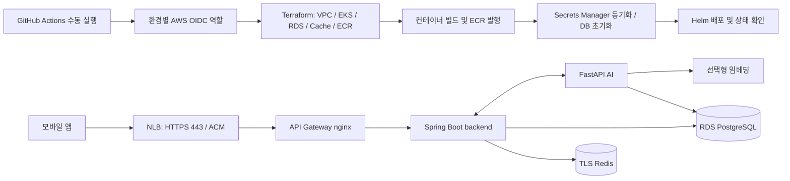

# AWS EKS 수동 배포 (DEV / PRD)

`letscodes-service`의 Terraform 원격 state·환경 구분·GitHub Actions 배포 패턴을 TripPilot에 적용했다. AWS 변경은 **Actions의 Run workflow에서 명시적으로 실행**한다. push, PR, schedule, 다른 workflow 완료로 AWS 배포가 시작되지 않는다. 기존 backend/AI/frontend CI의 테스트·GHCR 발행은 유지된다.

## 배포 구성

| 구성 | DEV | PRD |
| --- | --- | --- |
| GitHub Environment | `dev` | `prd` |
| 기본 배포 브랜치 | `develop` | `main` |
| VPC / EKS / ECR / DB / Redis | `trippilot-dev-*` | `trippilot-prd-*` |
| 가용 영역 | 2 | 3 |
| NAT Gateway | 1개 | AZ별 1개 |
| PostgreSQL | RDS, 단일 AZ | RDS Multi-AZ, 삭제 보호 |
| 애플리케이션 | backend + AI 각 1 replica | backend + AI 각 2 replicas |
| 임베딩 | 수동 실행 옵션 | 수동 실행 옵션 |
| Terraform state | 환경 전용 S3 버킷 | 환경 전용 S3 버킷 |

리전 기본값은 서울(`ap-northeast-2`)이다. AWS 계정은 같은 계정과 별도 계정 모두 설정할 수 있다. 강한 권한·비용 격리가 필요하면 DEV/PRD를 별도 AWS 계정에 구성한다. 같은 계정에서 리소스 이름·네트워크·state 분리는 IAM의 완전한 보안 경계를 대체하지 않는다.



EKS Auto Mode가 노드·스토리지·NLB를 관리한다. 노드는 private subnet에서 실행되며 `amd64` 이미지를 사용한다. Kubernetes API는 GitHub 호스팅 러너가 접근하도록 public endpoint를 사용하고 IAM/EKS Access Entry로 인증한다. 기본 public CIDR은 `0.0.0.0/0`이다. 조직에서 고정 egress IP를 가진 러너를 사용한다면 Terraform의 API CIDR 설정과 workflow `runs-on`을 함께 제한한다.

EKS 배포 대상은 Spring Boot backend, FastAPI AI, 선택형 임베딩이다. **현재 `frontend/Dockerfile`은 nginx 연동 확인용 스텁**이므로 여기에 포함하지 않았다. Expo 앱의 API 주소를 환경별 HTTPS 주소로 설정하고 모바일 앱은 기존 앱 배포 절차로 배포한다.

## 최초 준비

1. [AWS OIDC/state 부트스트랩 가이드](aws-bootstrap.md)에 따라 계정의 GitHub OIDC provider와 초기 부트스트랩 역할을 준비한다. AWS 권한이 전혀 없는 GitHub 실행이 스스로 최초 신뢰 관계를 만들 수는 없으므로, 이 단계는 계정 관리자의 초기 설정이 필요하다.
2. 저장소 Settings → Environments에 정확히 `dev`, `prd`를 만든다. 각 환경에 아래 Variables를 설정한다.
3. Actions → **AWS bootstrap (manual)** 워크플로를 환경별로 한 번 실행하여 state 버킷과 일반 배포 역할을 만든다. 실제 표시 이름은 workflow 파일의 `name`을 따른다.
4. 결과의 `DeploymentRoleArn`을 해당 환경의 `AWS_ROLE_ARN`에 설정한다.
5. AWS ACM에 환경 API 도메인의 인증서를 발급하고 DNS 검증을 완료한다. 인증서는 EKS/NLB와 같은 리전·계정이어야 한다.

| GitHub Environment Variable | 값 / 용도 |
| --- | --- |
| `AWS_ACCOUNT_ID` | 환경 AWS 계정 12자리 |
| `AWS_REGION` | 선택, 기본 `ap-northeast-2` |
| `AWS_BOOTSTRAP_ROLE_ARN` | 최초 state/배포 역할 생성에 사용하는 기존 OIDC 역할 |
| `AWS_GITHUB_OIDC_PROVIDER_ARN` | 선택, 기존 GitHub OIDC provider ARN |
| `AWS_ROLE_ARN` | 부트스트랩 출력 `trippilot-<env>-github-deploy` 역할 ARN |
| `DEPLOY_BRANCH` | 선택, DEV `develop` / PRD `main` 기본값을 변경할 때 |
| `ACM_CERTIFICATE_ARN` | 앱 배포용, 검증 완료한 ACM 인증서 ARN |
| `API_HOSTNAME` | 앱 배포용, 예: `api-dev.example.com` / `api.example.com` |

`dev`에는 develop만, `prd`에는 main만 허용하도록 **Deployment branches and tags**도 설정한다. 필요하면 PRD의 required reviewers를 설정한다. workflow의 브랜치 검사는 실수 방지이며, Environment 보호 설정이 OIDC 역할 사용을 제한하는 경계다. bootstrap 역할에 대한 운영자 접근도 별도로 제한한다.

저장소 기본 브랜치에 workflow 파일이 있어야 GitHub의 Run workflow 버튼이 나타난다. 브랜치 이름이 다르면 `DEPLOY_BRANCH`와 Environment 규칙을 함께 바꾼다. AWS 액세스 키를 저장소에 커밋하거나 일반 배포 workflow에 등록할 필요가 없다.

## 배포 실행

Actions → **AWS / Terraform and EKS deploy** → Run workflow:

| 입력 | 동작 |
| --- | --- |
| `environment` | `dev` 또는 `prd` |
| `mode=plan` (기본) | 이미 생성한 state 버킷을 사용해 변경사항만 확인. AWS 리소스나 앱을 생성하지 않음 |
| `mode=apply` | 이번 실행에서 생성한 plan을 적용 |
| `deploy_application=true` | apply 후 ECR 이미지 빌드 → 비밀값 동기화 → DB 초기화 → Helm → 연결 확인 |
| `deploy_application=false` | 인프라만 적용. 인증서·도메인 준비나 외부 서비스 설정 전 사용할 수 있음 |
| `embedding_enabled=true` | 임베딩 이미지 빌드·서비스 배포·AI pgvector RAG 연결. 메모리 비용 증가 |

처음에는 `apply` + `deploy_application=false`로 인프라를 만든 후, 필요한 외부 API 키를 Secrets Manager에 입력하고 앱을 배포할 수 있다. 외부 API 없이 시작하려면 인증서·도메인을 준비하고 바로 `apply` + `deploy_application=true`를 실행해도 된다. 외부 LLM·기상·지오코딩은 설정한 경우에만 활성화하며, 기본값으로 배포했다고 실제 외부 API 연동까지 활성화되지는 않는다.

일반 배포는 환경별로 직렬 실행된다. 기존 실행을 새 실행이 자동 취소하지 않는다. DEV 배포는 PRD 배포와 병렬 진행할 수 있다. S3 state는 버전 관리·암호화·TLS 강제·퍼블릭 차단 및 native S3 lockfile을 사용한다. plan 파일이나 state/비밀값을 Actions artifact로 업로드하지 않는다.

이미지는 체크아웃한 commit SHA + run ID + attempt로 태그를 만들고 ECR에서 immutable로 저장한다. GitHub Run workflow의 선택 브랜치에 포함된 코드가 배포된다. 재실행도 새로운 태그를 사용하므로 기존 이미지 덮어쓰기로 변경 내용이 섞이지 않는다.

첫 앱 배포 후 실행 Summary에 NLB DNS가 출력된다. `API_HOSTNAME`의 DNS CNAME(루트 도메인은 Route53 Alias)을 그 주소로 연결한다. 이 DNS 연결과 ACM 검증은 도메인 소유자가 수행하는 최초 준비다. 이후 workflow 실행은 동일한 Helm release·서비스를 갱신한다.

## 비밀값과 DB 초기화

Terraform은 Secrets Manager **비밀값 저장소만** 만들고 비밀값은 Terraform state에 저장하지 않는다. RDS 관리자 암호는 RDS가 Secrets Manager에서 관리한다. 배포 도구는 비밀값을 메모리에서 읽고 Kubernetes Secret으로 전달하며 Helm values에는 넣지 않는다.

| 저장소 | 내용 |
| --- | --- |
| backend | 고정 `JWT_SIGNING_KEY`, OAuth 설정 등 백엔드 환경변수 |
| ai | LLM API 키·공급자·AI 옵션 |
| database | `DB_PASSWORD`, `DB_MIGRATE_PASSWORD`, `AI_DB_PASSWORD` |
| shared | backend↔AI 공통 `SERVICE_AUTH_TOKEN` |

처음 비어 있는 저장소는 배포 도구가 DB 암호·서비스 토큰·RSA PKCS#8 JWT 서명키를 생성한다. 기존 값은 유지하므로 재배포할 때 토큰과 DB 자격증명이 바뀌지 않는다. 외부 API 키는 자동 생성하지 않는다. 지원되는 키와 검증은 `deploy/eks/runtime_secrets.py`가 정한다. AI에는 `TRIPPILOT_LLM_PROVIDER` 등 앱 환경변수 이름을 사용한다(Compose 별칭 `AI_LLM_PROVIDER`는 지원하지 않는다). 저장소의 Secret 이름·ARN은 Terraform outputs와 AWS 콘솔에서 확인한다.

DB 초기화 Job은 관리자 자격증명을 임시로 사용해 `app_migrate`, `app_user`, `app` 스키마 및 AI DB·pgvector 테이블을 준비한다. 런타임 SQL은 `app_user`, Flyway는 `app_migrate`로 동작한다. Job 종료 후 임시 관리자 Secret/Job을 삭제한다. 앱 Pod에는 RDS 관리자 암호를 전달하지 않는다. DB 초기화는 반복 실행할 수 있으며 DB/스키마를 삭제하지 않는다. SQL에는 원문 암호 대신 salt를 포함한 SCRAM-SHA-256 검증값을 전달한다. 사용자 지정 DB 암호는 출력 가능한 ASCII 문자열을 사용한다.

`SERVICE_AUTH_REQUIRE_TOKEN`과 `JWT_REQUIRE_CONFIGURED_KEY`를 켜서 비밀값 누락 시 시작을 막는다. PRD의 여러 backend replica가 같은 JWT 키를 사용하므로 서로의 액세스 토큰을 검증할 수 있다. 비밀값을 수정한 뒤에는 수동 배포를 다시 실행해야 Pod에 반영된다. DB 암호를 바꾸는 경우 기존 연결에 영향을 줄 수 있으므로 계획된 배포로 수행한다.

HTTPS NLB는 nginx gateway로 연결된다. gateway는 API 경로와 상태 확인 경로만 노출하며 `/internal`·Actuator 등은 외부에 공개하지 않는다. AI·임베딩·DB·Redis는 public LoadBalancer가 없다. RDS 연결에는 TLS를 사용한다. Redis는 TLS를 강제하는 private cache로 준비하며, 현재 backend에는 Redis adapter 구현이 없어 실제 캐시 사용은 해당 어댑터 구현 후 활성화된다.

## 확인과 복구

워크플로는 Terraform 검증·모의 provider 테스트, 배포 도구 테스트, Helm 검증을 통과한 뒤 AWS에 접근한다. 앱을 배포하는 실행에서는 backend 종료 설정의 Gradle 테스트도 수행한다. Helm은 `--atomic --wait`로 rollout 실패 시 이전 release로 복구하며, 성공 후 클러스터 내부에서 gateway/backend/AI 연결을 확인한다. 실제 도메인의 DNS/TLS 확인은 DNS 연결 후 별도로 수행한다.

긴 일정 생성 요청을 위해 backend/AI Pod 종료 유예를 660초, HTTP 및 backend 비동기 실행기의 종료 대기를 630초로 설정했다. 로컬 backend 비동기 대기는 기존 30초 기본값을 유지한다. 이 대기는 무제한 큐 처리 보장이 아니며, 노드 강제 종료·시간 초과 작업은 기존 앱 복구 로직의 대상이다.

앱 코드를 되돌리려면 배포 브랜치에 revert commit을 만든 뒤 수동 배포한다. 인프라 변경과 DB migration은 Helm rollback으로 되돌아가지 않는다. destructive DB migration은 별도 복구 계획·백업을 준비한다. PRD RDS는 삭제 보호가 켜져 있고, 전체 destroy나 state 삭제 workflow는 제공하지 않는다.

NLB·RDS·Redis 준비, EKS 노드 생성, 임베딩 모델 빌드는 첫 실행에서 오래 걸릴 수 있다. 테스트 환경이라도 EKS·NAT·RDS 등은 생성 후 계속 과금된다. 임베딩 활성화 시 Pod당 약 5GiB 이상의 메모리를 확보해야 한다. AI KB 테이블 생성과 외부 데이터/벡터 적재는 별개이며 실제 KB 내용은 프로젝트의 기존 AI 데이터 적재 절차를 적용한다.

## 코드 위치와 로컬 검증

- `infra/terraform/stack/`: 공통 AWS 리소스와 테스트, provider lock
- `infra/terraform/environments/{dev,prd}.tfvars`: 환경별 규모·보호 설정
- `infra/bootstrap/`: OIDC 배포 역할 및 state 버킷의 CloudFormation 정의
- `deploy/eks/`: AWS 전용 Helm chart, 비밀값 처리·DB 초기화·배포 확인 도구
- `.github/workflows/aws-bootstrap.yml`, `aws-deploy.yml`: 수동 AWS 작업 진입점
- 기존 `deploy/k8s/`: 로컬 kind 개발 환경

AWS를 변경하지 않는 검증:

```bash
python3 -m venv /tmp/trippilot-infra-check
/tmp/trippilot-infra-check/bin/pip install -r infra/requirements-test.txt
/tmp/trippilot-infra-check/bin/python -m unittest discover -s infra/tests -v
/tmp/trippilot-infra-check/bin/python -m unittest discover -s infra/bootstrap/tests -v
/tmp/trippilot-infra-check/bin/python -m unittest discover -s deploy/eks/tests -v
terraform -chdir=infra/terraform/stack init -backend=false -lockfile=readonly
terraform -chdir=infra/terraform/stack validate
terraform -chdir=infra/terraform/stack test
```

Terraform CLI는 `1.13.5`, Helm은 `3.19.0`을 기준으로 검증한다. 실제 AWS plan/apply 및 EKS smoke 검증은 AWS 계정·GitHub Environment 준비 후 위 수동 workflow에서 수행한다.

공식 근거: [GitHub OIDC의 AWS 환경별 subject](https://docs.github.com/en/actions/how-tos/secure-your-work/security-harden-deployments/oidc-in-aws), [Terraform S3 state locking](https://developer.hashicorp.com/terraform/language/backend/s3), [EKS Auto Mode NLB](https://docs.aws.amazon.com/eks/latest/userguide/auto-configure-nlb.html), [EKS Kubernetes 버전](https://docs.aws.amazon.com/eks/latest/userguide/kubernetes-versions.html).
